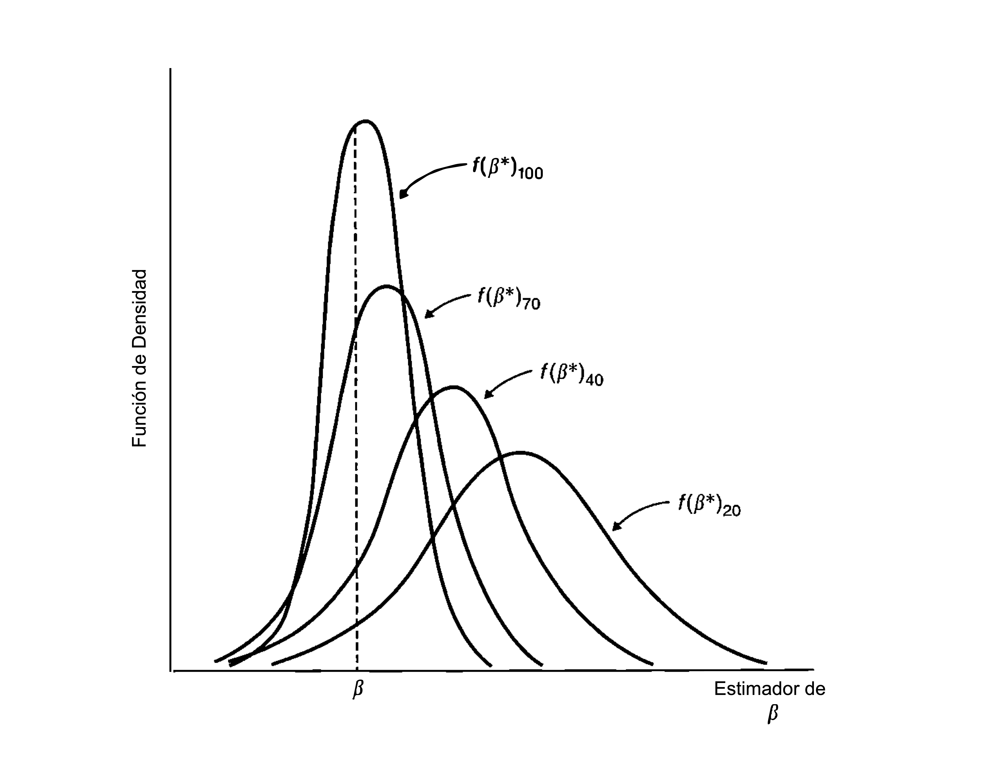

```{r setup, message=FALSE, warning=FALSE, include=FALSE}
library(ggplot2)
library(haven)
library(magrittr)
library(AER)

theme_set(theme_minimal(base_size = 16))
```

# El modelo de regresión lineal: Repaso {.center .center-x}

## Función de Regresión Poblacional

Función de **Regresión Poblacional**:
$$y_{i}=\beta_{0}+\beta_{1}x_{1i}+\beta_{2}x_{2i}+...+\beta_{K}x_{Ki}+u_{i}$$

Efecto marginal (efecto [ceteris paribus]{.emph}) de la variable $k$:
$$\Delta u_{i}=\Delta x_{j\neq k,i}=0\rightarrow\frac{\Delta y}{\Delta x_{ki}}=\beta_{k}\quad\forall k=1,...,K$$

Variación total en la variables explicativas ($\Delta u_{i}=0$):
$$\Delta y=\beta_{1}\Delta x_{1i}+\beta_{2}\Delta x_{2i}+...+\beta_{K}\Delta x_{Ki}$$

## Función de Regresión Muestral y Mínimos Cuadrados Ordinarios

Función de **Regresión Muestral**:
$$\widehat{y}_{i}=\widehat{\beta}_{0}+\widehat{\beta}_{1}x_{1i}+\widehat{\beta}_{2}x_{2i}+...+\widehat{\beta}_{K}x_{Ki}$$

Término residual:
$$e_{i}=y_{i}-\widehat{y}_{i}$$
Criterio de Mínimos Cuadrados Ordinarios:
$$\min\sum_{i=1}^{n}e_{i}^{2}=\min\sum_{i=1}^{n}(y_{i}-\widehat{\beta}_{0}-\widehat{\beta}_{1}x_{1i}-\widehat{\beta}_{2}x_{2i}-...-\widehat{\beta}_{K}x_{Ki})^{2}$$

## MCO y el sistema de ecuaciones normales

CPO (sistema de ecuaciones normales, $K+1$ ecuaciones con $K+1$ incógnitas):
\begin{eqnarray*}
	\frac{\partial SRC}{\widehat{\beta}_{0}} & = & -2\sum_{i=1}^{n}(y_{i}-\widehat{\beta}_{0}-\widehat{\beta}_{1}x_{1i}-\widehat{\beta}_{2}x_{2i}-...-\widehat{\beta}_{K}x_{Ki})=0\\
	\frac{\partial SRC}{\widehat{\beta}_{1}} & = & -2\sum_{i=1}^{n}(y_{i}-\widehat{\beta}_{0}-\widehat{\beta}_{1}x_{1i}-\widehat{\beta}_{2}x_{2i}-...-\widehat{\beta}_{K}x_{Ki})x_{1i}=0\\
	 & \vdots\\
	\frac{\partial SRC}{\widehat{\beta}_{K}} & = & -2\sum_{i=1}^{n}(y_{i}-\widehat{\beta}_{0}-\widehat{\beta}_{1}x_{1i}-\widehat{\beta}_{2}x_{2i}-...-\widehat{\beta}_{K}x_{Ki})x_{Ki}=0
\end{eqnarray*}

## Regresión simple con MCO

Tomemos el caso de dos variables:
$$
\widehat{y}_{i}=\widehat{\beta}_{0}+\widehat{\beta}_{1}x_{i}
$$

Mínimos Cuadrados Ordinarios:
$$
min\sum_{i=1}^{n}e_{i}^{2}=min\sum_{i=1}^{n}(y_{i}-\widehat{\beta}_{0}-\widehat{\beta}_{1}x_{i})^{2}
$$

CPO (sistema de ecuaciones normales, $2$ ecuaciones con $2$ incógnitas):
\begin{eqnarray*}
\frac{\partial SRC}{\widehat{\beta}_{0}} & = & -2\sum_{i=1}^{n}(y_{i}-\widehat{\beta}_{0}-\widehat{\beta}_{1}x_{i})=0\\
\frac{\partial SRC}{\widehat{\beta}_{1}} & = & -2\sum_{i=1}^{n}(y_{i}-\widehat{\beta}_{0}-\widehat{\beta}_{1}x_{i})x_{i}=0
\end{eqnarray*}

## Regresión simple con MCO

Estimadores MCO:
\begin{eqnarray*}
\hat{\beta}_{0} & = & \bar{y}-\hat{\beta}_{1}\bar{x}\\
\hat{\beta}_{1} & = & \frac{\sum_{i=1}^{n}(y_{i}-\bar{y})(x_{i}-\bar{x})}{\sum_{i=1}^{n}(x_{i}-\bar{x})^{2}}
\end{eqnarray*}


-  Si en la muestra $x$ y $y$ están correlacionadas positivamente (negativamente),
$\hat{\beta}_{1}>0$ ($\hat{\beta}_{1}<0$).
-  Requerimiento: $x$ tiene varianza positiva.

## Descuento de efectos parciales (controles)

La función de regresión muestral es:
$$
\widehat{y}_{i}=\widehat{\beta}_{0}+\widehat{\beta}_{1}x_{1i}+\widehat{\beta}_{2}x_{2i}+...+\widehat{\beta}_{K}x_{iK}
$$

Concentrémonos en $\hat{\beta}_{1}$. La CPO de MCO es:
$$
\sum_{i=1}^{n}(y_{i}-\widehat{\beta}_{0}-\widehat{\beta}_{1}x_{1i}-\widehat{\beta}_{2}x_{2i}-...-\widehat{\beta}_{K}x_{Ki})\left(\hat{x}_{1i}+e_{1i}\right)=0
$$
donde los $e_{1i}$ son los residuos MCO de la regresión $x_{1i}$
sobre $x_{2i},...,x_{Ki}$. 

## Descuento de efectos parciales (controles)

El estimador MCO de $\beta_1$ es:
$$
\hat{\beta}_{1}=\frac{\sum_{i=1}^{n}y_{i}e_{1i}}{\sum_{i=1}^{n}e_{1i}^{2}}
$$


Note que:

-  $e_{1i}$: Parte de $x_{1i}$ no correlacionada con $x_{2i},...,x_{Ki}$.
-  $\hat{\beta}_{1}$: Relación muestral entre $y$ y $x_{1}$ después
de descontar (controlar) los efectos de $x_{2i},...,x_{Ki}$.

# Propiedades del estimador MCO en muestras pequeñas {.center .center-x}

## Supuestos

S1. Muestreo aleatorio.

S2. Linealidad en los parámetros.

S3. No hay colinealidad perfecta.

S4. Esperanza condicional cero para el término de error: 
$$\mathbb{E}[u_{i}|x]=0,\,\,\,\,\,x=x_{1i},x_{2i},...,x_{Ki}$$

S5. Errores no autocorrelacionados y homocedásticos: 
$$\mathbb{V}(u_{i}|x)=\sigma^{2}\quad\forall i\quad y\quad \mathbb{Cov}(u_{i},u_{j}|x)=0\quad\forall i\neq j$$

S6. Normalidad de los errores: $u_i | x \sim \mathcal{N}(0, \sigma^2)\quad \forall i$.

## Implicancias

| Supuesto | Implicancia |
| --- | --- |
| S1 | Representatividad de la población (no selección) |
| S2 | Sistema de Ecuaciones Normales lineal | 
| S3 | Independecia Lineal del Sistema de Ecuaciones Normales |
| [S2 y S3]{.color-red} | [Identificación: Solución única para estimadores MCO]{.color-red} | 
| S4 | Idependencia entre $u$ y $x$ (exogeneidad) |
| [S1 a S4]{.color-red} | [Insesgamiento: $\mathbb{E}\left[\widehat{\beta}_{k}|x_{1i},...,x_{Ki}\right]=\beta_{k}\Rightarrow \mathbb{E}\left[\widehat{\beta}_{k}\right]=\beta_{k}\,\,\,\,k=0,1,...,K$]{.color-red} |
| [S1 a S5]{.color-red} | [Eficiencia: $\widehat{\beta}_{k}$ MCO es el más eficiente (mínima varianza) entre los estimadores linealmente insesgados (MELI). $\widehat{\mathbb{V}}(\hat{\beta}_{k}|x)=\frac{s^{2}}{\sum_{i=1}^{n}(x_{ki}-\bar{x}_{k})^{2}(1-R_{k}^{2})}$]{.color-red} |
| [S1 a S6]{.color-red} | [$\widehat{\beta}_{k}\sim \mathcal{N}(\beta_{k},\mathbb{V}(\widehat{\beta}_{k}|x))$. Inferencia tests $t$, $F$, $\chi^2$ y estimación por intervalo.]{.color-red} |

# Propiedades asintóticas del estimador MCO {.center .center-x}

## Consistencia

Consistencia
: *Sea $\hat{\beta}_{j}$ un estimador de \textbf{$\beta_{j}$ }para una muestra de tamaño $n$. $\hat{\beta}_{j}$ es un estimador consistente si para todo $\epsilon>0$, $\Pr[|\hat{\beta}_{j}-\beta_{j}|>\epsilon]\rightarrow0$ cuando $n\rightarrow\infty$. Alternativamente, se dice también que $\beta_{j}$ es el límite en probabilidad de $\hat{\beta}_{j}$, $plim(\hat{\beta}_{j})=\beta_{j}$.*

\ 

**Intuición**: 

- Sea $\hat{\beta}_{j}$ el estimador MCO de $\beta_{j}$. Para cada $n$, $\hat{\beta}_{j}$ tiene una distribución de probabilidad.

- Si $\hat{\beta}_{j}$ es consistente, a medida que $n\rightarrow\infty$ esta distribución se estrechará cada vez más alrededor de $\beta_{j}$. Entonces:  $\hat{\beta}_{j}$ estará arbitrariamente cerca de $\beta_{j}$.

## Consistencia

**Consistencia**: Considere el estimador $\beta^*$ bajo distintos tamaños de muestra:

{fig-align="center"}


## Consistencia

Vamos a requerir algunos conceptos de la estadística en muestras grandes.\bigskip

Ley de los Grandes Números
: *Sean $Y_{1},...,Y_{N}$ variable aleatorias i.i.d. con media $\mathbb{E}[Y]=\mu$.Entonces:
$$plim\left(\frac{1}{N}\sum_{i=1}^{N}Y_{i}\right)=\mathbb{E}[Y]=\mu$$*

Propiedades de los $plim$:
	
-  $plim\,g(\beta)=g(plim\,\beta)$
-  $plim\left(\beta_{1}+\beta_{2}\right)=plim\,\beta_{1}+plim\,\beta_{2}$
-  $plim\left(\beta_{1}\times\beta_{2}\right)=plim\,\beta_{1}\times plim\,\beta_{2}$
-  $plim\left(\beta_{1}/\beta_{2}\right)=plim\,\beta_{1}/plim\,\beta_{2}$
	
## Consistencia

-  El estimador de MCO para el modelo de regresión simple es:
$$\hat{\beta}_1=\frac{\sum_{i=1}^{N}(y_{i}-\bar{y})(x_{i}-\bar{x})}{\sum_{i=1}^{N}(x_{i}-\bar{x})^{2}}$$
-  Bajo el mismo procedimiento usado para mostrar insesgamiento: 
$$\hat{\beta}_1=\beta_1+\frac{\frac{1}{n}\sum_{i=1}^{N}(x_{i}-\bar{x})u_{i}}{\frac{1}{n}\sum_{i=1}^{N}(x_{i}-\bar{x})^{2}}$$

## Consistencia

-  Bajo los supuestos 1 a 4, el estimador MCO es consistente:
$$plim\,\hat{\beta}_1=\beta_1+\frac{\mathbb{Cov}(x,u)}{\mathbb{V}(x)}=\beta_{1}\,\,\,dado\ \mathbb{Cov}(x,u)=0$$

**La clave para consistencia es** $\mathbb{Cov}(x,u)=0$. De hecho podemos sustituir el supuesto $\mathbb{E}[u|x]=0$ por uno más débil (no requiere independencia solo no existencia de correlación):

\ 

S4'. $\mathbb{E}[u]=0$ y $\mathbb{Cov}(x,u)=0$.

## Sesgo asintótico (inconsistencia)

Supongamos que el verdadero modelo es:
$$
y_i=\beta_0+\beta_1 x_{1 i}+\beta_2 x_{2 i}+u_i
$$
pero estimamos:
$$
y_i=\widetilde{\beta}_0+\widetilde{\beta}_1 x_{1 i}+u_i
$$
usando MCO:
$$
\widetilde{\beta}_1=\frac{\sum\left(x_{1 i}-\bar{x}_1\right)\left(y_i-\bar{y}\right)}{\sum\left(x_{1 i}-\bar{x}_1\right)^2}
$$

¿Qué sucede con las propiedades asintóticas de $\widetilde{\beta}_1$ ?
$$
plim \left[\widetilde{\beta}_1\right]=\beta_1+\beta_2 \frac{\mathbb{C}ov(x_1,x_2)}{\mathbb{V}(x_1)} \rightarrow plim[\widetilde{\beta_1}]-\beta_1 = \beta_2 \delta \neq 0 \text{ si } \mathbb{C}ov(x_1,x_2) \neq 0
$$

## Normalidad Asintótica e Inferencia

- En muestras pequeñas, la normalidad exacta de los estimadores de MCO depende de la normalidad, en la población, de la distribución del error u.

  - Si los estimadores MCO no estarán distribuidos normalmente, los estadísticos $t$ no tendrán distribuciones $t$ y los estadísticos $F$ no tendrán distribuciones $F$.

- La normalidad no juega ningún papel en las propiedades de insegamiento y eficiencia, pero [la inferencia exacta basada en los estadísticos $t$ y $F$ si requiere de normalidad.]{.color-red}

  - [En muestras grandes, cuando $n \rightarrow \infty$ los estimadores tienen una distribución normal de forma aproximada]{.color-red} sin importar la distribución en muestras pequeñas. Entonces, la inferencia también se basa en distribuciones $t$ y $F$ aproximadas. 

Teorema Central del Límite
: *Si $x_1, x_2, \ldots, x_n$ son muestras aleatorias (i.i.d.) extraídas de una población con media $\mu$ y varianza finita $\sigma^2$, y si $\bar{x}_n$ es la media muestral de las primeras $n$ muestras, entonces $z = \left(\frac{\bar{x}_n-\mu}{\sigma_{\bar{x}}}\right) \stackrel{a}{\sim} \mathcal{N}(0, 1)$, con $\sigma_{\bar{X}}=\sigma / \sqrt{n}$. Alternativamente, $\sqrt{n}(\bar{x}_n-\mu) \stackrel{a}{\sim} \mathcal{N}(0, \sigma^2)$*

## Normalidad Asintótica e Inferencia

Normalidad Asintótica
: *Bajo los supuestos S1 a S5 tenemos*:

    - *$\sqrt{n}\left(\hat{\beta}_k-\beta_k\right) \stackrel{a}{\sim} \mathcal{N}\left(0, \sigma^2 / a_k^2\right)$, donde $\sigma^2 / a_k^2>0$ es la varianza asintótica de $\sqrt{n}\left(\hat{\beta}_k-\beta_k\right)$; los coeficientes de pendiente, $a_k^2=plim\left(n^{-1} STC_k(1-R_k^2)\right)$, donde $STC_k$ y $R_k^2$ corresponden a regresar $x_k$ sobre las otras variables independientes. Se dice que $\hat{\beta}_k$ está distribuida en forma asintóticamente normal;*
    - *$\hat{\sigma}^2$ es un estimador consistente de $\sigma^2=\mathbb{V}(u)$;*
    - *Para cada $k$,$$ \left(\hat{\beta}_k-\beta_k\right) / \operatorname{ee}\left(\hat{\beta}_k\right) \stackrel{\text { a }}{\sim} \operatorname{Normal}(0,1),$$ donde ee $\left(\hat{\beta}_k\right)$ es el error estándar usual de MCO.*

## Normalidad Asintótica e Inferencia

- Notación:
    
    - Media y varianza poblacionales: $\mu_x = \mathbb{E}[x]$ y $\sigma_x^2 = \mathbb{E}[(x-\mu_x)^2] = \mathbb{V}(x)$.
    
    - Media y varianza muestrales: $\bar{x} = \frac{\sum x_i}{n}$ y $s_x^2 = \frac{\sum(x_i-\bar{x})^2}{n}$.

- Tomemos el caso del modelo de regresión simple:
$$\hat{\beta}_1 = \beta_1 + \frac{\frac{1}{n}\sum_{i=1}^{N}(x_{i}-\bar{x})u_{i}}{\frac{1}{n}\sum_{i=1}^{N}(x_{i}-\bar{x})^{2}} = \beta_1 + \frac{\bar{v}}{s^2_{x}}$$ con $\bar{v} = \frac{1}{n}\sum_{i=1}^{N}(x_{i}-\bar{x})u_{i}$.

- Puntos a considerar:

    - $plim \ \bar{x} = \mu_x$, $plim \ s^2_x = \sigma^2_x$ y $plim \ \bar{v} = \mathbb{E}[(x-\mu_x)u] = 0$.
    
    - $v_i$ es i.i.d. porque $x_i$ e $u_i$ son i.i.d.
    
    - $\sigma^2_{v} = \mathbb{V}[(x-\mu_x)u]$ es finita porque $\sigma^2_{x_1}$ y $\sigma^2$ son finitas.  


## Normalidad Asintótica e Inferencia

- Entonces:
$$\bar{v}/\sigma_{\bar{v}} \stackrel{a}{\sim} \mathcal{N}(0,1) \text{ o alternativamente } \bar{v} \stackrel{a}{\sim} \mathcal{N}(0,\sigma^2_v/n) $$
- Sabemos además que converge a $\hat{\beta}_1-\beta_1 = \frac{\bar{v}}{\sigma^2_{x}}$ entonces:
$$\hat{\beta}_1-\beta_1 \stackrel{a}{\sim} \mathcal{N}\left(0,\frac{\mathbb{V}(\bar{v})}{(\sigma^2_x)^2}\right)$$

- Bajo los supuestos S1 a S5 tenemos:

    - $\mathbb{E}[v] = 0$ y $\mathbb{V}(v) = \mathbb{E}[(v-\mathbb{E}(v))^2]= \mathbb{E}[(x-\mu_x)^2]\mathbb{E}[u^2] = \sigma^2_x \sigma^2$

- Entonces:
$$\mathbb{V}(\bar{v}) = \frac{\sum \mathbb{V}(v_i)}{n^2}= \frac{n \sigma^2_x \sigma^2}{n^2} $$ por lo que finalmente: $\hat{\beta}_1 \stackrel{a}{\sim} \mathcal{N}\left(\beta_1,\frac{\sigma^2}{n \sigma^2_x}\right)$.

## Eficiencia Asintótica 

- Tomemos nuevamente el modelo de regresión simple y supongamos que se cumplen los supuesto S1 a S5.

- Sea $g(x)$ una función de $x$ tal que $z=g(x)$. Bajo el supuesto S4 $\mathbb{Cov}(z,x)\neq0$ y $\mathbb{Cov}(z,u)=0$

Implicaciones de Independencia
: *Si $x$ e $y$ son variables aleatorias $\mathbb{E}[x|y]=\mathbb{E}[x]$ entonces $\mathbb{Cov}(x,y)=0$. Más aún, si g(x) es una función de $x$ se cumple que $\mathbb{Cov}(g(x),y)=0$.*

- Sea $\tilde{\beta}$ un estimador de $\beta$:
$$
\tilde{\beta}_1 = \frac{\sum\left(z_i-\bar{z}\right)\left(y_i-\bar{y}\right)}{\sum\left(z_{i}-\bar{z}\right)\left(x_{i}-\bar{x}\right)}
$$

- El estimador $\tilde{\beta}_1$ es consistente ya que $plim \ \tilde{\beta}_1 = \beta_1$ dado $\mathbb{Cov}(z,x)=0$.

## Eficiencia Asintótica 

- Usando los mismo argumentos se puede mostrar que:
$$\tilde{\beta} = \frac{\sum\left(z_i-\bar{z}\right)\left(\beta (x_i - \bar{x} + u_i)\right)}{\sum\left(z_{i}-\bar{z}\right)\left(x_{i}-\bar{x}\right)} = \beta + \frac{\frac{1}{n} \sum (z_i - \bar{z})u_i}{\frac{1}{n}\sum\left(z_{i}-\bar{z}\right)\left(x_{i}-\bar{x}\right)}$$ y por tanto:
$$\tilde{\beta} \stackrel{a}{\sim} \mathcal{N}\left(\beta,\frac{\sigma^2_z \sigma^2}{n \mathbb{Cov}(x,z)^2}\right)$$

- ¿Cuál de los estimadores tiene la menor varianza? Usemos la [Desgualdad de Cauchy-Swartz: $\mathbb{Cov}(z,x)^2 \leq \sigma^2_x \times \sigma^2_z$]{.color-red}.
$$\frac{\sigma^2}{n \sigma^2_x} \leq \frac{\sigma^2_z \sigma^2}{n \mathbb{Cov}(x,z)^2} \Rightarrow \mathbb{Cov}(z,x)^2 \leq \sigma^2_x \times \sigma^2_z$$

## Extensión al modelo de regresión múltiple

- Recordemos que el estimador de MCO para el modelo de regresión múltiple es:
$$\hat{\beta_{k}}=\frac{\sum_{i=1}^{N}(y_{i}-\bar{y})e_{ki}}{\sum_{i=1}^{N}e_{ki}^{2}}$$ con $e_{k}$ el error de regresión de $x_k$ contra todas las demás variables explicativas del modelo.

- Tenemos los siguiente resultados:

    1. $plim\,\hat{\beta}_{k}=\beta_{k}+\frac{\mathbb{Cov}(e_{k},u)}{\mathbb{V}(e_{k})}=\beta_{k}\,\,\,dado\ \mathbb{Cov}(e_k,u)=0$
    2. $\hat{\beta}_k \stackrel{a}{\sim} \mathcal{N}\left(\beta_k,\frac{\sigma^2}{n \sigma^2_{e_{k}}}\right)$ o $\hat{\beta}_k \stackrel{a}{\sim} \mathcal{N}\left(\beta_k,\frac{\sigma^2}{n \sigma^2_{x_k} (1-R^2_k)}\right)$
    3. $\mathbb{AVar}(\hat{\beta}_k) \leq \mathbb{AVar}(\tilde{\beta}_k)$ con $\tilde{\beta}$ un estimador consistente y asintóticamente normal.

## Prueba de hipótesis de los Multiplicadores de Lagrange

- Suponga que planteamos el siguiente modelo poblacional:
$$y_i = \beta_0 + \beta_1 x_{1i} + ... +  \beta_k x_{ki} + u_i$$

- Suponga además que estamos interesados en testear la siguiente hipótesis nula:
$$H_0 : \beta_{k-q+1} = ... = \beta_k = 0$$

- El modelo restrigido sería:
$$y_i = \beta_0 + \beta_1 x_{1i} + ... +  \beta_q x_{qi} + \tilde{u}_i$$

- Intuición: *Si la hipótesis nula es cierta, omitir los último $q$ parámetros no debiera generar correlación entre $\tilde{u}$ y $x_j$ para $j=1,...,k$.*

## Prueba de hipótesis de los Multiplicadores de Lagrange

- [Entonces, el $R^2$ de una regresión entre $\tilde{u}$ contra las variables $x_1,...,x_k$ debiera ser cercano a 0.]{.color-red}

- Procedimiento del test:

    1. Realizar la regresión del modelo restringido: $y$ contra $x_1,...,x_q$ y recuperar los errores $\tilde{u}$.
    2. Realizar una regresión entre los errores $\tilde{u}$ contra todas las variable explicativa $x_1,...,x_k$ y calcular el estadístico de prueba $ML=n R_{\tilde{u}}^2 \sim \chi^2_q$.

        *Si $ML>\chi^2_q$ hay suficiente evidencia para rechazar $H_0$.* 

# Estimador de Máximo Verosimilitud

## Introducción

- Motivación: Experimento "repetir el lanzamiento de una moneda 10 veces".

- $X$ número de caras (v.a.). $X \sim \operatorname{Binomial}\left(10, p_0\right)$ donde $p_0$ es la probabilidad de éxito.

- Ahora pensemos en $p_0$ desconocido. La función de densidad de $X$ condicional en $p_0$ es:
$$
f\left(X ; p_0\right)=\operatorname{Pr}(X=x)=\binom{N}{x} p_0^x\left(1-p_0\right)^{(N-x)}
$$

- En el experimento $N=10$. Ahora supongamos que realizamos el experimento y observamos $X=3$, dada esta realización hagamos dos pruebas:
$$
\begin{aligned}
& \operatorname{Pr}_{0,5}(X=3)=\binom{10}{3} 0.5^3 0.5^7=0.12 \\
& \operatorname{Pr}_{0,2}(X=3)=\binom{10}{3} 0.2^3 0.8^7=0.20
\end{aligned}
$$

- Note que entre los dos resultados anteriores, $p=0,2$ es el valor hace la probabilidad de observar la realización $X=3$ más alta.


## Introducción

- *Principio de máxima verosimilitud:* Si se buscara estimar $p_0$ se elegiría aquel que maximice la probabilidad de observar una realización particular (la muestra).
$$
\max_p f(3 ; p)=\binom{N}{3} p^3(1-p)^7
$$

- Alternativamente:
$$
\max_p \ln f(3 ; p)=3 \ln p+7 \ln (1-p)+\ln \binom{N}{3}
$$

- La condición de primer orden es:
$$
\frac{\partial \ln f(3 ; p)}{\partial p}=\frac{3}{p}+\frac{7}{1-p}=0 \longrightarrow p=\frac{3}{10}
$$

Este es el valor de $p$ que maximiza la probabilidad de observar $X=3$. Note que en general para $X=K$ en un experimento repetido $N$ veces el estimador máximo verosimilitud de $p$ es $=p=\frac{K}{N}$.
	
## El Principio de Máxima Verosimilitud

- Sea $y=\left[y_1, y_2, \ldots, y_N\right]^{\prime}$ el vector de $N$ valores muestrales (observables) y $\theta=\left[\theta_1, \theta_2, \ldots, \theta_K\right]$ el vector de $K$ parámetros desconocidos.

- La densidad conjunta de $y$ condicionada en $\theta$ es $f(y ; \theta)$.

- Una interpretación alternativa a dicha función de densidad sería: para un $\theta$ determinado, cuál sería la probabilidad de observar un conjunto de resultados muestrales.

- La función de verosimilitud:
$$
L(\theta ; y)=f(y ; \theta)
$$

- El estimador de máxima verosimilitud sigue el principio de máxima verosimilitud descrito antes y por tanto sería:
$$
\hat{\theta}^{M V}=\arg \text { máx } L(\theta ; y)
$$

Alternativamente:
$$
\hat{\theta}^{M V}=\arg \text { máx } \ln L(\theta ; y)
$$

## Propiedades del Estimador de Máxima Verosimilitud
La propiedades del estimador de máxima verosimilitud son esencialmente asintóticas (esto es, en muestra grandes). Dichas propiedades son:

1. Consistencia: $\operatorname{plim}\left(\hat{\theta}^{M L}\right)=\theta \longrightarrow \lim _{N \rightarrow \infty} \operatorname{Pr}\left(\hat{\theta}^{M L}-\theta>\epsilon\right)=0$

2. Normalidad Asintótica: $\hat{\theta}^{M L} \sim N\left(\theta, I^{-1}(\theta)\right)$ donde $I(\theta)=E\left[\left(\frac{\partial l}{\partial \theta}\right)\left(\frac{\partial l}{\partial \theta}\right)^{\prime}\right]=-E\left[\frac{\partial^2 l}{\partial \theta^2}\right]$.

3. Eficiencia Asintótica: $\hat{\theta}^{M L}$ tiene la mínima varianza entre la clase de estimadores consistentes y asintóticamente normales.

4. Invarianza: Si $\hat{\theta}^{M L}$ es un estimador de máxima verosimilitud de $\theta$ y $g(\theta)$ es una función continua, entonces $g\left(\hat{\theta}^{M L}\right)$ es un estimador de máxima verosimilitud de $g(\theta)$.

## Variables Aleatorias Independientes

- La densidad conjunta de variables aleatorias independientes e idénticamente distribuidas es el producto de las funciones de densidad marginales.

- Suponga que $y_i$ en $y$ son independientes y tienen la misma distribución de probabilidad, entonces:
$$
L(\theta ; y)=f\left(y_1 ; \theta\right) \times f\left(y_2 ; \theta\right) \times \ldots f\left(y_N ; \theta\right)
$$

- Alternativamente:
$$
l(\theta ; y)=\sum_{i=1}^N \ln f\left(y_i ; \theta\right)
$$

## El Modelo de Regresión Lineal

- Illustramos el estimador usando el modelo de regresión lineal simple:
$$
y_i=\alpha+\beta x_i+u_i
$$

- Entre los supuestos del modelo teníamos que ui.i.d $\sim N\left(0, \sigma^2 I\right)$ por tanto la función de densidad de la observación $u_i$ es:
$$
f\left(u_i\right)=\frac{1}{\sqrt{2 \pi \sigma^2}} \exp \left\{-0,5 \frac{u_i^2}{\sigma^2}\right\}
$$

- Por tanto:
$$
f(u)=f\left(u_1\right) \times f\left(u_2\right) \times \ldots \times f\left(u_N\right)=\frac{1}{\left(2 \pi \sigma^2\right)^{N / 2}} \exp \left\{-0,5 \frac{\sum_{i=1}^N u_i^2}{\sigma^2}\right\}
$$

- Aplicando logaritmo tenemos:
$$
\ln f(u)=-\frac{N}{2} \ln 2 \pi-\frac{N}{2} \ln \sigma^2-0,5 \frac{\sum_{i=1}^N\left(y_i-\alpha-\beta x_i\right)^2}{\sigma^2}
$$

## El Modelo de Regresión Lineal
Las condiciones de primer orden son:
$$
\begin{aligned}
\frac{\partial l}{\partial \alpha} & =-\frac{1}{\sigma^2}\left[\sum_{i=1}^N\left(y_i-\alpha-\beta x_i\right)\right]=0 \\
\frac{\partial l}{\partial \beta} & =-\frac{1}{\sigma^2}\left[\sum_{i=1}^N\left(y_i-\alpha-\beta x_i\right) x_i\right]=0 \\
\frac{\partial l}{\partial \sigma^2} & =-\frac{N}{2 \sigma^2}+\frac{1}{2 \sigma^4}\left[\sum_{i=1}^N\left(y_i-\alpha-\beta x_i\right)^2\right]=0
\end{aligned}
$$

## El Modelo de Regresión Lineal

- Cómo $\sigma^2>0$, las dos primeras ecuaciones resuelven por $\alpha$ y $\beta$ :
$$
\begin{aligned}
\sum_{i=1}^N y_i-N \widehat{\alpha}-\widehat{\beta} \sum_{i=1}^N x_i & =0 \\
\sum_{i=1}^N y_i x_i-\widehat{\alpha} \sum_{i=1}^N x_i-\widehat{\beta} \sum_{i=1}^N x_i^2 & =0
\end{aligned}
$$
Note que este es el sistema de ecuaciones normales de MCO.

- De la última condición de primer orden tenemos:
$$
\widehat{\sigma}^2=\frac{1}{N} \sum_{i=1}^N\left(y_i-\widehat{\alpha}-\widehat{\beta} x_i\right)^2=\frac{1}{N} \sum_{i=1}^N \widehat{u}_i^2
$$

# Método de Momentos

## Introducción

- Los Estimadores del Método de Momentos (MM) tienen las siguientes ventajas:

    - MM incluye (como caso particular) los estimadores más comunes y proporciona un marco de trabajo útil para su comparación y evaluación.

    - MM es una alternativa "sensilla" respecto a otros estimadores (especialmente cuando resulta complicado formular un estimador de MV)
    
    - MM hace sensillo implementar modelos no lineales.

- Los costos:

    - MM es un estimador de muestra grandes (sus propiedades deseables son asintóticas). Ejemplo: es asintóticamente eficiente pero rara vez es eficiente en muestras pequeñas.
    
    - MM suele requerir algún tipo de programación (aunque esto está cambiando en las versionas más recientes de los paquetes: R tiene una implementación relativamente sensilla).
    
## El Método de Momentos

- Definimos el momento poblacional $\gamma$ como la esperanza de una función continua $g(\cdot)$ de una variable aleatoria $x$ :
$$
\gamma=E[g(x)]
$$

Los momentos usualmente utilizados usan $g(x)=x^i$ con $i=1, \ldots, k$ :

- Momento de primer orden (la media): $\gamma_1=E[x]$

- Momento (no centrado) de segundo orden: $\gamma_2=E\left[x^2\right] \ldots$

- Momento (no centrado) de orden $k: \gamma_k=E\left[x^k\right]$

- Note que la varianza es una función de los dos primeros momentos:
$$
\operatorname{Var}(x)=E\left[x^2\right]-(E[x])^2
$$

## El Método de Momentos

Definimos momento muestral como la versión del poblacional calculada con una muestra aleatoria de tamaño $n$ dada.
$$
\hat{\gamma}=\frac{1}{n} \sum_{i=1}^n g\left(x_i\right)
$$

Del mismo modo que antes podemos definir:

- Momento de primer orden (la media): $\hat{\gamma_1}=\frac{1}{n} \sum_{i=1}^n x_i$

- Momento (no centrado) de segundo orden: $\hat{\gamma_2}=\frac{1}{n} \sum_{i=1}^n x_i^2$...

- Momento (no centrado) de orden $k: \hat{\gamma_k}=\frac{1}{n} \sum_{i=1}^n x_i^k$

## El Método de Momentos
- El método de momentos consiste simplemente en lo siguiente: Para estimar el momento poblacional utilizamos los correspondientes momentos muestrales.

- Ejemplo: El estimados de la varianza:
$$
\begin{aligned}
\operatorname{Var}(x) & =\frac{1}{n} \sum_{i=1}^n x_i^2-\left(\frac{1}{n} \sum_{i=1}^n x_i\right)^2 \\
& =\frac{1}{n} \sum_{i=1}^n\left(x_i-\bar{x}\right)^2
\end{aligned}
$$

Este es el estimador de momentos de la varianza.

- Note que es sesgado en muestras pequeñas (el estimado convencionalmente usado es $\left.\operatorname{Var}(x)=\frac{1}{n-1} \sum_{i=1}^n\left(x_i-\bar{x}\right)^2\right)$. En muestras grandes el sesgo tiende a cero.

## MCO como un Problema de Momentos
- Suponga que tenemos el siguiente modelo de regresión simple:
$$
y_i=\beta_0+\beta_1 x_i+\epsilon_i
$$
donde $\epsilon_i \sim Q\left(0, \sigma^2\right)$ con $Q$ alguna distribución (no necesariamente normal).
- Si el modelo está bien especificado entonces:
$$
E\left[\epsilon_i \times 1\right]=E\left[\epsilon_i \times x_i\right]=0
$$
para todo $i$ (condiciones de ortogonalidad).
- Usando el modelo de regresión tenemos:
$$
\begin{aligned}
E\left[\left(y_i-\beta_0-\beta_1 x_i\right) \times 1\right] & =0 \\
E\left[\left(y_i-\beta_0-\beta_1 x_i\right) \times x_i\right] & =0
\end{aligned}
$$

Note que $\beta_k(k=0,1)$ es desconocido.

## MCO como un Problema de Momentos
- El método de momentos sugiere reemplazar momentos poblacionales por momentos muestrales:
$$
\begin{aligned}
& \frac{1}{n} \sum_{i=1}^n\left(y_i-\beta_0-\beta_1 x_i\right) \times 1 \\
& \frac{1}{n} \sum_{i=1}^n\left(y_i-\beta_0-\beta_1 x_i\right) \times x_i
\end{aligned}
$$

- El verdadero valor de los parámetros $\beta_k(k=0,1)$ hace que los momentos poblacionales sean cero. Es razonable suponer que los estimadores hacen que los momentos muestrales sean cero.
$$
\begin{aligned}
& \frac{1}{n} \sum_{i=1}^n\left(y_i-\hat{\beta}_0-\hat{\beta}_1 x_i\right) \times 1=0 \\
& \frac{1}{n} \sum_{i=1}^n\left(y_i-\hat{\beta}_0-\hat{\beta}_1 x_i\right) \times x_i=0
\end{aligned}
$$

- Note que esta ecuaciones son el sistema de ecuaciones normales del estimador MCO.

