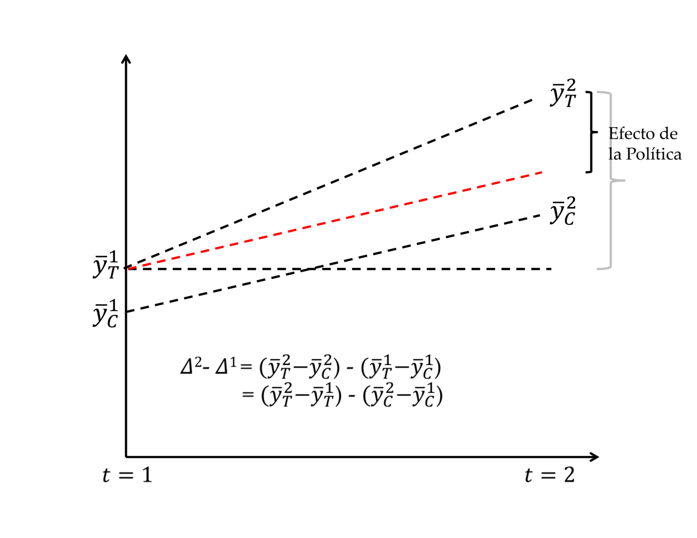
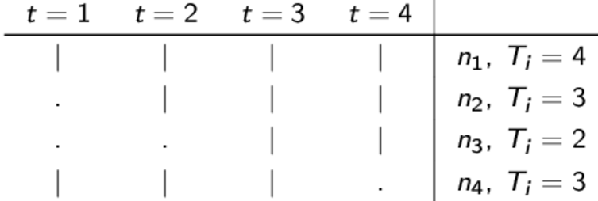
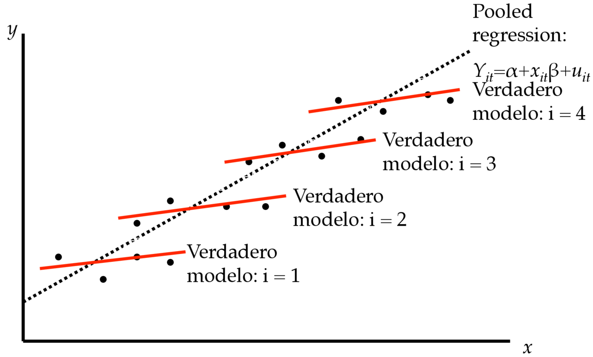

```{r message=FALSE, warning=FALSE, include=FALSE}
library(ggplot2)

theme_set(theme_minimal(base_size = 14))
```

## Categorización

La combinación de datos de corte transversal y de series de tiempo puede
ser dividida en dos categorías:

1.  [Datos Agrupados de Corte Transversal (pooled):]{.emph} muestras aleatorias
    de una población en diferentes momentos del tiempo.

    -   Encuesta Nacional de Empleo (INE) 1986-2013.

    -   Encuesta de Empleo del Gran Santiago (UCHILE) 1960-2013
        (trimestral).

    -   Encuesta Nacional Industrial Anual (ENIA) 1998-2010.

## Categorización

La combinación de datos de corte transversal y de series de tiempo puede
ser dividida en dos categorías:

2.  [Datos de Panel o Datos Longitudinales:]{.emph} Seguimiento en diferentes
    momentos en el tiempo de las mismas unidades de corte transversal
    (la muestra aleatoria se define una sola vez).

    -   Encuesta de Protección Social (2002-2004-2006-2009).

    -   Panel CASEN (1996-2001-2006).

    -   Encuesta Longitudinal de Empresas (cada dos años, 2009-2015)

    -   Penn World Table (189 países entre 1950-2010).

# Datos Agrupados de Corte Transversal

## Datos Agrupados de Corte Transversal

*Precios de viviendas en dos años diferentes:*

```{r}
#| warning: false
 
library(haven)
db <- read_dta("http://fmwww.bc.edu/ec-p/data/wooldridge/hprice3.dta")
head(db[,1:12], n=6)
tail(db[,1:12], n=6)
```

## Datos Agrupados de Corte Transversal

Ventajas:

-   Aumenta el tamaño de muestra (y los grado de libertad).

-   Permite contar con mayor variabilidad y tener menor colinealidad.

-   Permite investigar el efecto del tiempo.

-   Permite investigar cómo las relaciones pueden haber cambiado en el
    tiempo.

Potenciales Problemas:

-   Las observaciones no son $i.i.d.$: Las distribuciones de
    probabilidad pueden cambiar en el tiempo (no están idénticamente
    distribuidas).

-   Las estimaciones pueden adolecer del problema de sesgo de
    heterogeneidad (no observables relevantes omitidos).

## Datos Agrupados de Corte Transversal

Controlando por cambios en el tiempo en la media de la distribución:

-   Suponga que tenemos $T$ periodos: incluir variables dummy por período.
    $$y_{i}=\beta_{0}+\beta_{1}x_{1i}+..+\beta_{K}x_{Ki}+\delta_{2}D_{2i}+...+\delta_{T}D{}_{Ti}+u_{i}$$
    donde $D_{ti}=1$ si el período es $t$ y cero en cualquier otro caso.

-  Permitimos que el intercepto cambie (y con ello la media
    condicional de $y$): $$\begin{aligned}
    E[y_{i}|x,D_{2i}=0,...,D_{Ti}=0] & = & \beta_{0}+\beta_{1}x_{1i}+..+\beta_{K}x_{Ki}\\
    E[y_{i}|x,D_{2i}=1,...,D_{Ti}=0] & = & \left(\beta_{0}+\delta_{2}\right)+\beta_{1}x_{1i}+..+\beta_{K}x_{Ki}\\
     & \vdots\\
    E[y_{i}|x,D_{2i}=0,...,D_{Ti}=1] & = & \left(\beta_{0}+\delta_{T}\right)+\beta_{1}x_{1i}+..+\beta_{K}x_{Ki}
    \end{aligned}$$

-   Todos los métodos vistos antes aplican.

## Ejemplo 1: Evolución de las Tasas de Fertilidad (Sander, 1992)

```{r}
db <- read_dta("http://fmwww.bc.edu/ec-p/data/wooldridge/fertil1.dta")
aggregate(kids~year, data = db, FUN = mean)
aggregate(kids~year, data = db, FUN = var)
```

## Ejemplo 1: Evolución de las Tasas de Fertilidad (Sander, 1992)

```{r}
reg <- lm(kids~educ+age+I(age^2)+black+east+northcen+west+farm
          +othrural+town+smcity+y74+y76+y78+y80+y82+y84, data = db)
summary(reg)
```

## Ejemplo 1: Evolución de las Tasas de Fertilidad (Sander, 1992)

-   Las variables binarias temporales tienen una alta significancia
    conjunta.

```{r}
library(AER)
linearHypothesis(reg, c("y74=0","y76=0","y78=0","y80=0","y82=0","y84=0"))
```

## Ejemplo 1: Evolución de las Tasas de Fertilidad (Sander, 1992)

-   Es probable que existe heterocedasticidad. Usamos el test Breusch-Pagan con $H_0$ homoscedasticidad.

```{r}
bptest(reg)
```

\ 

::: {.callout-note icon=false}

## Nota: 

Recuerde que el test de Breusch-Pagan corre una regresión de $\hat{u}^2$ contra todas las variables explicativas y luego realiza un test F de significancia conjunta. La hipótesis nula es que todos los parámetros son conjuntamente cero, y por tanto $\mathbb{E}[\hat{u}^2]=cte$.
:::

## Datos Agrupados de Corte Transversal

Controlando por cambios en el tiempo en la varianza de la distribución:

-   Usamos MCG factibles suponiendo que la varianza del error es
    distinta para los diferentes periodos.

-   En el modelo
    $y_{i}=\beta_{0}+\beta_{1}x_{1i}+..+\beta_{K}x_{Ki}+u_{i}$
    definimos:
    $$Var(u_{i}|x,d)=\sigma_{i}^{2}=\exp(\delta_{1}D_{1i}+\delta_{2}D_{2i}+...+\delta_{T}D{}_{Ti})=h(d)$$

-   Note que podemos escribir: $$\begin{aligned}
    u_{i}^{2} & =  \exp(\delta_{1}D_{1t}+\delta_{2}D_{2i}+...+\delta_{T}D{}_{Ti})v_{i}\\
    E[u_{i}^{2}|x,d] & =  \exp(\delta_{1}D_{1t}+\delta_{2}D_{2i}+...+\delta_{T}D{}_{Ti})
    \end{aligned}$$ dado $E[v_{i}|x,d]=1$. 

## Datos Agrupados de Corte Transversal

Controlando por cambios en el tiempo en la varianza de la distribución:

-   Alternativamente:
    $$log(u_{i}^{2})=\delta_{1}D_{1t}+\delta_{2}D_{2i}+...+\delta_{T}D{}_{Ti}+\omega_{i}$$

-   Conociendo la función $h(d)$ podemos transformar el modelo y
    corregir por heterocedasticidad.

## Datos Agrupados de Corte Transversal

Procedimiento MCG Factibles

1.  Ejecutar la regresión de $y$ sobre $x_{1},x_{2},\ldots,x_{K}$ y
    obtener los residuos $e^{2}$.

2.  Obtener $\log(e^{2})$ elevando primero al cuadrado los residuales de
    MCO y en seguida tomando el logaritmo natural.

3.  Ejecutar la regresión de $\log(e^{2})$ sobre
    [$D_{1i},D_{2i},\ldots,D_{Ti}$]{.roman} obtener los valores
    ajustados,
    $\hat{g_{i}}=\hat{\delta}_{1}D_{1i}+\hat{\delta}_{2}D_{2i}+...+\hat{\delta}_{T}D{}_{Ti}$.

4.  Exponenciar los valores ajustados: $\hat{h}_{i}=\exp(\hat{g}_{i})$ .

5.  Ejecutar la regresión de $y_{i}^{*}$ sobre
    $x_{1i}^{*},x_{2i}^{*},\ldots,x_{Ki}^{*}$ donde
    $var_{i}^{*}=\frac{var_{i}}{\sqrt{\hat{h}_{i}}}$.

## Ejemplo 1: Evolución de las Tasas de Fertilidad (Sander, 1992)

Implementación:

```{r}
reg1 <- lm(kids~educ+age+I(age^2)+black+east+northcen+west+farm
           +othrural+town+smcity+y74+y76+y78+y80+y82+y84, data = db)

db$errores1 <- resid(reg1)
db$errores1_2 <- db$errores1^2
 
reg2 <- lm(log(errores1_2)~y74+y76+y78+y80+y82+y84, data = db)

db$h = exp(fitted(reg2))
db$ponderador = 1/db$h

reg3 <- lm(kids~educ+age+I(age^2)+black+east+northcen+west+farm
           +othrural+town+smcity+y74+y76+y78+y80+y82+y84, data = db, 
           weights = ponderador)

summary(reg3)
```

## Datos Agrupados de Corte Transversal

**Test de Chow:** Test para verificar si la función de regresión cambia
en el tiempo.

-   Modelo restringido:
    $$y_{i}=\beta_{0}+\beta_{1}x_{1i}+..+\beta_{K}x_{Ki}+\delta_{2}D_{2i}+...+\delta_{T}D{}_{Ti}+u_{i}\rightarrow MCO\,(\widehat{\beta},\widehat{\delta})$$
    obtener $SCR_{R}$.

-   Modelo No restringido:
    $$y_{i}^{(n_{t})}=\beta_{0}+\beta_{1}x_{1i}^{(n_{t})}+..+\beta_{K}x_{Ki}^{(n_{t})}+u_{i}^{(n_{t})}\rightarrow MCO\,\widehat{\beta}\,\textrm{para}\,n_{1},..,n_{T}$$
    obtener $SCR_{NR}=SCR_{n_{1}}+...+SCR_{n_{T}}$.


## Datos Agrupados de Corte Transversal

-   Verificamos $H_{0}:\beta_{1}=...=\beta_{T}$ (la recta de regresión no cambia) usando
    $$F=\frac{\left(SCR_{R}-SCR_{NR}\right)/(T-1)K}{SCR_{NR}/n-T-TK}\sim F_{(T-1)K,n-T-TK}$$
    con $n=n_{1}+...+n_{T}.$ Este test no es robusto bajo
    heterocedasticidad. En este caso es mejor construir un test basado
    en términos interacción.

## Datos Agrupados de Corte Transversal

### Análisis de Política

-   Los datos surgen de un experimento natural (o de un
    cuasiexperimento): Evento exógeno modifica el contexto de toma de
    decisiones.

-   Dos cortes transversales extraídos de una población (antes y después
    de una intervención).

-   Supuesto Clave: El grupos de tratamiento y control son
    aleatoriamente elegidos.

-   La variable de impacto es $y$ (ingresos, puntaje escolar, asistencia
    escolar, etc).

-   Buscamos responder: ¿Qué parte del cambio en la variable $y$ se debe
    a la intervención?

-   El modelo de regresión además permite controlar por otras variables
    que afectan $y$.

## Datos Agrupados de Corte Transversal

### Análisis de Política

*Idea Básica*: El estimador *Diferencia de la Diferencia*:

{fig-align="center"}

Interpretación: [Efecto promedio del tratamiento]{.emph}

## Datos Agrupados de Corte Transversal

### Análisis de Política

En el contexto de regresión tenemos: 
\begin{aligned}
    y_{i}^{1} & = & x_{i}^{1}\beta^{1}+\delta^{1}d_{i}+u_{i}^{1}\,\,\,AP\\
    y_{i}^{2} & = & x_{i}^{2}\beta^{2}+\delta^{2}d_{i}+u_{i}^{2}\,\,\,DP
\end{aligned} 
$$d_{i}=\begin{cases}
    1 & \text{Tratado por la Política}\\
    0 & \text{E.O.C}
    \end{cases}$$ 

Note que: 
\begin{aligned}
    \Delta^{1} & = & E[y^{1}|x^{1},d=1]-E[y^{1}|x^{1},d=0]=\delta^{1}\\
    \Delta^{2} & = & E[y^{2}|x^{2},d=1]-E[y^{2}|x^{2},d=0]=\delta^{2}
\end{aligned}

Entonces el estimador [diferencia de la diferencia]{.emph} es: $\Delta^{2}-\Delta^{1}=\delta^{2}-\delta^{1}$

## Datos Agrupados de Corte Transversal

### Análisis de Política

Modelo alternativo (agrupando ambas muestras):
$$y_{i}=x_{i}\beta+\delta_{0}d_{i}+\delta_{1}p_{i}+\delta_{2}d_{i}p_{i}+u_{i}$$
$$p_{i}=\begin{cases}
    1 & \text{Después de la Política}\\
    0 & \text{E.O.C.}
    \end{cases}$$ 
    
Note que: 
\begin{aligned}
    \Delta^{1} & =  E[y|x,d=1,p=0]-E[y|x,d=0,p=0]=\delta_{0}\\
    \Delta^{2} & =  E[y|x,d=1,p=1]-E[y|x,d=0,p=1]=\delta_{0}+\delta_{2}
\end{aligned}

Entonces el estimador diferencia de la diferencia es: $\Delta^{2}-\Delta^{1}=\delta_{2}$

El test de significativa del *efecto promedio del tratamiento* es directo con un
test $t$.

## Ejemplo 2: Efecto ubicación de un incinerador de basura sobre los precios de las viviendas (Kiel y McClain, 1995)

```{r}
db <- read_dta("http://fmwww.bc.edu/ec-p/data/wooldridge/kielmc.dta")

reg_efp <- lm(rprice~y81+nearinc+y81nrinc+age+agesq+intst+land+area+
                  rooms+baths, data = db)
summary(reg_efp)
```

## Ejemplo 2: Efecto ubicación de un incinerador de basura sobre los precios de las viviendas (Kiel y McClain, 1995)

Alternativamente (para medir el efecto porcentual):

```{r}
reg_perefp <- lm(log(rprice)~y81+nearinc+y81*nearinc+age+agesq+intst+
                     land+area+rooms+baths, data = db)
summary(reg_perefp)
```

# Datos de Panel

## Datos de Panel

Estadísticas de delincuencia a nivel estado para dos años

```{r}
library(dplyr)
db <- read_dta("http://fmwww.bc.edu/ec-p/data/wooldridge/prison.dta")
db_8690 <- db %>% 
    filter(year %in% c(86,90)) %>% 
    select(state, year, unem, criv, crip, incpc, polpc)

head(db_8690, n=6)
tail(db_8690, n=6)
```

## Datos de Panel 

### Consideraciones Básicas

-   En general, los datos se observan a intervalos regulares de tiempo.

-   Los datos de panel pueden ser balanceados ($T_{i}=T$ para todo $i$)
    o no balanceados ($T_{i}\neq T$ para algún $i$).

    -   la selección muestral debe ser aleatoria.

-   Se pueden tener paneles:

    -   de muchos individuos y pocos períodos temporales (*short
        panels*).

    -   de pocos individuos y muchos períodos temporales (*long
        panels*).

    -   de muchos individuos y muchos períodos temporales.

## Datos de Panel 

### Consideraciones Básicas

-   Para paneles balanceados, describir el número de observaciones implica:

    -   Número de individuos distintos $N$.

    -   Total de periodos cubiertos por el panel $T$.

    -   El número total de observaciones es simplemente $NT$.

-   Para paneles NO balanceados, además debemos considerar:

    -   Períodos concretos en que se observa cada individuo $T_{i}$ (o
        su media).

    -   Número total de observaciones $\sum_{i=1}^{N}T_{i}$.

-   También se puede presentar el siguiente patrón de observaciones:

{fig-align="center"}

## Datos de Panel

### Modelo de Componentes de Error

**Motivación:** Supongamos que el verdadero modelo es:

$$y_{i}=\beta_{0}+\beta_{1}x_{1i}+\beta_{2}x_{2i}+u_{i}$$ pero
estimamos:
$$y_{i}=\widetilde{\beta}_{0}+\widetilde{\beta}_{1}x_{1i}+u_{i}$$ usando
MCO:
$$\widetilde{\beta}_{1}=\frac{\sum(x_{1i}-\overline{x}_{1})(y_{i}-\overline{y})}{\sum(x_{1i}-\overline{x}_{1})^{2}}$$

## Datos de Panel

### Modelo de Componentes de Error

¿Qué sucede con las propiedades de $\widetilde{\beta}_{1}$?

$$E[\widetilde{\beta}_{1}]=\beta_{1}+\beta_{2}\frac{\sum(x_{1i}-\overline{x}_{1})(x_{2i}-\overline{x}_2)}{\sum(x_{1i}-\overline{x}_{1})^{2}}$$
[Sesgo por variables omitidas]{.emph} (la dirección depende de la correlación entre $x_1$ y $x_2$).

## Datos de Panel

### Modelo de Componentes de Error

**Ahora en el contexto de panel:** Supongamos que estimamos el siguiente
modelo agrupando (pooled) los datos e ignorando la estructura de panel.
$$y_{it}=\beta_{0}+\beta_{1}x_{1it}+\beta_{2}x_{2it}+...+\beta_{K}x_{Kit}+u_{it}$$
El modelo sufre de sesgo por variable omitidas (heterogeneidad).

{fig-align="center"}

## Datos de Panel

### Modelo de Componentes de Error

**Alternativa**: Reconocer que existen factores no observados que afectan a la variable dependiente. 
\begin{aligned}
y_{it} & =  \beta_{0}+\beta_{1}x_{1it}+\beta_{2}x_{2it}+...+\beta_{K}x_{Kit}+{u_{it}}\\
 & =  \beta_{0}+\beta_{1}x_{1it}+\beta_{2}x_{2it}+...+\beta_{K}x_{Kit}+{\alpha_{i}+\delta_{t}+\epsilon_{it}}
 \end{aligned}
 
 donde:

-   $u_{it}=\alpha_{i}+\delta_{t}+\epsilon_{it}$: Término de error
    compuesto (no observable).

    -   $\alpha_{i}$: Efectos individuales (heterogeneidad no
        observada).

    -   $\delta_{t}$: Efecto temporal

    -   $\epsilon_{it}$: Error idiosincrático.

## Datos de Panel

### Modelo de Componentes de Error

-   El efecto temporal $\delta_{t}$ puede ser estimado usando variable
    binarias temporales, al igual que en el caso de datos agrupados.

-   ¿Cómo tratamos el efecto individual $\alpha_{i}$? La literatura de
    Panel de Datos se enfoca en este problema.

    -   Caso 1 ($\alpha_{i}=0$): En este caso, $u_{it}=\epsilon_{it}$ satisface todos los supuestos.
        \begin{aligned}
        E[\epsilon_{it}|x_{it}] & =  0\\
        E[\epsilon_{it}\epsilon_{hs}] & =  \begin{cases}
        \sigma^{2} & \textrm{si}\,i=h\,\textrm{y}\,t=s\\
        0 & \textrm{si}\,i\neq h\,\textrm{o}\,t\neq s
        \end{cases}
        \end{aligned}
        
        El estimador de MCO es MELI. El panel no agrega información.

    -   Caso 2 ($\alpha_{i}\neq0$): Todo depende si el efecto individual
        está o no correlacionado con las variables explicativas del
        modelo.

## Datos de Panel

### El Estimador en Primeras Diferencias

Supongamos que tenemos un panel con $N$ grande y $T=2$:
\begin{aligned}
y_{i1} & =  \beta_{0}+\beta_{1}x_{1i1}+\beta_{2}x_{2i1}+...+\beta_{K}x_{Ki1}+{\alpha_{i}+\epsilon_{i1}}\\
y_{i2} & =  \beta_{0}+\beta_{1}x_{1i2}+\beta_{2}x_{2i2}+...+\beta_{K}x_{Ki2}+{\alpha_{i}+\epsilon_{i2}}
\end{aligned}

Tomando la diferencia tenemos:
$$\Delta y_{i}=\beta_{1}\Delta x_{1i}+\beta_{2}\Delta x_{2i}+...+\beta_{K}\Delta x_{Ki}+\Delta\epsilon_{i}$$
Esta es conocida como *ecuación en primera diferencia*. 

**Note que el efecto individual desaparece y por tanto MCO puede ser aplicado.**

## Datos de Panel

### El Estimador en Primeras Diferencias

-   Para obtener estimadores consistentes e insesgados se requiere:
    $E[\Delta\epsilon_{i}|\Delta x_{i}]=0$ para todo $i$.

-   Variabilidad en $\Delta x_{i}$ con respecto a $i$ es requerida.

-   Variables que no cambian en el tiempo no pueden ser incluidas (es
    imposible diferenciarlas del efecto individual no observado).

## Ejemplo 3: Tasa de criminalidad y la tasa de desempleo

Estamos interesado en la relación entre la tasa de criminalidad y la tasa de desempleo. Planteamos:
$$tc_{it}=\beta_{0}+\beta_{1}td_{it}+u_{it}$$

- Contamos con datos de 46 ciudades y dos años. 

- Nuestra intuición nos dice que $\beta_{1}>0$. 

## Ejemplo 3: Tasa de criminalidad y la tasa de desempleo

Si ignorando la estructura de panel estimamos:

```{r}
db <- read_dta("http://fmwww.bc.edu/ec-p/data/wooldridge/crime2.dta")
reg1 <- lm(crmrte~unem, data = db)
summary(reg1)
```

## Ejemplo 3: Tasa de criminalidad y la tasa de desempleo

Usando un *corte transversal* en $t=87$:

```{r}
reg2 <- lm(crmrte~unem, data = db, subset = year == 87)
summary(reg2)
```

## Ejemplo 3: Tasa de criminalidad y la tasa de desempleo

Ahora usando el *estimador en primeras diferencias*:

```{r}
library(plm)
db.p <- pdata.frame(db, index = 46)
db.p$dcrmrte <- diff(db.p$crmrte)
db.p$dunem   <- diff(db.p$unem)
reg_dif <- lm(dcrmrte~dunem, data = db.p)
summary(reg_dif)
```

## Ejemplo 3: Tasa de criminalidad y la tasa de desempleo

Alternativamente es posible usar directamente el comando `plm` declarando previamente la estructura de panel con `pdata.frame(dabe_datos, index = c("ivar","tvar"))`:

```{r}
reg_dif2 <- plm(crmrte~unem, data = db.p, model = "fd")
summary(reg_dif2)
```

## Análisis de Política con Datos de Panel

-   Los datos de panel son muy útiles para el análisis de políticas, en particular para la evaluación de programas.

-   Se requiere un panel de dos periodos, antes y después de haberse aplicado el programa.

-   Dos grupos:

    -   **Tratados**: Unidades (personas, empresas, ciudades, etc.) que toman parte en un determinado programa o intervención.

    -   **Controles**: Unidades que no toman parte del programa.

-   La idea es similar al uso de datos agrupados. La diferencia importante es que tenemos las mismas unidades antes y después.

-   Esto permite controlar por la posibilidad de que la participación en
    el programa este correlacionada con alguna característica no
    observada.

## Análisis de Política con Datos de Panel

-   Definamos: 

    - $y_{it}$: variable resultad.
    
    - $prog_{it}$: variable binaria de participación en el programa.
    
    - $d2_{t}$: variable binaria temporal (efecto temporal).

-   El modelo (simple) de efectos inobservables para la evaluación de política es:
    $$y_{it}=\beta_{0}+\delta_{0}d2_{t}+\beta_{1}prog_{it}+\alpha_{i}+\epsilon_{it}$$

-   Diferenciando:
    $$\Delta y_{it}=\delta_{0}+\beta_{1}\Delta prog_{it}+\epsilon_{it}$$

## Análisis de Política con Datos de Panel

-   Note que: 
    $$\Delta prog_{it}=\left\{ \begin{array}{ccc}
        1 &  & Tratado\\
        0 &  & Control
        \end{array}\right.$$ 
        
    dado que el programa sólo ocurrió en el segundo periodo.

-   El efecto promedio del tratamiento es entonces: 
    \begin{aligned}
        \hat{\beta_{1}} & =  E[\Delta y_{it}|\Delta prog_{it}=1]-E[\Delta y_{it}|\Delta prog_{it}=0]\\
         & =  \overline{\Delta y}{}_{Tratado}-\overline{\Delta y}{}_{Control}
    \end{aligned}

## Ejemplo 4: Políticas de capacitación en las empresas

-   Buscamos evaluar el efecto del programa de capacitación laboral sobre la productividad de los trabajadores (Usar datos JTRAIN de Wooldridge).

-   *Variables resultado:* $\log(scrap_{it})$, Tasa de desperdicio de la industria $i$ durante el año $t$

    -   Unidad de medida: log del número de artículos, por cada 100, que deben desecharse por estar defectuosos.

-   Variable programa: $grant_{it}$, Indicador binario igual a 1 si la empresa $i$ en el año $t$ recibió un subsidio para capacitación .laboral.

## Ejemplo 4: Políticas de capacitación en las empresas

-   El modelo:
    $$\log(scrap_{it})=\beta_{0}+\delta_{0}d2_{t}+\beta_{1}grant_{it}+\alpha_{i}+\epsilon_{it}$$

-   Problema: $\alpha_{i}$ puede estar correlacionado con $grant_{it}$

    -   El subsidio puede priorizar empresas con trabajadores poco
        productivos.

    -   Para mostrar la eficiencia del programa (artificialmente), el
        gobierno podría priorizar empresas con trabajadores altamente
        productivos.

    -   Si el subsidio se asigna a podido de la empresa, el hecho que
        ésta pida el subsidio podría depender de la productividad de los
        trabajadores.

## Ejemplo 4: Análisis de políticas de capacitación en las empresas

```{r}
#| echo: false
library(plm)
db <- read_dta("http://fmwww.bc.edu/ec-p/data/wooldridge/jtrain.dta")
db.p <- pdata.frame(db, index = c("fcode","year"))
reg <- plm(log(scrap)~d88+grant, data = db.p, model = "fd", subset = year %in% c(1987,1988))
summary(reg)
```

*El subsidio de capacitación laboral reduce la tasa de desperdicio en cerca de 27.2%:  $\exp(-0.317)-1=0.272$*.

## Datos de Panel

### El Estimador en Primeras Diferencias en Paneles con más de dos periodos

¿Qué sucede si $T>2$? Tomemos dos periodos luego de diferenciar la
ecuación:
\begin{aligned}
    Cov(\Delta\epsilon_{it},\Delta\epsilon_{it-1}) & =  E[\Delta\epsilon_{it}\Delta\epsilon_{it-1}]-E[\Delta\epsilon_{it}]E[\Delta\epsilon_{it-1}]\\
     & =  E[\Delta\epsilon_{it}\Delta\epsilon_{it-1}]
\end{aligned}

donde: $\Delta\epsilon_{it}=\epsilon_{it}-\epsilon_{it-1}$ y
$\Delta\epsilon_{it-1}=\epsilon_{it-1}-\epsilon_{it-2}$. 

Note que:
$$E[\Delta\epsilon_{it}\Delta\epsilon_{it-1}]=-\sigma_{\epsilon}^{2}\neq0$$
El modelo adolece de un problema de autocorrelación.

## Datos de Panel

### El Estimador en Primeras Diferencias en Paneles con más de dos periodos

Existen dos modelos alternativo para estimar modelos con componentes no
observables. Éstos difieren según el tratamiento de $\alpha_{i}$:

-   Modelo de Efectos Fijos: Supone $Cov(x_{it},\alpha_{i})\neq0$

-   Modelo de Efectos Aleatorios: Supone $Cov(x_{it},\alpha_{i})=0$

## Datos de Panel

### Modelo de Efectos Fijos

El Modelo:
$$y_{it}=\beta_{0}+\beta_{1}x_{1it}+\beta_{2}x_{2it}+...+\beta_{K}x_{Kit}+\alpha_{i}+\epsilon_{it}$$
Los regresores pueden estar correlacionados con $\alpha_{i}$:

-   No es necesario especificar la forma concreta de la correlación.

-   Todo el análisis será condicional en $\alpha_{i}$.

Supuesto fundamental: 
$$E[\epsilon_{it}|\alpha_{i},x_{it}]=0$$ 

Los regresores deben seguir estando no correlacionados con $\epsilon_{it}$.

## Datos de Panel

### Modelo de Efectos Fijos

Esto implica
$E[y_{it}|\alpha_{i},x_{it}]=\beta_{0}+\beta_{1}x_{1it}+\beta_{2}x_{2it}+...+\beta_{K}x_{Kit}+\alpha_{i}$
y por tanto:
$$\frac{\partial E[y_{it}|\alpha_{i},x_{it}]}{\partial x_{jit}}=\beta_{j}$$

Se puede identificar el efecto marginal aunque el regresor sea endógeno
(respecto del error compuesto).

## Datos de Panel

### Modelo de Efectos Fijos

Algunos problemas de estimación:

-   En principio, se necesitan estimar $\alpha_{1},...,\alpha_{N}$ junto
    con los parámetros $\beta$ ($N+K$).

    -   En paneles cortos, la estimación de los parámetros necesita
        $N\rightarrow\infty$.

    -   La estimación de los $\beta$ podría estar sesgada por estimar
        "infinitos" parámetros auxiliares $\alpha_{i}$.

-   Alternativamente, se puede estimar el modelo transformado para
    eliminar $\alpha_{i}$.

    -   Sólo se identifica $\beta$ para regresores que varían en el
        tiempo.

## Datos de Panel

### Modelo de Efectos Fijos

Estimar consistentemente puede NO ser suficiente:

-   Para predecir $y_{it}$:
    $$E[y_{it}|x_{it}]=x_{it}\beta+E[\alpha_{i}|x_{it}]$$ en paneles
    cortos, $E[\alpha_{i}|x_{it}]$ no se estima consistentemente.


## Datos de Panel

### Modelo de Efectos Fijos

El modelo era:
$$y_{it}=\beta_{0}+\beta_{1}x_{1it}+\beta_{2}x_{2it}+...+\beta_{K}x_{Kit}+\alpha_{i}+\epsilon_{it}$$
Las realizaciones de $\alpha_{i}$ sólo pueden ser estimadas con un
panel. Supuestos: $$\begin{array}{ccc}
    E[\epsilon_{it}|x]=0 &  & Var[\epsilon_{it}]=\sigma_{\epsilon}^{2}\\
    E[\alpha_{i}\alpha_{j}]=0\,j\neq i &  & Var[\alpha_{i}]=\sigma_{\alpha}^{2}\\
    E[\alpha_{i}\epsilon_{it}]=0 &  & E[\alpha_{i}]=0
    \end{array}$$

Note que:
$$E[x_{kit}u_{it}]=E[x_{kit}\alpha_{i}]\neq0\,\,\,\,\,\,\,\forall k=1,..,K$$

## Datos de Panel

### Modelo de Efectos Fijos

El modelo puede ser visto como un modelo lineal en donde cada individuo
tiene su intercepto:
$$y_{it}=\underbrace{\alpha_{i}}+\beta_{1}x_{1it}+\beta_{2}x_{2it}+...+\beta_{K}x_{Kit}+\epsilon_{it}$$
El modelo se puede estimar por MCO con $N$ variables ficticias por individuo.

## Datos de Panel

### Modelo de Efectos Fijos

La estimación del modelo se puede realizar incluyendo $N-1$ variables
binarias por individuo:
$$y_{it}=\alpha_{1}+\alpha_{2}d_{2it}+...+\alpha_{N}d_{Nit}+\beta_{1}x_{1it}+\beta_{2}x_{2it}+...+\beta_{K}x_{Kit}+\epsilon_{it}$$

Donde: $$d_{jit}=\begin{cases}
    1 & Individuo\,j\\
    0 & e.c.o.c.
    \end{cases}$$

Entonces, *el estimador de efectos fijos (EF)* es el estimador de MCO
agregando $N-1$ variables dummy (una por cada por individuo, exepto 1).

Note que éste estimador genera los problemas mencionados antes cuando $N\rightarrow\infty$.

## Datos de Panel

### Modelo de Efectos Fijos

**Efectos Fijos y la Transformación "Within":** El modelo era:
$$y_{it}=\beta_{0}+\beta_{1}x_{1it}+\beta_{2}x_{2it}+...+\beta_{K}x_{Kit}+\alpha_{i}+\epsilon_{it}$$
Tomando promedios por individuo:
$$\bar{y}_{i}=\beta_{0}+\beta_{1}\bar{x}_{1i}+\beta_{2}\bar{x}_{2i}+...+\beta_{K}\bar{x}_{Ki}+\alpha_{i}+\bar{\epsilon}_{it}$$
donde:
$$\bar{y}_{i}=\frac{1}{T}\sum_{t=1}^{T}y_{it}\,\,\,\,\,\bar{x}_{ki}=\frac{1}{T}\sum_{t=1}^{T}x_{kit}\,\,\,\,\,\bar{\epsilon}_{i}=\frac{1}{T}\sum_{t=1}^{T}\epsilon_{it}$$

## Datos de Panel

### Modelo de Efectos Fijos

Restando:
$$y_{it}-\bar{y}_{i}=\beta_{1}\left(x_{1it}-\bar{x}_{1i}\right)+\beta_{2}\left(x_{2it}-\bar{x}_{2i}\right)+...+\beta_{K}\left(x_{Kit}-\bar{x}_{Ki}\right)+\epsilon_{it}-\bar{\epsilon}_{i}$$
o alternativamente:
$$\ddot{y}_{it}=\beta_{1}\ddot{x}_{1it}+\beta_{2}\ddot{x}_{2it}+...+\beta_{K}\ddot{x}_{Kit}+\ddot{\epsilon}_{it}$$

**El estimador de efectos fijos (EF)** es el estimador MCO del modelo en
desvíos respecto a las medias individuales.

## Datos de Panel

### Modelo de Efectos Fijos

Entonces, existen dos formas idénticas de computar [el estimador de
efectos fijos (EF)]{.emph} (Teorema de Frisch,Waugh, Lovell):

-   Regresión de $y_{it}$ sobre $x_{it}=(x_{1it},...,x_{Kit})$ y variables
    dummy por individuo.

-   Regresión de $y_{it}-\bar{y}_{i}$ sobre
    $\bar{x}_{it}-\bar{x}_{i}=(x_{1it}-\bar{x}_{1i},...,x_{Kit}-\bar{x}_{Ki})$

Propiedades del *estimador de efectos fijos (EF)*

-   Es insesgado ($x_{it}=(x_{1it},...,x_{Kit})$ y
    $d_{it}=(d_{1it},...,d_{Nit})$ son exógenas con respecto a
    $\epsilon_{it}$).

-   Es consistente, cuando $N\rightarrow\infty$ o $T\rightarrow\infty$.
    Importante: la insesgadez y consistencia del estimador no supone que
    $x_{it}$ y $d_{it}$ son ortogonales (puede haber correlación entre
    ellos).

## Datos de Panel

### Modelo de Efectos Fijos

**Control de heterogeneidad:** Supongamos que el modelo es:
$$y_{it}=\beta_{0}+\beta x_{it}+\phi z_{i}+\alpha_{i}+\epsilon_{it}$$ La
transformación "within" de este modelo es:
$$\ddot{y}_{it}=\ddot{x}_{it}\beta+\ddot{\epsilon}_{it}$$ La
transformación elimina cualquier variable que no varia en el tiempo:

-   Si $z_{i}$ es observable, ésta no puede ser usada en el modelo.

-   Si $z_{i}$ es no observable, estimar EF permite "controlar" por su
    presencia.
    
[Este es el sentido en el cual la disponibilidad de paneles permite controlar por variables omitidas que no varían en el tiempo.]{.emph}


## Datos de Panel

### Modelo de Efectos Fijos

Test de Significancia de los Efectos Fijos: 
\begin{aligned}
    H_{0} & :  \alpha_{2}=\alpha_{3}=...=\alpha_{N}=0\\
    H_{1} & :  \text{Al menos uno es significativo}
\end{aligned}

Este es un test de Chow donde:

-   $SCR_{R}$ Modelo que aplica MCO agrupados 

-   $SCR_{NR}$ Regresión con Variables Dummy (si $N$ es muy grande, se
    usa el Estimador "Within").

$$F=\frac{(SCR_{R}-SCR_{NR})/N-1}{SCR_{R}/(NT-N-K)}\sim F_{N-1,NT-N-K}$$

## Ejemplo 5: Ecuación de Mincer y los Retornos de la Educación
$$ln(w_{it})=\beta_{0}+\beta_{1}e_{it}+\beta_{2}x_{it}+\beta_{3}x_{it}^{2}+z_{it}\delta+{\alpha_{i}+\epsilon_{it}}$$

-   $w_{it}$ salario.

-   $e_{it}$ educación.

-   $x_{it}$ experiencia.

-   $z_{it}$ incluye controles tales como raza, genero, estado civil,
    pertenencia a un sindicato, etc.

Estamos interesados en el parámetro $\beta_{1}$ y usamos datos de Vella y Verbeek (1998): Panel balanceado de $N=545$ y $T=8$. Problema: $e_{it}$ no tiene variabilidad temporal.

## Ejemplo 5: Ecuación de Mincer y los Retornos de la Educación

MCO Agrupados:

```{r}
#| echo: false
library(plm)
db <- read_dta("http://fmwww.bc.edu/ec-p/data/wooldridge/wagepan.dta")
reg_mco <- lm(lwage~educ+exper+I(exper^2)+union+black+hisp+married, data = db)
summary(reg_mco)
```

## Ejemplo 5: Ecuación de Mincer y los Retornos de la Educación

Usamos la estructura de panel:

```{r}
#| echo: false
db.p = pdata.frame(db, index = c("nr", "year"))
head(subset(db.p, select = c("black","exper","hisp","married","educ",
                             "union","lwage")), n=15)
```

## Ejemplo 5: Ecuación de Mincer y los Retornos de la Educación

Estimador en primeras diferencias:

```{r}
#| echo: false
reg_dif <- plm(lwage~educ+exper+I(exper^2)+union+black+hisp+married, 
               data = db.p, model = "fd")
summary(reg_dif)
```

## Ejemplo 5: Ecuación de Mincer para Medir los Retornos de la Educación

Estimador Within (efectos fijos):

````{r}
#| echo: false
reg_ef <- plm(lwage~educ+exper+I(exper^2)+union+black+hisp+married, 
              data = db, model = "within")
summary(reg_ef)
```

## Ejemplo 5: Ecuación de Mincer para Medir los Retornos de la Educación

Estimador Within con Variables Dummy Temporales:

```{r}
#| echo: false
reg_ef_cd <- plm(lwage~educ+exper+I(exper^2)+union+black+hisp+married
                 +educ:d81+educ:d82+educ:d83+educ:d84+educ:d85+educ:d86
                 +educ:d87, data = db.p, model = "within")
summary(reg_ef_cd)
```

## Datos de Panel

### Errores Estándar del Modelo de Efectos Fijos

-   Hasta ahora hemos supuesto que $E[\epsilon_{it} \epsilon_{js}] = 0$
    para todo $i \neq j$ y $t \neq s$ y que
    $V[\epsilon_{it}] = \sigma^2_{\epsilon}$.

-   Si bien las muestras son aleatorias en las unidades $i$, y es
    razonable suponer que no existe correlación entre ellas, es
    perfectamente posible que exista correlación temporal al interior de
    las unidades de corte transversal.

-   Podrían existir variables omitidas autocorrelacionadas (cuyos
    efectos persisten en el tiempo), que generan la misma
    autocorrelación en los errores a nivel de individuo.

## Datos de Panel

### Errores Estándar del Modelo de Efectos Fijos

-   Si los errores están autocorrelacionados, la los errores estándares
    de MCO no son adecuados. Usaremos el concepto de *errores estándar
    agrupados (clusters)*:
    $$E\left[\epsilon_{i,t} \epsilon_{j,s}\right]=\left\{\begin{array}{ll}0 & \text { si } i\neq j \\ \sigma_{i,(t,s)} & \text { si } i = j\end{array}\right.$$
    lo que supone una correlación arbitraria al interior del grupo. Los
    $\sigma_{i,(t,s)}$ son estimados con los otros parámetros del
    modelo.


## Ejemplo 5: Ecuación de Mincer y los Retornos de la Educación

Estimador Within con Errores Estándar Agrupados:
```{r}
#| echo: false
coeftest(reg_ef_cd, vcov = vcovHC, type = "HC1")
```


## Datos de Panel

### Modelo de Efectos Fijos y Paneles Desbalanceados

-   Las mismas ideas vistas hasta ahora aplican para paneles
    desbalanceados.

-   Por ejemplo, en la transformación Within usamos:
    $$\bar{y}_{i}=\frac{1}{T_{i}}\sum_{t=1}^{T_{i}}y_{it}\,\,\,\,\,\bar{x}_{ki}=\frac{1}{T_{i}}\sum_{t=1}^{T_{i}}x_{kit}\,\,\,\,\,\bar{\epsilon}_{i}=\frac{1}{T_{i}}\sum_{t=1}^{T_{i}}\epsilon_{it}$$

-   Lo difícil en paneles desbalanceados es determinar porqué el panel
    está desbalanceado.

    -   Atrición: La razón por la que la unidad de corte transversal
        deja la muestra está correlacionada con el error idiosincrático
        $\epsilon_{it}$ (lo que es posible con efectos fijos es atrición
        con respecto al componente no observable $\alpha_{i}$).

## Datos de Panel

### Efectos Fijos vs. Estimador en Diferencias

-   Efectos fijos y primeras diferencias son exactamente iguales si
    $T=2$.

-   Para $T>2$, los dos métodos son deferentes. Probablemente el modelo
    de efectos fijos se usa más porque es más fácil de implementar y es
    mejor (eficiencia).

-   El modelo de efectos fijos puede ser rápidamente implementado para
    paneles desbalanceados.

## Datos de Panel

### Modelo de Efectos Aleatorios

-   El efecto individual $\alpha_{i}$ se trata como puramente aleatorio.

    -   Debe especificarse su distribución, condicional en los regresores.

-   Supuesto habitual: $\alpha_{i}$ no está correlacionado con los regresores del modelo y
    $\alpha_{i}|x_{it}\sim N(0,\sigma_{\alpha}^{2})$

-   Se puede estimar el modelo por MCGF:

    -   Todos los coeficientes y efectos marginales, incluyendo de las
        variables que no varían en el tiempo.

    -   La predicción $E[y_{it}|x_{1it},...,x_{Kit}]$.


-   PERO la estimación es inconsistente si el supuesto sobre la distribución de $i$ es incorrecto

    -   Esto es, sí $\alpha_{i}$ está correlacionado con los regresores.


## Datos de Panel

### Modelo de Efectos Aleatorios

El modelo es el mismo

$$y_{it}=\beta_{0}+\beta_{1}x_{1it}+\beta_{2}x_{2it}+...+\beta_{K}x_{Kit}+\alpha_{i}+\epsilon_{it}$$
con EF estimábamos:
$$y_{it}=\alpha_{1}+\alpha_{2}d_{2it}+...+\alpha_{N}d_{Nit}+\beta_{1}x_{1it}+\beta_{2}x_{2it}+...+\beta_{K}x_{Kit}+\epsilon_{it}$$
Si $d_{it}$ es ortogonal a $x_{it}$, esto es $E(\alpha_{i}|x)=0$,
entonces el estimador de MCO de la regresión entre $y_{it}$ y $x_{it}$
es insesgado.

Es decir, si $d_{it}$ es ortogonal a $x_{it}$, la omisión de las
variables binarias no sesga al estimador de MCO.

## Datos de Panel

### Modelo de Efectos Aleatorios

Es mas una cuestión de tratamiento:
$$y_{it}=\beta_{0}+\beta_{1}x_{1it}+\beta_{2}x_{2it}+...+\beta_{K}x_{Kit}+\alpha_{i}+\epsilon_{it}$$

Efectos fijos (controla por $\alpha_{i}$):
$$y_{it}={\beta_{0}+\alpha_{i}}+\beta_{1}x_{1it}+\beta_{2}x_{2it}+...+\beta_{K}x_{Kit}+\epsilon_{it}$$

Efectos aleatorios (tratar $\alpha_{i}$ como variables omitidas):
\begin{aligned}
    y_{it} & =  \beta_{0}+\beta_{1}x_{1it}+\beta_{2}x_{2it}+...+\beta_{K}x_{Kit}+{u_{it}}\\
    u_{it} & =  \alpha_{i}+\epsilon_{it}
\end{aligned}

## Datos de Panel

### Modelo de Efectos Aleatorios

El modelo: 
\begin{aligned}
    y_{it} & =  \beta_{0}+\beta_{1}x_{1it}+\beta_{2}x_{2it}+...+\beta_{K}x_{Kit}+u_{it}\\
    u_{it} & =  \alpha_{i}+\epsilon_{it}
\end{aligned}

Los supuestos: 
$$\begin{array}{ccc}
    E[\epsilon_{it}|x_{it}]=0 &  & Var[\epsilon_{it}]=\sigma_{\epsilon}^{2}\\
    E[\alpha_{i}\alpha_{j}]=0\,\,\,j\neq i &  & E[\alpha_{i}\alpha_{i}]=\sigma_{\alpha}^{2}\\
    E[\alpha_{i}\epsilon_{it}]=0 &  & E[\alpha_{i}|x_{it}]=0
\end{array}$$

## Datos de Panel

### Modelo de Efectos Aleatorios

**Problema:** $u_{it}$ no satisface los supuestos clásicos, aún cuando por separado lo hagan $\alpha_{i}$ y $\epsilon_{it}$. 
\begin{aligned}
    Var(u_{it}) & =  \sigma_{\alpha}^{2}+\sigma_{\epsilon}^{2}\\
    Cov(u_{it},u_{is}) & =  E[u_{it}u_{is}]=\sigma_{\alpha}^{2}\,\,\,\,\,t\neq s\\
    Corr(u_{it},u_{is}) & = \frac{\sigma_{\alpha}^{2}}{\sigma_{\alpha}^{2}+\sigma_{\epsilon}^{2}}\,\,\,\,\,t\neq s
\end{aligned}

## Datos de Panel

### Modelo de Efectos Aleatorios

Intuición:

- Trivialmente, $u_{it}$ está correlacionado con $u_{it-1}$ ya que ambos "comparten" $\alpha_{i}$: la presencia permanente de $\alpha_{i}$ hace que la especificación de efectos aleatorios induzca autocorrelación.

- Si bien MCO es insesgado, no es eficiente, por la presencia de autocorrelación.

- ¿Cuál es el Estimador Eficiente? Mínimos Cuadrados Generalizados (MCG).


## Datos de Panel

### Modelo de Efectos Aleatorios

La transformación de MCG que elimina la correlación serial en los
errores es:
$$\lambda=1-\sqrt{\frac{\sigma_{\epsilon}^{2}}{T\sigma_{\alpha}^{2}+\sigma_{\epsilon}^{2}}}$$
que está entre cero y uno. Por tanto, la ecuación transformada resulta
ser:
$$\tilde{y}_{it}=\tilde{\beta}_{0}+\beta_{1}\tilde{x}_{1it}+...+\beta_{K}\tilde{x}_{Kit}+\tilde{u}_{it}$$
con: 
$$\tilde{y}_{it} = y_{it}-\lambda\overline{y}_{i}\ \ \ \ \ \tilde{x}_{kit} = x_{kit}-\lambda\overline{x}_{ki} \ \ \ \ \ \tilde{\beta}_{0} = \beta_{0}(1-\lambda)$$
    
y donde la barra superior vuelve a indicar los promedios a lo largo del tiempo.

[Ahora $\tilde{u}_{it}$ no está autocorrelacionado.]{.emph}

## Datos de Panel

### Modelo de Efectos Aleatorios

Comentarios:

-   La implementación de MCG requiere primero estimar $\lambda$ (los
    componentes de varianzas).

-   Estimador de efectos aleatorios: estimador MCG.

## Datos de Panel

### Modelo de Efectos Aleatorios

Procedimiento para estimar el modelo de Efectos Aleatorios:

1. Estimar modelo mediante la transformación "Within":
$$\ddot{y}_{it}=\beta_{1}\ddot{x}_{1it}+...+\beta_{K}\ddot{x}_{Kit}+\ddot{\epsilon}_{it}$$

con lo que tendríamos:
$$\hat{\sigma}_{\epsilon}^{2}=\frac{\sum_{t=1}^{T}\sum_{i=1}^{N}\hat{\ddot{\epsilon_{it}}}^{2}}{NT-N-K}$$

## Datos de Panel

### Modelo de Efectos Aleatorios

2. Estimar el modelo "Between" (usando solo datos de corte transversal):
$$\bar{y}_{i}=\beta_{1}\bar{x}_{1i}+...+\beta_{K}\bar{x}_{Ki}+u_{iB}$$
    
donde $u_{iB}=\alpha_{i}+\bar{\epsilon}_{i}$. Tendríamos entonces:
$$\hat{\sigma}_{B}^{2}=\frac{\sum_{i=1}^{N}\hat{u}_{iB}}{N-K}$$


## Datos de Panel

### Modelo de Efectos Aleatorios

3. Recuperar la varianza del componente individual $\alpha_{i}$:
$$\hat{\sigma}_{\alpha}^{2}=\hat{\sigma}_{B}^{2}-\frac{\hat{\sigma}_{\epsilon}^{2}}{T}$$

4. Usando $\hat{\sigma}_{\epsilon}^{2}$ y $\hat{\sigma}_{\alpha}^{2}$ es posible aplicar MCG:
$$\tilde{y}_{it}=\tilde{\beta}_{0}+\beta_{1}\tilde{x}_{1it}+...+\beta_{K}\tilde{x}_{Kit}+\tilde{u}_{it}$$
con: 
$$\tilde{y}_{it} = y_{it}-\hat{\lambda}\overline{y}_{i} \ \ \ \ \ \ 
        \tilde{x}_{kit} = x_{kit}-\hat{\lambda}\overline{x}_{ki} \ \ \ \ \ \
        \tilde{\beta}_{0} = \beta_{0}(1-\hat{\lambda}) \ \ \ \ \ \ \ \hat{\lambda}=1-\sqrt{\frac{\hat{\sigma}_{\epsilon}^{2}}{T\hat{\sigma}_{\alpha}^{2}+\hat{\sigma}_{\epsilon}^{2}}}$$

## Ejemplo 5: Retomando el ejemplo de la ecuación de Mincer

Estimador Between:

```{r}
#| echo: false
reg_be <- plm(lwage~educ+exper+I(exper^2)+union+black+hisp+married, 
              data = db.p, model = "between")
summary(reg_be)
```

## Ejemplo 5: Retomando el ejemplo de la ecuación de Mincer

Estimador de Efectos Aleatorios

```{r}
#| echo: false
reg_ea <- plm(lwage~educ+exper+I(exper^2)+union+black+hisp+married, 
              data = db.p, model = "random")
summary(reg_ea)
```

## Datos de Panel

### Contraste de Efectos Aleatorios de Breusch y Pagan (1980)

Considere las siguientes hipótesis: $$\begin{aligned}
H_{0} & :  \sigma_{\alpha}^{2}=0\,\,\,\,(Corr(u_{it},u_{is})=0)\\
H_{1} & :  \sigma_{\alpha}^{2}\neq0
\end{aligned}$$

El test de los multiplicadores de Lagrange derivado por estos autores
usa el siguiente estadístico:
$$LM=\frac{nT}{2(T-1)}\left[\frac{\sum_{i=1}^{n}\left(\sum_{t=1}^{T}\hat{u}_{it}\right)^{2}}{\sum_{i=1}^{n}\sum_{t=1}^{T}\hat{u}_{it}^{2}}-1\right]\sim\chi^{2}(1)$$


## Datos de Panel

### Efectos Fijos vs. Efectos Aleatorios

El modelo: 
\begin{aligned}
y_{it} & =  \beta_{0}+\beta_{1}x_{1it}+\beta_{2}x_{2it}+...+\beta_{K}x_{Kit}+u_{it}\\
u_{it} & =  \alpha_{i}+\epsilon_{it}
\end{aligned}

-   $Cov(x_{kit},\alpha_{i})=0$: MCO, EF, EA y Between son todos
    consistentes para los $\beta$. **EA es eficiente**.

-   $Cov(x_{kit},\alpha_{i})\neq0$: **Sólo EF es consistente** para los
    $\beta$.

-   La practica gravita mayoritariamente a EF.

## Datos de Panel

### Efectos Fijos vs. Efectos Aleatorios

-   El estimador de Efectos Fijos permite estimar el modelo bajo supuestos menos restrictivos.

    -   Permite correlación entre los regresores y los efectos
        individuales.

    -   Permite estimar el modelo incluso si los regresores son
        "endógenos".

-   **PERO** es menos deseable en otras dimensiones:

    -   Es menos eficiente (al explotar sólo variación "within").

    -   No identifica los coeficientes de regresores que no varíen en el
        tiempo.

-   El estimador de Efectos Aleatorios es más eficiente.

    -   Esto si se cumplen supuestos adicionales a los de Efectos Fijos.

    -   **PERO** puede ser inconsistente.


## Datos de Panel

### Efectos Fijos vs. Efectos Aleatorios

**Contraste de Hausman:**

-   Bajo la hipótesis nula de que se cumplen los supuestos del modelo de
    EA, ambos estimadores (EF y EA) son similares: $$\begin{aligned}
    H_{0} & :  Cov(x_{kit},\alpha_{i})=0\,\,\forall k\\
    H_{1} & :  Cov(x_{kit},\alpha_{i})\neq0\,para\,alg\acute{u}n\,k
    \end{aligned}$$

-   El contraste compara los coeficientes estimables de los regresores
    que varían con el tiempo.

-   El estadístico de contraste mide la "distancia" entre ambas
    estimaciones: si es "grande" se rechaza $H_{0}$.

## Datos de Panel

### Efectos Fijos vs. Efectos Aleatorios

-   Ejemplo: $y_{it}=\beta x_{it}+\alpha_{i}+\epsilon_{it}$
    $$H=\frac{(\hat{\beta}_{EA}-\hat{\beta}_{EF})^{2}}{Var(\hat{\beta}_{EA})-Var(\hat{\beta}_{EF})}\sim\chi^{2}(1)$$

-   *Intuición:* bajo $H_{0}$, $\hat{\beta}_{EA}$ y $\hat{\beta}_{EF}$
    son consistentes, $H$ debería ser pequeño. Bajo $H_{1}$, solo
    $\hat{\beta}_{EF}$ es consistente, $H$ debería ser alto.


## Ejemplo 5: Una vez más con la ecuación de Mincer

Test Hausman:

```{r}
#| echo: false
phtest(reg_ef, reg_ea)
```

## Panel de Datos

### Bondad de Ajuste

-   Se pueden obtener obtener un $R^{2}$ del modelo para los datos
    totales, "Within" y "Between".
    
-   Estos $R^{2}$ se obtienen calculando las correlaciones entre los
    datos observados y los datos predichos por el modelo.
    \begin{aligned}
    R_{T}^{2} & =  \left[Corr(y_{it},x_{it}\hat{\beta})\right]^{2}\\
    R_{W}^{2} & =  \left[Corr(y_{it}-\overline{y}_{i},(x_{it}-\overline{x}_{i})\hat{\beta})\right]^{2}\\
    R_{B}^{2} & =  \left[Corr(\overline{y}_{i},\overline{x}_{i}\hat{\beta})\right]^{2}
    \end{aligned}

-   No existe una descomposición para los $R^{2}$ como en la varianza: cada uno se interpreta independientemente.

## Panel de Datos

### Efectos Temporales

Recordemos que el modelo con dos efectos (uno individual y uno temporal)
era:
$$y_{it}=\beta_{0}+\beta_{1}x_{1it}+\beta_{2}x_{2it}+...+\beta_{K}x_{Kit}+{\alpha_{i}+\delta_{t}+\epsilon_{it}}$$

La constante varía tanto entre individuos, $\alpha_{i}$ , como en el
tiempo, $\delta_{t}$.

En paneles cortos ($T$ pequeño respecto de $N$), $\delta_{t}$ se modela
como "fijo" (con una variable dummy para cada $t$).


