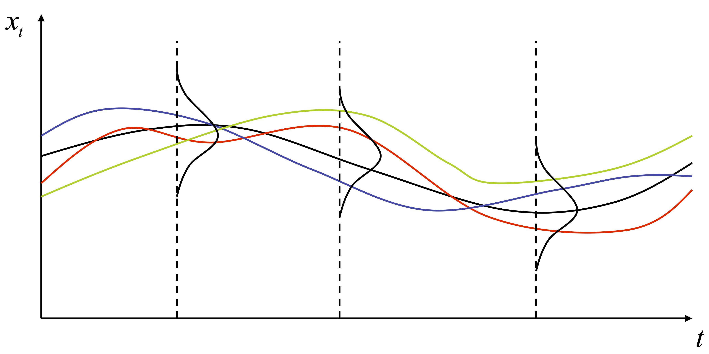

```{r message=FALSE, warning=FALSE, include=FALSE}
library(ggplot2)

theme_set(theme_minimal(base_size = 14))

library(readxl) # Leer documentos xlsx 
library(dynlm)
library(forecast)
library(AER)
```

## Introducción

Serie de tiempo
: *Son datos recopilados para una unidad observacional en múltiples períodos de tiempo.*

\ 

Algunos ejemplos:

-   El consumo agregado y el PIB de un país (20 años de observaciones
    trimestrales = 80 observaciones).

-   El tipo de cambio Pesos/US\$ (datos diarios por 1 año = 365
    observaciones.

-   La horas promedio trabajadas en una semana representativa (datos
    anuales desde 1990 a 2016 = 27 observaciones)

**Nota:** Un aspecto central respecto de corte transversal es que los
datos siguen un orden particular: [el tiempo]{.emph}.

## Algunos ejemplos de series de tiempo
```{r}
pib <- read_xlsx("data/pib_real_anual.xlsx", 
                 sheet = "Cuadro", skip = 2, col_names = c("date","pib"))

pib.ts <- ts(pib$pib, start = 1960, frequency = 1)

plot(pib.ts, col = "red", xlab = "", ylab = "Miles de Millones de Pesos Encadenados",
     lwd = 2, main = "Chile: Producto Interno Bruto Real Anual")
```

## Algunos ejemplos de series de tiempo
```{r}
td <- read_xlsx("data/desempleo.xlsx", 
                 sheet = "Cuadro", skip = 2, col_names = c("date","td"))

td.ts <- ts(td$td, start = c(1986,2), frequency = 12)

plot(td.ts, col = "red", xlab = "", ylab = "Porcentaje de la Fuerza Laboral",
     lwd = 2, main = "Chile: Tasa de Desempleo")
abline(h = mean(td.ts), lty = 2, col="blue")
```

## Algunos ejemplos de series de tiempo
```{r}
tcr <- read_xlsx("data/tipo_cambio_real.xlsx", 
                 sheet = "Cuadro", skip = 3, col_names = c("date","tcr"))

tcr.ts <- ts(tcr$tcr, start = c(1986,1), frequency = 12)

plot(tcr.ts, col = "red", xlab = "", ylab = "Índice 1986 = 100",
     lwd = 2, main = "Chile: Tipo de Cambio Real")
```

## Algunos ejemplos de series de tiempo
```{r}
inf <- read_xlsx("data/inflacion.xlsx", 
                 sheet = "Cuadro", skip = 2, col_names = c("date","inf12"))

inf12.ts <- ts(inf$inf12, start = c(1981,1), frequency = 12)

plot(inf12.ts, col = "red", ylab = "Índice 1986 = 100", xlab = "",
     lwd = 2, main = "Chile: Tasa de Inflación en 12 Meses")
abline(v = 1991.000, lty = 2, col = "blue")
abline(v = 2000.000, lty = 2, col = "blue")
```

## Caracterísisticas típicas de las series de tiempo

1.  Fuertes tendencias.

2.  Difícil de distinguir tendencias y ciclos.

3.  Ciclos estocásticos, difíciles de predecir.

4.  Comportamientos estacionales marcados.

5.  Oscilaciones muy erráticas, no hay tendencias ni ciclos obvios.

6.  Covariaciones sugerentes.

7.  Cambios estructurales.

# Definiciones Básicas

## Proceso Estocástico

Proceso Estocástico o PGD 
: *Sucesión de variables aleatorias ordenadas en el tiempo. Por ejemplo el PIB, el tipo de cambio, el IPC,
etc.
$$\{y_{-\infty},...,y_{0},y_{1},y_{2},...,y_{\infty}\}\,\,o\,\,\{y_{t}\}_{t=-\infty}^{\infty}$$*

-   Note que cada $y_{t}$ es una variable aleatoria y tendrá su propia
    función de distribución $F(r)=p(y\leq r)$ con sus correspondientes
    momentos ($E(y_{t}),V(y_{t}),...$).

-   Para caracterizar un proceso estocástico en un período $1$ a $T$
    debemos especificar las funciones de distribución conjunta de estas
    variables ($F(y_{1},y_{2},...,y_{T})$).

-   Consideramos sólo observaciones consecutivas y equidistantes. La distancia en el tiempo se denomina
    **frecuencia**: anual, trimestral, mensual, semana, diaria.

## Serie de Tiempo

Serie de Tiempo
: *La serie de tiempo $\{y_{1},...,y_{T}\}$, con $T$ el número de observaciones, contiene los valores observados de la variable $y_{t}$, esto es, las realización del PGD.*

\ 

:::: {.columns}

::: {.column width="40%"}
Ejemplo: $PIB_{2007}=62,793,469$ millones de pesos es una [realización del PGD]{.emph} (en función a factores económicos, políticos, metereológicos, etc).
:::

::: {.column width="60%"}

:::

::::

## Definiciones básicas

Las series de tiempo introducen la dimensión temporal. Esto hace que debamos preocuparnos de aspectos como:

-   Rezagos y adelantos en el tiempo.

-   Correlación serial o autocorrelación.

-   Cálculo de errores estándar en presencia de correlación serial.

-   Estacionariedad

Una buena forma de aprender sobre el comportamiento de las series de tiempo es observando datos y tratando de encontrar patrones. Una buena fuente de datos:

-   Base de Datos del Banco Central de Chile `www.bcentral.cl.`

## Rezagos, primeras diferencias y crecimiento

-   El primer rezago de $y_{t}$ es $y_{t-1}$.

-   El rezago *j-esimo* de $y_{t}$ es $y_{t-j}$.

-   La primera diferencia, $\Delta y_{t}$, es el cambio entre los períodos $t-1$ y $t$:
    $$\Delta y_{t}=y_{t}-y_{t-1}$$

-   La primer diferencia del logaritmo de $y_{t}$ es: $$\Delta\ln y_{t}=\ln y_{t}-\ln y_{t-1}$$

-   La tasa de crecimiento entre los periodos $t-1$ y $t$ es: $$g_{y}=\frac{y_{t}-y_{t-1}}{y_{t-1}}\times100$$ y puede ser aproximada (para cambios pequeños) por: $g_{y}=\Delta\ln y_{t}\times100$

## Autocorrelación 

-   Se denomina autocorrelación a la correlación entre una serie de tiempo y sus valores rezagados.

-   Definimos la primera autocovarianza como:
    $$\mathbb{Cov}(y_{t},y_{t-1})=\mathbb{E}\left[\left(y_{t}-\mathbb{E}[y_{t}]\right)\left(y_{t-1}-\mathbb{E}[y_{t-1}]\right)\right]$$

-   La primera autocorrelación se define entonces como:
    $$\rho_{1}=\mathbb{Corr}(y_{t},y_{t-1})=\frac{\mathbb{Cov}(y_{t},y_{t-1})}{\sqrt{\mathbb{V}(y_{t})\mathbb{V}(y_{t-1})}}$$

-   Estas correlaciones están definidas en el PGD, esto es son "poblacionales". Describen la distribución conjunta entre $y_{t},y_{t-1}$.

## Autocorrelación

-   De la misma forma definimos la *j-esima* covarianza y la *j-esima* correlación.
    $$\mathbb{Cov}(y_{t},y_{t-j})=\mathbb{E}\left[\left(y_{t}-\mathbb{E}[y_{t}]\right)\left(y_{t-j}-\mathbb{E}[y_{t-j}]\right)\right]$$
    $$\rho_{j}=\mathbb{Corr}(y_{t},y_{t-j})=\frac{\mathbb{Cov}(y_{t},y_{t-j})}{\sqrt{\mathbb{V}(y_{t})\mathbb{V}(y_{t-j})}}$$

-   Describimos la distribución conjunta entre $y_{t},y_{t-j}$ en el PGD o la "población".

## Autocorrelación muestral

-   La *j-esima* autocorrelación muestral es el estimador de la *j-esima* autocorrelación poblacional:
    $$\hat{\rho}_{j}=\frac{\widehat{\mathbb{Cov}(y_{t},y_{t-j})}}{\widehat{\mathbb{V}(y_{t})}}$$
    donde:
    $$\widehat{\mathbb{Cov}(y_{t},y_{t-j})}=\frac{1}{T}\sum_{t=j+1}^{T}(y_{t}-\bar{y}_{j+1,T})(y_{t-j}-\bar{y}_{1,T-j})$$

-   $\bar{y}_{j+1,T}$ es el promedio muestral de $y_{t}$ calculado con las observaciones $t=j+1,...,T$.

## Estacionariedad

El concepto de estacionariedad nos indica que la historia es relevante (es clave para **validez externa**).

Estacionariedad
: *Una serie de tiempo es estacionaria si su distribución de probabilidad no cambia en el tiempo, esto es, si la distribución conjunta de $y_{s+1},y_{s+2},...,y_{s+T}$ no depende de $s$ sin importar el valor de $T$. En caso contrario, la series es no estacionaria. Por otro lado, se dice que un par de series de tiempo $x_{t}$ e $y_{t}$ son conjuntamente estacionarias si la distribución conjunta de $y_{s+1},...,y_{s+T},x_{s+1},...x_{s+T}$ no depende de $s$ sin importar el valor de $T$.*

\ 

**Nota**: Estacionaridad implica que el futuro es parecido al pasado, al menos en un sentido probabilístico. Discutiremos esto más adelante.

## Definción alternativa: Estacionariedad débil

Definición alternativa, más débil pero más práctica:

Estacionariedad en Covarianza
: *Un proceso estocástico $y_{t}$ es débilmente estacionario o estacionario en covarianza si y solo si:*

    1.  $\mathbb{E}\left[y_{t}\right]=\mu<\infty,\,\,\,\forall t$
    
    2.  $\mathbb{V}(y_{t})=\mathbb{E}\left[(y_{t}-\mathbb{E}[y_{t}])^{2}\right]=\gamma_{0}<\infty,\,\,\,\forall t$
    
    3.  $Cov(y_{t},y_{t-j})=\mathbb{E}\left[(y_{t}-\mathbb{E}[y_{t}])(y_{t-j}-\mathbb{E}[y_{t-j}])\right]=\gamma_{j}<\infty,\,\,\,\forall t,\forall j$

\ 

Interpretación:

- Una serie de tiempo con media y varianza constantes y finitas y con covarianzas que solo dependen del rezago para el cual se definen pero no del tiempo es considerada estacionaria en el sentido débil.


## Usos para las series de tiempo

-   [Predicción]{.emph}.

    -   Ejemplo 1: Cuánto será el crecimiento del PIB el próximo año?

    -   Ejemplo 2: Cuánto será el aumento de costos futuros en el sistema de salud?

-   Estimación de [Efectos causales dinámicos]{.emph}.

    -   Ejemplo 1: Qué sucede con la tasa de inflación si el Banco Central aumenta la tasa de inflación y la tasa de desempleo a 3 meses y a 12 meses?

    -   Ejemplo 2: Cuál es el efecto en el tiempo de la reforma tributaria sobre las variables macroeconómicas?

# Usando R con series de tiempo

## Definiendo series de tiempo en R

- Para realizar cálculos específicos con series de tiempo (como rezagos, adelantos, tendencias y efectos estacionales, etc) tendremos que definir explícitamente la estructura de nuestros datos. 

- En R, hay varios **tipos de series de tiempo**. La distinción más importante se relaciona con si los datos están equidistantes entre sí en el tiempo o no. 

  - Las series de tiempo **equidistantes en el tiempo** se recopilan en puntos regulares en el tiempo (ejemplos:  datos mensuales, trimestrales o anuales. En R, estos datos se almacenan de manera eficiente en el tipo de variable `ts` (time series).
  
  - Las series de tiempo **irregulares** tienen distancias variables (ejemplos datos financiero diarios o por horas. Trabajaremos principalmente con datos equidistantes. Hay varios paquetes para declarar series de tiempo irregulares, los más importantes son `xts` (extended time series) y `zoo`.

## Definiendo series de tiempo en R

- Objetos tipo `ts`, para series de tiempo que son **equidistantes en el tiempo**, se definen de la siguiente manera:
  ```{r eval=FALSE, echo=TRUE}
  datos_st = ts(datos, start = c(año, periodo), frequency = num_frec)
  ```
  
  - `datos` puede ser un vector, una matriz, o una base de datos.
  
  - `c(año, periodo)` es un vector con el año de inicio y el periodo intra anual de inicio (1 a 4 para series trimestrales, 1 a 12 para series mensuales, etc.)
  
  - `num_frec` es un número que representa la frecuencia con la que se observa la serie de tiempo en un año: 2 para datos semestrales, 4 para datos trimestrales, 12 para datos mensuales, 52 para datos semanales, etc. 

- Funciones específicas a este tipo de datos.
  ```{r eval=FALSE, echo=TRUE}
  y_j = lag(datos_st, k = -j)             # rezago j-esimo
  dy_j = diff(datos_st, lag = j)          # dy = y_t - y_t-j
  ddy = diff(datos_st, , differences = 2) # d(dy) = (y_t - y_t-1)-(y_t-1 - y_t-2)
  ```

## Definiendo series de tiempo en R

- El paquete `lubridate` permite trabajar de forma bien conveniente con fechas en R (permite entre otras cosas convertir texto en fechas, hacer cálculos entre fechas, obtener ciertos componentes de una fecha).
  ```{r eval=FALSE, echo=TRUE}
  library(lubridate)
  ```

- Para transformar una variable en formato fecha usamos funciones como `ymd()`, `mdy()`, `qy()`, etc (ver la ayuda para los distintos formatos de fecha):
  ```{r eval=FALSE, echo=TRUE}
  ymd("2017-01-31")         # formato año-mes-día y obtenemos "2017-01-31"
  mdy("January 31st, 2017") # format mes-día-año y obtenemos "2017-01-31"
  dmy("31-Jan-2017")        # format día-mes-año y obtenemos "2017-01-31"
  ``` 
  Nota: la variable a transformar puede ser un vector.

- En ocasiones tenemos diferentes componentes de una fecha en diferentes variables (por ejemplo, variables año, mes y día). En este caso usamos la función `make_datetime()`. 
  ```{r eval=FALSE, echo=TRUE}
  make_datetime(year = 1978, month = 2, day = 18) # obtenemos "1978-02-18"
  ```

## Definiendo series de tiempo en R

- Es posible extraer distintos componentes de una fecha usando funciones como `year()`, `month()`, `mday()`, etc:
  ```{r eval=FALSE, echo=TRUE}
  dmy("14/10/1979")
  month(bday)              # obtenemos 10
  year(bday)               # obtenemos 1979
  wday(bday, label = TRUE) # Obtenemos Sun
  ```

- Contar con variables en formato adecuado de fechas va a ser muy útil para aquellas series de tiempo que son **irregulares** (sólo días de semana por ejemplo). Usando el paquete `xts` tenemos:
  ```{r eval=FALSE, echo=TRUE}
  library(xts)
  datos_st = xts(x=datos, order.by=variable_fechas)
  ```

  El paquete `xts` nos da funciones similares a `ts` pero que pueden lidiar con series de tiempo que son irregulares: `lag.xts()` y `diff.xts()`.

## Funciones útiles para trabajar con series de tiempo

- Para extraer las observaciones de una serie de tiempo para un sub-periodo usamos la función `window()`. 
  ```{r eval=FALSE, echo=TRUE}
  nueva_st <- window(serie_tiempo, start = c(año,periodo), end = c(año,periodo))
  ```
  Si `start` o `end` no son provistos la función usa la fecha inicial o final, respectivamente.

- Para agrupar series de tiempo, manteniendo el periodo de tiempo común entre series de tiempo, usamos la función `ts.intersect()`.
  ```{r eval=FALSE, echo=TRUE}
  nuevo_grupo_st <- ts.intersect(serie_tiempo_1, serie_tiempo_2)
  ```

- Para agrupar series de tiempo, manteniendo el periodo de tiempo que engloba ambas series de tiempo, usamos la función `ts.union()`.
  ```{r eval=FALSE, echo=TRUE}
  nuevo_grupo_st <- ts.union(serie_tiempo_1, serie_tiempo_2)
  ```
  Note que las observaciones faltantes serán relledadas con `NA`. 
  
## Funciones útiles para trabajar con series de tiempo

- Las autocovarianzas y autocorrelaciones se pueden calcular a diferentes rezagos usando al función `acf()`.
  ```{r eval=FALSE, echo=TRUE}
  acf(serie_tiempo, lag.max = num_rez, type = typo_stat, plot = TRUE)
  ```
  donde `typo_stat` puede ser `"correlation"` o `"covariance"`;  `num_rez` indica que se usaran los rezagos 1 a `num_rez`; `plot = TRUE` indica que se generará un gráfico con los resultados.

- Las covarianzas y correlaciones cruzadas entre dos series de tiempo se pueden calcular a diferentes rezagos usando al función `ccf()`.
  ```{r eval=FALSE, echo=TRUE}
  ccf(serie_tiempo_1, serie_tiempo_2, lag.max = num_rez, type = typo_stat, plot = TRUE)
  ```
    Las mismas opciones anteriores aplican también a esta función.

## Funciones útiles para trabajar con series de tiempo

- Para cambiar la frecuencia de una serie de tiempo, por ejemplo llevarla de mensual a trimestral, usamos la función `aggregate() ` y una función de agregación (por ejemplo `sum` o `mean`).
  ```{r eval=FALSE, echo=TRUE}
  nueva_serie_tiempo <- aggregate.ts(serie_tiempo, nfrequency = nueva_frecuencia,
                                       FUN = función) 
  ```

# Predicción

## Aspectos básicos

*Predecir e identificar efectos causales son tareas completamente distintas.*

Para la predicción:

-   $\overline{R}^{2}$ importa mucho. Recuerde que: $$\bar{R}^{2}=1-\left[\frac{(1-R^{2})(N-1)}{N-K-1}\right]$$ con $N$ el número de observaciones y $K$ el número de parámetros de pendiente estimados.

-   Sesgo por variables omitidas no es un problema.

-   No hay necesidad de interpretar los parámetros.

-   Validez externa del modelo es clave: el modelo estimado con datos del pasado debe ser válido en el futuro.

## Modelos autoregresivos

-   Un punto de partida natural para predecir el futuro de $y_{t}$ es usar sus valores pasados $y_{t-1},y_{t-2,}y_{t-3},...$

-   Un **modelo autoregresivo (AR)** es un modelo de regresión en el cual corremos una regresión entre $y_{t}$ sobre sus valores pasados.

-   El número de rezagos usados en la regresión determina el **orden** del modelo autoregresivo.

    -  AR(1) o primer orden: regresión de $y_{t}$ sobre $y_{t-1}$.

    -   AR(2) o segundo orden: regresión de $y_{t}$ sobre $y_{t-1}$ y $y_{t-2}$.

    -   AR(p) u orden $p$: regresión de $y_{t}$ sobre $y_{t-1}$, $y_{t-2}$, \... y $y_{t-p}$.

## Modelo autoregresivo de primer orden - AR(1)

-   El modelo AR(1) poblacional:
    $$y_{t}=\beta_{0}+\beta_{1}y_{t-1}+u_{t}$$
-   El modelo AR(1) puede se estimado por MCO, en la regresión de $y_{t}$ sobre $y_{t-1}$. ¿Cómo luce el estimador del parámetro $\beta_{1}$?

-   Los parámetros $\beta_{0}$ y $\beta_{1}$ no tienen una interpretación causal.

-   El test de hipótesis $H_{0}:\beta_{1}=0$ contra
    $H_{1}:\beta_{1}\neq0$ responde a la pregunta si la información
    pasada es útil o no para la predicción.

## Modelo autoregresivo de primer orden - AR(1)

-   Las predicciones o proyecciones se definen fuera de la muestra. Se relacionan con valores futuros.

    -   Definimos $y_{T+1|T}$ como la predicción de $y_{T+1}$ condicional en la información hasta $T$ ($y_{T},y_{T-1},...$) y usando los parámetros poblacionales.

    -   Definimos $\hat{y}_{T+1|T}$ como la predicción de $y_{T+1}$ condicional en la información hasta $T$ ($y_{T},y_{T-1},...$) y usando los parámetros estimados con $T$ datos.

## Modelo autoregresivo de primer orden - AR(1)

-   Para el modelo AR(1) tenemos: 
$$\begin{aligned}
y_{T+1|T} & =  \beta_{0}+\beta_{1}y_{T}\\
\hat{y}_{T+1|T} & =  \hat{\beta}_{0}+\hat{\beta}_{1}y_{T}
\end{aligned}$$

-   El error de predicción un período adelante se define como:
    $$e_{1}^{f}=y_{T+1}-\hat{y}_{T+1|T}$$

-   La distinción entre el error de predicción y el residuo de regresión
    sigue la misma lógica fuera y dentro de la muestra.
    
## Modelo autoregresivo de orden p - AR(p)

-   El modelo AR(p) poblacional:
    $$y_{t}=\beta_{0}+\beta_{1}y_{t-1}+\beta_{2}y_{t-2}+...+\beta_{p}y_{t-p}+u_{t}$$

-   El modelo AR(p) usa $p$ rezagos de la variable dependiente.

-   Como antes, los parámetros $\beta_{1}$ a $\beta_{p}$ no tienen interpretación causal.

-   El test de hipótesis:
    $$H_{0}:\beta_{i}=\beta_{i+1}=...=\beta_{p}=0$$ indica que los
    rezagos de $i$ hasta $p$ no tienen información útil para predecir
    $y_{t}$ (usamos un test $F$ o un test $t$ dependiendo del número de
    restricciones)

    -   Esta idea se puede usar de forma secuencia para determinar el orden $p$. El problema es que los modelos tienden a ser muy grandes.

## Selección del rezago óptimo usando Criterios de Información

- Otra alternativa es determinar los rezagos usando los **criterios de información**.

- El problema de elegir modelos con mucho rezagos no existe en este caso ya que en los criterios de información esta implícita la disyuntiva entre ajuste vs. grados de libertad.

-   Existen dos criterios de información, el Criterio de Bayes (BIC) y el Criterio de Akaike (AIC).

## Selección del rezago óptimo usando Criterios de Información

Criterio de Información de Bayes (BIC)
: *El criterio de información BIC se calcula como: $$BIC(p)=\ln\left(\frac{SRC(p)}{T}\right)+(p+1)\frac{\ln T}{T}$$*

-   El primer término es siempre decreciente en $p$ (un $p$ grande siempre mejora el ajuste).

-   El segundo término es siempre creciente en $p$.

    -   La varianza de predicción dada por el error de estimación es
        creciente en $p$, por tanto no es buena idea predecir con un
        modelo con mucho rezagos.

    -   Este término es una *penalidad* al uso de muchos parámetros.

-   Al minimizar el $BIC(p)$ elegimos el mejor valor de $p$.

## Selección del rezago óptimo usando Criterios de Información

Criterio de Información de Akaike (AIC)
: *El criterio de información AIC se calcula como: $$AIC(p)=\ln\left(\frac{SRC(p)}{T}\right)+(p+1)\frac{2}{T}$$*

-   La interpretación es la misma que en el criterio $BIC(p)$.

-   La diferencia está en que el término de penalidad es más pequeño
    para el criterio $AIC(p)$: $$(p+1)\frac{2}{T}<(p+1)\frac{\ln T}{T}$$

-   Por esto el criterio $AIC(p)$ estima mayores rezagos que el criterio
    $BIC(p)$.

## Ejemplo 1: Propiedades estadísticas de la tasa de inflación en Chile

```{r}
library(readxl) # Leer documentos xlsx 
library(dplyr)
library(dynlm) # Modelos dinámicos
    
# Cargando datos
datos <- read_xlsx("data/ipc_y_tasa_desempleo.xlsx")

# Declaramos los datos como series de tiempo
ipc.t <- ts(datos$IPC, start = 1990, frequency = 12) 
td.t <- ts(datos$tasa_desempleo, start = 1990, frequency = 12)

# Transformar en logs y diferencias a un periodo y a 12 periodos 
lipc = log(ipc.t)

inf = diff(lipc)*100
inf12 = diff(lipc, lag = 12)*100

# Rezagos
linf = stats::lag(inf, k = -1)
linf12 = stats::lag(inf12, k = -1)

# Primeras diferencias 
dinf = diff(inf)
dinf12 = diff(inf12)
```

:::: {.columns}

::: {.column width="50%"}
```{r}
plot(inf12, main = "Chile: Tasa de Inflación en 12 Meses",
     ylab = "Porcentaje", xlab = "Meses", col = "red")

plot(dinf12, main = "Chile: Primera Dif. de la Tasa de Inflación en 12 Meses",
     ylab = "Porcentaje", xlab = "Meses", col = "red")
```
:::

::: {.column width="50%"}
```{r}
plot(inf, main = "Chile: Tasa de Inflación Mensual",
     ylab = "Porcentaje", xlab = "Meses", col = "blue")

plot(dinf, main = "Chile: Primera Dif. de la Tasa de Inflación Mensual",
     ylab = "Porcentaje", xlab = "Meses", col = "blue")
```
:::

::::

## Ejemplo 1: Propiedades estadísticas de la tasa de inflación en Chile

:::: {.columns}

::: {.column width="50%"}
```{r}
acf(inf12, main = "Función de Autocorrelación: Inflación 12 Meses",
    xlab = "Rezago (Meses)")

acf(dinf12, main = "Función de Autocorrelación: Dif. Inflación 12 Meses",
    xlab = "Rezago (Meses)")
```
:::

::: {.column width="50%"}
```{r}
acf(inf, main = "Función de Autocorrelación: Inflación Mensual",
    xlab = "Rezago (Meses)")

acf(dinf, main = "Función de Autocorrelación: Dif. Inflación Inflación",
    xlab = "Rezago (Meses)")
```

:::

::::


## Ejemplo 2: Predicción de la tasa de inflación

- Elegimos el mejor modelo AR usando los criterios de información:
```{r}
    # Estimar varios modelos y comparar ajuste
    ar1_dinf <- dynlm(dinf~L(dinf, 1), start = c(2000,1))
    ar2_dinf <- dynlm(dinf~L(dinf, 1:2), start = c(2000,1))
    ar3_dinf <- dynlm(dinf~L(dinf, 1:3), start = c(2000,1))
    ar4_dinf <- dynlm(dinf~L(dinf, 1:4), start = c(2000,1))
    ar5_dinf <- dynlm(dinf~L(dinf, 1:5), start = c(2000,1))
    ar6_dinf <- dynlm(dinf~L(dinf, 1:6), start = c(2000,1))
    
    comparar <- data.frame(orden=1:6,
                           AIC = c(AIC(ar1_dinf), AIC(ar2_dinf),
                                   AIC(ar3_dinf), AIC(ar4_dinf),
                                   AIC(ar5_dinf), AIC(ar6_dinf)),
                           BIC = c(BIC(ar1_dinf), BIC(ar2_dinf),
                                   BIC(ar3_dinf), BIC(ar4_dinf),
                                   BIC(ar5_dinf), BIC(ar6_dinf)))
    
    comparar %>%     
        as_tibble() %>% 
        knitr::kable(digits = 3, 
                 col.names = c("Orden AR", "AIC", "BIC"),
                 align = "ccc",
                 caption = "*Comparación de criterios de información*")
```

## Ejemplo 2: Predicción de la tasa de inflación

```{r}
#| echo: true
ar5_dinf <- dynlm(dinf~L(dinf, 1:5), start = c(2000,1))
summary(ar5_dinf)
```

## Ejemplo 2: Predicción de la tasa de inflación

- Predicción de la diferencia de la inflación un periodo adelante:
\begin{aligned}
\widehat{\Delta \pi}_{May,23|Abr,23} &= \hat{\beta_0}+\hat{\beta_1} \Delta \pi_{Abr,23} +\hat{\beta_2} \Delta \pi_{Mar,23} +\hat{\beta_3} \Delta \pi_{Feb,23} \\
&+\hat{\beta_4} \Delta \pi_{Ene,23} +\hat{\beta_5} \Delta \pi_{Dic,22}
\end{aligned}

- Predicción de la inflación:
$$\widehat{\pi}_{May,23|Abr,23} = \pi_{Abr,23} + \widehat{\Delta \pi}_{May,23|Abr,23}$$

```{r}
#| echo: true
for.data = c(1,rev(window(dinf, start = c(2022,12)))) # 5 últimos datos en orden reverso
dinf.for <- coef(ar5_dinf) %*% for.data
inf.for = for.data[2] + dinf.for
inf.for
```


## Modelo Autoregresivo de Retardos Distribuidos (ARD)

-   Hasta ahora hemos considerado modelos de predicción que suponen que sólo el pasado de la misma variable es relevante.

-   Sin embargo, tiene sentido que otras variables $x$ puedan tener información relevante para predecir $y$.

-   Usando esta idea tenemos:
    $$y_{t}=\beta_{0}+\beta_{1}y_{t-1}+...+\beta_{p}y_{t-p}+\delta_{1}x_{t-1}+...+\delta_{r}x_{t-r}+u_{t}$$

-   Este es un modelo autoregresivo de retardos distribuidos con $p$ rezagos de $y$ y $r$ rezagos de $x$: $ARD(p,q)$

## Modelo Autoregresivo de Retardos Distribuidos (ARD)

:::: {.columns}

::: {.column width="50%"}


-   Ejemplo: Inflación y Desempleo. *Curva de Phillips*: si la tasa de
    desempleo está por encima de la tasa natural, entonces la tasa de
    inflación aumentará.

-   De esta forma, $\Delta inf_{t}$ debería estar relacionada con
    valores pasados de la tasa de desempleo y el coeficiente debiera ser
    negativo.
:::

::: {.column width="50%"}
```{r}
#| fig-width: 7 
#| fig-height: 7  
inf_a = aggregate(window(dinf12, start = c(2000,1), end = c(2019,12)), nfrequency = 1, FUN = mean)
td_a = aggregate(window(td.t, start = c(2000,1), end = c(2019,12)), nfrequency = 1, FUN = mean)
plot(x=as.numeric(td_a), y=as.numeric(inf_a),
     xlab = "Tasa de Desempleo", ylab = "Var. Tasa de Inflación", col = "blue",
     main = "Chile: Curva de Phillips")
abline(lm(as.numeric(inf_a)~as.numeric(td_a)), col="red")
```
:::

::::

## Ejemplo 2: Modelo ARD para la Tasa de Inflación

```{r}
#| echo: true
ard_dinf <- dynlm(dinf~L(dinf, 1:5) + L(td.t, 1:2), start = c(2000,1))
summary(ard_dinf)
```

## Test de Causalidad de Granger

El *Test de Causalidad a la Granger* indaga en si una variable $x$
*tiene poder predictivo* (información relevante) sobre la variable $y$.
Recuerde:
$$y_{t}=\beta_{0}+\beta_{1}y_{t-1}+...+\beta_{p}y_{t-p}+\delta_{1}x_{t-1}+...+\delta_{r}x_{t-r}+u_{t}$$
T.C.G. es un test F sobre para probar:
$H_{0}:\delta_{1}=...=\delta_{r}=0$

En el caso de nuestro modelo ARD para la inflación:

```{r}
#| echo: true
library(AER)
linearHypothesis(ard_dinf, c("L(td.t, 1:2)1 = 0", "L(td.t, 1:2)2 = 0"))
```

## Selección del Rezago Óptimo usando Criterios de Información

Generalización del Criterio de Bayes para los Modelos ARD

-   Definamos como $K$ el número total de coeficientes estimados en el
    modelo (intercepto + rezagos de $y$ + rezagos de $x$). El criterio
    de Bayes es:
    $$BIC(K)=\ln\left(\frac{SRC(K)}{T}\right)+K\frac{\ln T}{T}$$

-   Se podrías calcular este criterio para todas las combinaciones
    posibles de rezagos $p$ y rezagos $r$.

-   En la práctica, elegimos el $AR(p)$ para $y$ y decidimos si incluir
    rezagos de $x$ usando el test de Causalidad de Granger.

## Incertidumbre e Intervalos de Predicción

-   ¿Porqué necesitamos una medida de incertidumbre? Para construir intervalos de confianza de la predicción.

-   Estos intervalos dan una idea del grado de precisión que deberíamos esperar de la predicción.

-   Consideremos la predicción de un modelo ARD(1,1):
    $$\hat{y}_{T+1|T}=\hat{\beta}_{0}+\hat{\beta}_{1}y_{T}+\hat{\delta}_{1}x_{T}$$

-   El error de predicción es:
    $$y_{T+1}-\hat{y}_{T+1|T}=u_{T+1}-\left[\left(\hat{\beta}_{0}-\beta_{0}\right)+\left(\hat{\beta}_{1}-\beta_{1}\right)y_{T}+\left(\hat{\delta}_{1}-\delta_{1}\right)x_{T}\right]$$

## Incertidumbre e Intervalos de Predicción

-   El error de predicción cuadrático medio es: 
\begin{aligned}
        E\left(y_{T+1}-\hat{y}_{T+1|T}\right)^{2} & =  E\left[u_{T+1}^{2}\right]\\
         & +  E\left[\left(\hat{\beta}_{0}-\beta_{0}\right)+\left(\hat{\beta}_{1}-\beta_{1}\right)y_{T}+\left(\hat{\delta}_{1}-\delta_{1}\right)x_{T}\right]^{2}
    \end{aligned}

-   Entonces: $$EPCM=Var(u_{T+1})+\Theta$$ con $\Theta$ la incertidumbre asociada a errores de estimación.

-   Cuando la muestra es grande tenemos que: $Var(u_{T+1})>>\Theta$ y por tanto: $EPCM\approx Var(u_{T+1})$

## Incertidumbre e Intervalos de Predicción

-   Definamos también la raíz del error de predicción cuadrático medio:
    $$REPCM=\sqrt{E\left(y_{T+1}-\hat{y}_{T+1|T}\right)^{2}}$$

-   Esta es una medida de dispersión de la distribución del error de predicción (es de hecho una desviación estándar, pero para la predicción).

-   Entonces es una medida de la *magnitud de una error de predicción típico*.

## Incertidumbre e Intervalos de Predicción

- Para proximar el $REPMC$ usar la varianza del error de regresión 
$$\widehat{REPCM} = \sqrt{\hat{\sigma}_{u}^{2}}$$

-   Si $u_{T+1}$ tiene una distribución normal, entonces el intervalo de la predicción al 95% se puede construir como:
    $$\hat{y}_{T+1|T}\pm1.96\times\widehat{REPCM}$$

-   El intervalo para la predicción no es un intervalo de confianza ($\hat{y}_{T+1}$ no es un coeficiente no aleatorio, sino es en efecto aleatorio).

-   El intervalo anterior es válido sólo bajo el supuesto de normalidad. Sin embargo, su uso es muy común.

-   Se pueden construir intervalos de predicción a distintos porcentajes
    (70%, 80%, 90%, 95%, 99%).

## Ejemplo 3: Intervalos de Confianza para la Tasa de Inflación

- Estimamos un modelo AR(5). Usamos alternativamente el comando `ar()`:
```{r}
#| echo: true
ar_dinf5 = ar(window(dinf, start = c(2000,1)), order.max = 5); ar_dinf5
```

- Predecimos usando el comando `predict()` con la opción `n.ahead`:

:::: {.columns}

::: {.column width="50%"}
```{r}
#| echo: true
dinf.f1 <- predict(ar_dinf5, n.ahead = 1); dinf.f1
```
:::

::: {.column width="50%"}
```{r}
#| echo: true
dinf.ic <- c(dinf.f1$pred-1.96*dinf.f1$se,
             dinf.f1$pred+1.96*dinf.f1$se)
dinf.ic
```
:::

::::


## Predicción de Múltiples Periodos

-   Supongamos un modelo AR(1): $$y_{t} = \phi_{0}+\phi_{1}y_{t-1}+\epsilon_{t}$$

-   La **predicción** un período adelante es: 
\begin{aligned}
        y_{T+1} & =  \phi_{0}+\phi_{1}y_{T}+\epsilon_{T+1}\\
        y_{T+1|T} & =  E[\phi_{0}+\phi_{1}y_{T}+\epsilon_{T+1}|y_{T},y_{T-1},..]\\
         & =  \phi_{0}+\phi_{1}y_{T}
\end{aligned}

-   La predicción dos período adelante es: $y_{T+2|T} = \phi_{0}+\phi_{0}\phi_{1}+\phi_{1}^{2}y_{T}$

-   La predicción $j$ períodos adelante es: $y_{T+j|T} = \phi_{0}(1+\phi_{1}+\phi_{1}^{2}+...+\phi^{j-1})+\phi_{1}^{j}y_{T}$

## Predicción de Múltiples Periodos

-   Note que la calidad de la predicción disminuye mientras más lejos
    está $j$:
    $$\lim_{j\rightarrow\infty}y_{T+j|T}=\frac{\phi_{0}}{1-\phi_{1}}$$
    La predicción es la media del proceso.

-   El **error de predicción** (de la predicción $j$ períodos adelante)
    se define como: $e_{T}(j)=y_{T+j}-y_{T+j|T}$. Para diferentes horizontes de predicción tenemos: 
\begin{aligned}
        e_{T}(1) & =  y_{T+1}-\left(\phi_{0}+\phi_{1}y_{T}\right)=\epsilon_{T+1}\\
        e_{T}(2) & =  y_{T+2}-\left(\phi_{0}+\phi_{0}\phi_{1}+\phi_{1}^{2}y_{T}\right)=\epsilon_{T+2}+\phi\epsilon_{T+1}\\
         & \vdots\\
        e_{T}(j) & =  \epsilon_{T+j}+\phi_{1}\epsilon_{T+j-1}+\phi_{1}^{2}\epsilon_{T+j-2}+...+\phi_{1}^{j-1}\epsilon_{T+1}
    \end{aligned}

## Predicción de Múltiples Periodos

-   La **Varianza del Error de Predicción** es:
    $$V(e_{T}(j))=\sigma^{2}\left(1+\phi_{1}^{2}+\phi_{1}^{4}+...+\phi_{1}^{2(j-1)}\right)$$

-   Entonces podemos construir un **Intervalo de Confianza** (a cada
    horizonte) para juzgar la precisión de la predicción:
    \begin{aligned}
        j=1 & : & \left(\phi_{0}+\phi_{1}y_{T}\right)\pm Z_{\alpha/2}\sqrt{\sigma^{2}}\\
        j=2 & : & \left(\phi_{0}+\phi_{0}\phi_{1}+\phi_{1}^{2}y_{T}\right)\pm Z_{\alpha/2}\sqrt{\sigma^{2}\left(1+\phi_{1}^{2}\right)}\\
         & \vdots\\
        j=k & : & \left(\phi_{0}(1+\phi_{1}+\phi_{1}^{2}+...+\phi^{k-1})+\phi_{1}^{k}y_{T}\right)\\
         &  & \pm Z_{\alpha/2}\sqrt{\sigma^{2}\left(1+\phi_{1}^{2}+\phi_{1}^{4}+...+\phi_{1}^{2(k-1)}\right)}
        
    \end{aligned}

## Ejemplo 4: Predicción para la Tasa de Inflación hasta Diciembre 2023

```{r}
#| echo: true
dinf.f2 <- forecast(ar_dinf5, h = 8, level = 95)
plot(dinf.f2, main = "Predicción 8 periodos adelantes para dinf")
```

# Efectos causales dinámicos

## El modelo estático

- Consideremos las siguientes series de tiempo: $y$, $z_1$, $z_2$, ..., $z_k$. Un modelo estático representa una **relación contemporánea** y es: 
$$y_{t}=\beta_{0}+\beta_{1} z_{1t}+...+\beta_{k} z_{kt}+u_{t}, \ \ \ t=1,2, \ldots, T$$

-   Diferenciando totalmente:
$$y_t - y_{t-1} = \Delta y_{t}=\beta_{1} \Delta z_{1t}+...+\beta_{k} \Delta z_{kt}+ \Delta u_{t}$$

-   El efecto **ceteris paribus** de $z_1$ sobre $y$ se da cuando $\Delta z_{2t} = ... = \Delta z_{kt} = \Delta u_{t} = 0$, entonces: 
$$\Delta y_{t}=\beta_{1} \Delta z_{1t} \rightarrow \frac{\Delta y}{\Delta z_{1t}} = \beta_1$$

- El efecto *ceteris paribus* es un **efecto contemporáneo o inmediato**. 

## El modelo de rezagos distribuidos finitos (RDF)

- En un modelo RDF(q) con dos series de tiempo $y$ y $z$:
$$y_{t}=\alpha_{0}+\delta_{0} z_{t}+\delta_{1} z_{t-1}+...+\delta_{q} z_{t-q}+u_{t}, \ \ \ t=1,2, \ldots, T$$

- Diferenciando totalmente:
$$y_t - y_{t-1} = \Delta y_{t} = \delta_{0} \Delta z_{t}+ \delta_{1} \Delta z_{t-1} + ...+\delta_{q} \Delta z_{t-q} + \Delta u_{t}$$

- Efecto **ceteris paribus** de un cambio permanente en $z$ en $t$ sobre $y$: $\Delta z_t \neq 0$,  $\Delta u = 0$ para todo $t$ y $\Delta z_{t - j} = \Delta z_{t+j} = 0$ para todo $j>0$. 
$$
\begin{aligned}
\Delta y_{t} &= \color{#ee6c4d}{\delta_{0} \Delta z_{t}}+ \delta_{1} \Delta z_{t-1} + \delta_{2} \Delta z_{t-2} + ...+\delta_{q} \Delta z_{t-q} + \Delta u_{t} \\
\Delta y_{t+1} &= \delta_{0} \Delta z_{t+1}+ \color{#ee6c4d}{\delta_{1} \Delta z_{t}} + \delta_{2} \Delta z_{t-1} + ...+\delta_{q} \Delta z_{t+1-q} + \Delta u_{t+1} \\
\Delta y_{t+2} &= \delta_{0} \Delta z_{t+2}+ \delta_{1} \Delta z_{t+1} + \color{#ee6c4d}{\delta_{2} \Delta z_{t}} + ...+\delta_{q} \Delta z_{t+2-q} + \Delta u_{t+2} \\
\vdots
\end{aligned}
$$

## El modelo de rezagos distribuidos finitos (RDF)

El efecto **ceteris paribus** es:

- Efecto en $t$ es $\frac{\Delta y_t}{\Delta z_{t}} = \delta_0$ (*multiplicador de impacto*).

- El efecto un periodo adelante es $\frac{\Delta y_{t+1}}{\Delta z_{t}}=  \delta_1$ (*multiplicador un periodo adelante*). 
  
    - Efecto acumulado $\delta_0+\delta_1$.
  
- El efecto un periodo adelante es $\frac{\Delta y_{t+2}}{\Delta z_{t}}= \delta_2$ (*multiplicador dos periodos adelante*). 
  
    - Efecto acumulado $\delta_0+\delta_1+\delta_2$.
  
## El modelo de rezagos distribuidos finitos (RDF)

- El **multiplicador de largo plazo** es la suma de todos los coeficientes de las variables $z$.
$$PLP=\delta_{0}+\delta_{1}+\ldots+\delta_{q}$$

\ 

**Nota**: *Una alta correlación entre entre $z$ y sus rezagos (multicolinealidad) hace difícil obtener estimadores precisos de cada $\delta$ individual. No obstante, a menudo se pueden obtener buenas estimaciones de la $PLP$.*  

## El modelo de rezagos distribuidos finitos (RDF)

**Ejemplo**: La tasa de fertilidad podría depender de excepciones tributarias, pero por razones biológicas y psicológicas el efecto podrías darse con rezago.
$$tf_t = \alpha_0 + 0.15 et_t + 0.3 et_{t-1} + 0.1 et_{t-2} + 0.05 et_{t-3} + u_t$$
donde $tf$ es la tasa de fertilidad (niños nacidos / 1000 mujeres) y $e_t$ son las exempciones tributarias.

:::: {.columns}

::: {.column width="50%"}
```{r multiplicadores, echo=FALSE, fig.dim=c(5, 4), out.width="75%"}
delta = c(0.15, 0.3, 0.1, 0.05, 0)
rezago = 0:4
acum_delta = cumsum(delta)
mult_temp <- tibble(x = rezago, y = delta, yc = acum_delta)

ggplot(data = mult_temp, aes(x, y)) +
geom_line(color = "red", size = 2) +
labs(title = "Distribución de Rezados", y = "Multiplicador", x = "Periodos") +
theme_minimal() + theme(axis.text.x = element_text(size = 12),
                        axis.text.y = element_text(size = 12),
                        plot.title = element_text(size = 15))
```
:::

::: {.column width="50%"}
```{r multiplicadores_acum, echo=FALSE, fig.dim=c(5, 4), out.width="75%"}
ggplot(data = mult_temp, aes(x, yc)) +
geom_line(color = "red", size = 2) +
labs(title = "Distribución de Rezados Acumulados", y = "Multiplicador Acumulado", x = "Periodos") +
theme_minimal() + theme(axis.text.x = element_text(size = 12),
                        axis.text.y = element_text(size = 12),
                        plot.title = element_text(size = 15))
```
:::
::::

## Estimación, propiedades en muestras finitas e inferencia

- Usamos MCO para estimar tanto el modelo estático como el de rezagos distribuidos finitos.

- **Supuestos**:

    1. Linealidad en Parámetros
    
    2. No hay colinealidad perfecta
    
    3. Media condicional del error cero
    
    4. Homocedasticidad y No autocorrelación en los errores.
    
    5. Normalidad en los errores

**Nota:** *Como antes, bajo los supuestos 1 a 3 MCO es insesgado. Agregando 4 MCO es ficiente ([MELI]{.emph}). Además, agregando 6 toda los procedimientos de inferencia aplican.* 

## ¿Qué significa ahora media condiconal cero?

Media condicional cero: $\mathbb{E}\left(u_{t} \mid \mathbf{X}\right)=0, t=1,2, \ldots, T$

:::: {.columns}

::: {.column width="50%"}
Definamos la matriz completa de las variables dependientes: 
$$\mathbf{X}=\left(\begin{array}{cccc}
x_{11} & x_{12} & \cdots & x_{1 K} \\
\vdots & \vdots & \cdots & \vdots \\
x_{t 1} & x_{t 2} & \cdots & x_{t K} \\
\vdots & \vdots & & \vdots \\
x_{T 1} & x_{T 2} & \cdots & x_{T K}
\end{array}\right)$$
:::

::: {.column width="50%"}
- **Exogeneidad débil**: las variables explicativas y el error no correlacionan de manera contemporánea: $\mathbb{Corr}(x_{tj},u_t ) = 0$, para toda $j$.

- **Exogeneidad estricta**: las variables explicativas y el error nunca correlacionan $\mathbb{Corr}(x_{kj},u_t ) = 0$, para toda $j$ y $k$. *No existe retroalimentación del futuro sobre la variable dependiente hoy*.
:::
::::

## Ejemplo 5: La Curva de Phillips estática

Consideremos el siguiente modelo estático: $$inf_t =\beta_0 + \beta_1 unem_t + u_t$$ 

:::: {.columns}

::: {.column width="40%"}
- ¿Disyuntiva a c/p entre inflación y desempleo?

- $H_0: \beta_1 = 0$ y $H_1: \beta_1 < 0$.

:::

::: {.column width="60%"}
```{r echo=FALSE, message=FALSE, warning=FALSE}
#install.packages("wooldridge")
library(wooldridge)
library(dynlm)

data("phillips")
# Tasa de desempleo
inf <- ts(phillips$inf, start = 1948)
# Tasa de inflación
unem <- ts(phillips$unem, start = 1948)

reg <- dynlm(inf ~ unem)
summary(reg)$coefficients
```
:::
::::

- Según esta regresión, **no existe una disyuntiva** ya que $\beta_1=0.5>0$.

- El estadístico $t=0.5/0.27=1.85$ para $H_0: \beta_1 = 0$ permite rechazar la hipótesis nula al 10%.

- ¿Problemas?


## Ejemplo 5: La Curva de Phillips estática

*El resultado hallado es **contrario a la teoría**. ¿Los supuestos del modelo clásico se cumplen?*

*Nota:* $u_t$ contiene shocks monetarios, shocks de demanda, shocks de oferta, shocks en el tipo de cambio, entre otros.

\ 

- **S1** restrictivo pero buena aproximación.

- **S2** no es problema si $unemp$ varia en el tiempo. 

- **S3** $\mathbb{E}(u_t|unem_1,...,unem_T)=0$ es probable de ser violado (el estimador sería **sesgado**).
  - $unem_{t-1} \uparrow \Rightarrow \text{Demanda}\downarrow  \Rightarrow u_t \downarrow$.
  - $u_{t-1} \uparrow \Rightarrow inf_{t-1} \uparrow \Rightarrow unem_t \uparrow$

## Ejemplo 5: La Curva de Phillips estática

- **TS4** $\mathbb{V}(u_t|unem_1,...,unem_T)=\sigma^2$ no se cumple si 
  - la política monetaria responde agresivamente a mayor desempleo.

- **TS5** $Corr(u_t,u_s|unem_1,...,unem_T)=0$ no se cumple si
  - el efecto de otras variables en $unemp$ persiste en el tiempo.

- **TS6** $\mathcal{N}(0,\sigma^2)$ cuestionable en muestras pequeñas.

## Transformación útil

- En algunas ocasiones es útil hacer **transformaciones para cambiar la interpretación de los parámetros** a estimar. Ejemplo con un RDF(2):
$$y_t = \alpha + \beta_0 x_t + \beta_1 x_{t-1} + \beta_2 x_{t-2} + u_t$$ 
tenemos el multiplicador de impacto y los multiplicadores a 1 y 2 periodos. 

- Sumar y restar $\beta_0 x_{t-1}$ al lado derecho:
  $$y_t = \alpha + \beta_0 (x_t - x_{t-1}) + (\beta_0 + \beta_1) x_{t-1} + \beta_2 x_{t-2} + u_t$$
  
- Sumar y restar $(\beta_0 + \beta_1) x_{t-2}$ al lado derecho:
  $$y_t = \alpha + \beta_0 (x_t - x_{t-1}) + (\beta_0 + \beta_1) (x_{t-1} - x_{t-2}) + (\beta_0 + \beta_1 + \beta_2) x_{t-2} + u_t$$

## Transformación útil

- El modelo RDF transformado queda como:
$$y_t = \alpha + \gamma_0 \Delta x_t  + \gamma_1 \Delta x_{t-1} + \gamma_2 x_{t-2} + u_t$$
- Note que los parámetros estimados ahora son **efectos acumulados**:

  - $\gamma_0 = \beta_0$: multiplicador de impacto.
  
  - $\gamma_1 = \beta_0 + \beta_1$: efecto acumulado un periodo adelante.
  
  - $\gamma_2 = \beta_0 + \beta_1 + \beta_2$: efecto acumulado dos periodos adelante (efecto de largo plazo)

- Esta transformación es muy útil para realizar **pruebas de hipótesis sobre efectos acumulados** y funciona en general para modelo RDF(q).
$$y_t = \alpha + \gamma_0 \Delta x_t  + \gamma_1 \Delta x_{t-1} + ...+ \gamma_{q-1} \Delta x_{t-(q-1)}  + \gamma_q x_{t-q} + u_t$$

## Ejemplo 6: Exención tributaria y tasas de fertilidad

- Whittington, Alm y Peters (1990): Efecto de exenciones tributarias personales (deducciones por jardín infantil o educación básica) sobre la tasa de fertilidad.

  $$g f r_{t}=\beta_{0}+\beta_{1} p e_{t}+ \beta_{2} pe_{t-1} + \beta_{3} pe_{t-2} + \beta_{4} ww2_{t}+\beta_{5} pill_{t}+u_{t}$$
  donde:
  
  - $gfr$: número de niños nacidos por cada 1000 mujeres.
  
  - $pe$: valor en dólares reales de la exención personal.
  
  - $ww2= 1$  si años de 1941 a 1945 (Segunda Guerra Mundial).
  
  - $pill=1$ si 1963 en adelante (salió al mercado la píldora anticonceptiva).
  
## Ejemplo 6: Exención tributaria y tasas de fertilidad

- Resultados:
```{r echo=FALSE, message=FALSE, warning=FALSE}
library (dynlm) 
library (lmtest) 
library (car)
library(wooldridge)
library(stargazer)

data <- fertil3

# Define Yearly time series beginning in 1913

ts.data <- ts(data, start=1913)

# Linear regression of model with lags:
reg <- dynlm (gfr ~ pe + L(pe) + L(pe, 2) + 
                ww2 + pill, data=ts.data)

summary(reg)$coefficients

testF <- linearHypothesis(reg, c("pe=0", "L(pe)=0", "L(pe, 2)=0"))

b <- coef(reg)
mult_lp <- b["pe"]+b["L(pe)"]+b["L(pe, 2)"]

# F test. H0: LRP=0
testF2 <- linearHypothesis(reg,"pe + L(pe) + L(pe, 2) = 0")
```

- Los coeficientes en las variables son por separado es estadísticamente insignificantes.

- Alta correlación entre $pe_t$, $pe_{t-1}$ y $pe_{t-2}$ dificulta la estimación individual.

- Test F de significancia conjunta 
$$H_0: \beta_{1} = \beta_{2} = \beta_{3}=0$$ 
  es `r testF$F[2]` con un p-value de `r testF$'Pr(>F)'[2]`.

## Ejemplo 6: Exención tributaria y tasas de fertilidad

- Multiplicador de largo plazo, $MLP = \beta_{1} +\beta_{2} +\beta_{3}$, es `r mult_lp`.

- Test F para la hipótesis $H_0: \beta_{1} + \beta_{2} + \beta_{3}=0$ 
es `r testF2$F[2]` con un p-value de `r testF2$'Pr(>F)'[2]`

- Alternativamente:
$$gfr_{t}=\beta_{0}+\beta^*_{1} \Delta pe_{t}+ \beta^*_{2} \Delta pe_{t-1} + \beta^*_{3} pe_{t-2} + \beta_{4} ww2_{t}+\beta_{5} pill_{t}+u_{t}$$
con $\beta^*_{3}$ el MLP.

```{r echo=FALSE, message=FALSE, warning=FALSE, paged.print=FALSE}
# Transformacion
reg2 <- dynlm (gfr ~ diff(pe) + L(diff(pe)) + L(pe, 2) + 
                ww2 + pill, data=ts.data)

summary(reg2)$coefficients
```

# Tendencias y estacionalidad

## Tendencias

- Para hacer inferencias causales debemo reconocer que ciertas series muestran **tendencia en el tiempo**.

- Ignorar la existencia de tendencias conduce a conclusiones erróneas.

- ¿Qué clase de modelos estadísticos representan la tendencia?

:::: {.columns}

::: {.column width="50%"}
**Modelo de tendencia lineal**

$$y_{t}=\alpha_{0}+\alpha_{1} t+u_{t}, t=1,2, \ldots$$

- $u_t$ es *i.i.d.* con $\mathbb{E}(u_t)=0$ y $\mathbb{V}(u_t)=\sigma^2$.

- $\alpha_1 = \Delta y_t$. El signo indica si la serie aumenta o disminuye en promedio (variación constante).
:::

::: {.column width="50%"}
```{r tend_lineal, echo=FALSE, fig.dim=c(5, 4), out.width="100%"}
t = 1:250
y = 0.1 + 0.5*t + rnorm(250, mean=0, sd=5)
temp <- tibble(x = t, y = y)

ggplot(data = temp, aes(x, y)) +
geom_line(color = "red", size = 2) +
labs(title = "Tendencia Lineal", y = "y", x = "Periodos") +
theme_minimal() + theme(axis.text.x = element_text(size = 12),
                        axis.text.y = element_text(size = 12),
                        plot.title = element_text(size = 15))
```
:::
::::

## Tendencias

:::: {.columns}

::: {.column width="50%"}
**Modelo de tendencia exponencial**

$$\log(y_{t})=\alpha_{0}+\alpha_{1} t+u_{t}, t=1,2, \ldots$$
alternativamente: 

$$y_{t}=e^{\alpha_{0}+\alpha_{1} t+u_{t}}, t=1,2, \ldots$$

- $u_t$ es *i.i.d.* con $\mathbb{E}(u_t)=0$ y $\mathbb{V}(u_t)=\sigma^2$.

- $\alpha_1 = \Delta \log(y_t) \approx \frac{y_t-y_{t-1}}{y_{t-1}}$. El signo indica si la serie crece o decrece en promedio (crecimiento porcentual constante).
:::

::: {.column width="50%"}
```{r tend_exp, echo=FALSE, fig.dim=c(5, 4), out.width="100%"}
t = 1:250
y = exp(0.1 + 0.02*t + rnorm(250, mean=0, sd=0.1))
temp <- tibble(x = t, y = y)

ggplot(data = temp, aes(x, y)) +
geom_line(color = "red", size = 2) +
labs(title = "Tendencia Exponencial", y = "y", x = "Periodos") +
theme_minimal() + theme(axis.text.x = element_text(size = 12),
                        axis.text.y = element_text(size = 12),
                        plot.title = element_text(size = 15))
```
:::
::::

## Tendencias

:::: {.columns}

::: {.column width="50%"}
**Tendencias más complejas**

Por ejemplo, tendencias cuadráticas.

$$y_{t}=\alpha_{0} + \alpha_{1} t + \alpha_2 t^2 + u_{t}, t=1,2, \ldots$$

- $u_t$ es *i.i.d.* con $\mathbb{E}(u_t)=0$ y $\mathbb{V}(u_t)=\sigma^2$.

- La pendiente aproximada: $\frac{\Delta y_t}{\Delta t} = \alpha_1 + \alpha_2 t$.

- Si $\alpha_1>0$ y $\alpha_2>0$ la pendiente de la tendencia aumenta aumentando.

- Si $\alpha_1>0$ y $\alpha_2<0$  la tendencia tiene una forma de U invertida.
:::

::: {.column width="50%"}
```{r tend_polinomica, echo=FALSE, fig.dim=c(5, 4), out.width="100%"}
t = 1:250
y = -15 + 2.5*t - 0.01*t^2 + rnorm(250, mean=0, sd=4)
temp <- tibble(x = t, y = y)

ggplot(data = temp, aes(x, y)) +
geom_line(color = "red", size = 2) +
labs(title = "Tendencia en forma de U invertida", y = "y", x = "Periodos") +
theme_minimal() + theme(axis.text.x = element_text(size = 12),
                        axis.text.y = element_text(size = 12),
                        plot.title = element_text(size = 15))
``` 
:::
::::

## El modelo de regresión y la tendencia

- Nada respecto de las variables (explicadas o explicativa) con tendencia viola los supuestos 1 a 6. 

- El tipo de tendencia con el que trataremos es [tendencia deterministica]{.emph}. Después analizaremos otro tipo de tendencia que puede generar no estacionariedad. 

- El problema surge con [variable omitidas con tendencia]{.emph} que están correlacionadas con las variables explicativas.

- Si ignora esta posibilidad podemos encontrar una relación falsa (sesgo). Este problema se conoce como [regresión espuria]{.emph}.

- La adición de una tendencia en el tiempo elimina este problema:
$$y_t = \beta_0 + \beta_1 x_{1t} + ... + \beta_{Kt} x_{Kt} + \gamma t + u_t, t=1,2, \ldots$$

## El modelo de regresión y la tendencia {visibility="hidden"}

- Incluir una tendencia en el modelo es equivalente a la **eliminación previa de la tendencia** en las series de datos originales.

- En el modelo anterior
$$y_t = \beta_0 + \beta_1 x_{1t} + ... + \beta_{Kt} x_{Kt}  + \gamma t + u_t, t=1,2, \ldots$$
interpretamos los estimadores MCO como descuentos de efectos parciales.

- Podemos [eliminar ("descontar") la tendencia]{.emph} antes de estimar el modelo:
$$y_t = \alpha_0 + \alpha_1 t + \tilde{y_t}, t=1,2, \ldots$$ 
para todas las variables del modelo.

- Luego usar MCO en el modelo (genera estimadores idénticos al modelo orginal):
$$\tilde{y}_t = \beta_1 \tilde{x}_{1t} + ... + \beta_{Kt} \tilde{x}_{Kt}  + \tilde{u}_t, t=1,2, \ldots$$

## Ejemplo 7: Inversión y precios de vivienda

- Analizamos si la inversión real en vivienda per cápita está relacionada con el precio de las viviendas.
$$\log (invpc)= \beta_0 + \beta_1 \log (price) + \beta_3 t + u_t$$
donde:
  - $invpc$ es la inversión real en vivienda per cápita (en miles de dólares).
  
  - $price$ es un índice del precio de vivienda (igual a 1 en 1982).
  
  - $t$ es una tendencia lineal. 
  
*[Este ejemplo busca resaltar al **importancia de controlar por la tendencia]{.emph} cuando las series muestra comportamientos ascendentes o descendentes en el tiempo, ya que la relación podría deberse únicamente a la presencia de tendencia ([relación artificial o espurea]{.emph}).*

## Ejemplo 7: Inversión y precios de vivienda

```{r precio_vivienda, echo=FALSE, out.width="70%"}
library(dynlm);library(wooldridge)

# Cargando datos de inversión en vivienda y precios
data <- hseinv

# Definir series de tiempo anuales partiendo en 1947
ts.data <- ts(hseinv, start=1947)

# Graficos
series_para_graficar = log(ts.data[,c("invpc","price")])
plot(series_para_graficar, plot.type = "single", ylab = "log(invpc), log(price)", 
     xlab = "Años", col = c("red", "blue"), lty = 1:2, lwd = c(2,2),
     main = "Inversión y Precios de Vivienda", legend = TRUE, grid = TRUE)
legend("bottomright", legend = c("invpc", "price"), lwd = 2,
      col = c("red", "blue"))

```

## Ejemplo 7: Inversión y precios de vivienda

```{r}
#| warning: false
library(modelsummary)

# Modelo de regresión:
reg1 <- dynlm(log(invpc) ~ log(price)                , data=ts.data)
reg2 <- dynlm(log(invpc) ~ log(price) + trend(ts.data), data=ts.data)

# Eliminar tendencia primero
linv_reg <- dynlm(log(invpc) ~ trend(ts.data), data=ts.data)
lprice_reg <- dynlm(log(price) ~ trend(ts.data), data=ts.data)
reg3 <- dynlm(resid(linv_reg) ~ resid(lprice_reg) - 1)

# Tabla de regresión
modelsummary(list("Sin Tend"=reg1, "Con tend"=reg2, 
                  "Quitando Tend"=reg3), output = "markdown",
             gof_omit = "AIC|BIC|Log.Lik|RMSE|R2 Adj.|R2|F|Num.Obs.", 
             stars = T, title = "*Variable dependiente: log(invpc)*")
```

## Ejemplo 7: Inversión y precios de vivienda

- En la primera regresión, la elasticidad es grande y significativa (`r reg1$coefficients[2]`). Debe ser cuidadoso aquí, porque la relación puede deberse solamente a la existencia de tendencia.

- Al controlar por tendencia, regresión 2, la elasticidad estimada del precio es negativa (`r reg2$coefficients[2]`) y en términos estadísticos no es diferente de cero (el estadístico t para $H_0: \beta = 0$ es `r reg2$coefficients[2]/summary(reg2)$coefficients[2,2]`).

- Note que controlar por la tendencia es equivalente a eliminar primero la tendencia de las series. 

## Estacionalidad

- Una serie de tiempo en [frecuencia interanual]{.emph} (trimestral, mensual, semanal o diaria) puede presentar estacionalidad.

- Una manera de modelar este fenómeno es permitir que el valor esperado de la serie de tiempo sea distinto (de forma deterministica) en cada periodo interanual.

- Para lograr este objetivo podemos incluir [variables binarias estacionales]{.emph} en el modelo de regresión.

- Por ejemplo, si la serie de tiempo es mensual tenemos:
$$y_t = \beta_0 + \beta_1 x_{1t} + ... + \beta_{Kt} x_{Kt} + \gamma_1 feb_t + ... + \gamma_{11} dic_t  + u_t$$
donde $mes_t$ es 1 en el mes correspondiente y 0 en otro caso. Note que hemos omitido una variable binaria $ene_t$ para evitar colinealidad perfecta.

## Estacionalidad {visibility="hidden"}

- Incluir variables binarias estacionales en una regresión es equivalente a la [eliminación de la estacionalidad de los datos]{.emph}.

- De igual forma que con la tendencia, podemos [eliminar ("descontar") la estacionalidad] antes de estimar el modelo.
$$y_t = \gamma_0 + \gamma_1 feb_t + ... + \gamma_{11} dic_t + \tilde{y_t}$$ 
para todas las variables del modelo.

- Luego MCO para el siguiente modelo genera los mismo estimadores que el modelo original.
$$\tilde{y}_t = \beta_1 \tilde{x}_{1t} + ... + \beta_{Kt} \tilde{x}_{Kt}  + \tilde{u}_t$$

- Finalmente, alguna series de tiempo pueden presentar [tendencias y  patrones estacionales]{.emph}. En este caso se usa un modelo de regresión con una tendencia y variables binarias estacionales.

## Ejemplo 8: Antidumping e importaciones químicas

- Krupp y Pollard (1996):  Efectos de las demandas antidumping de las industrias químicas estadounidenses sobre la importación de diversas sustancias químicas.

- Antecedentes: 

  - Principios de los 80s: la industria de cloruro de bario en EEUU consideró que China estaba ofreciendo sus exportaciones a EEUU a precios injustamente bajos.
  
  - Interpusieron una demanda ante la Comisión Estadounidense de Comercio Internacional (CCI) en 10/1983 y la CCI falló a favor en 10/1984.

- Modelo:
\begin{eqnarray*}
\log (chnimp) &=& \beta_0 + \beta_1 \log (chempi) + \beta_2 \log (gas) + \beta_3 \log (rtwex)  \\
&+& \beta_4 befile6 + \beta_5 affile6 + \beta_6 afdec6 + \sum_{i=2}^{12} \delta_i s_{i,t} + u_t
\end{eqnarray*}

## Ejemplo 8: Antidumping e importaciones químicas

- Donde: 

    - $chnimp$: volumen de importaciones de cloruro de bario de China.
    
    - $chempi$: índice de la producción química (controla por la demanda general de cloruro de bario)
    
    - $gas$: volumen de la producción de gasolina (otra variable de demanda).
    
    - $rtwex$: índice del tipo de cambio.
    
    - $befile6=1$ si seis meses anteriores a la demanda.
    
    - $affile6=1$ si seis meses posteriores a la demanda.
    
    - $afdec6=1$ si seis meses que siguieron al fallo positivo.

## Ejemplo 8: Antidumping e importaciones químicas

- Preguntas relevantes:

  - ¿Las importaciones eran demasiado altas en el periodo anterior a la demanda inicial?
  
  - ¿Las importaciones cambiaron de manera notable después de  la demanda?
  
  - ¿Cuál es la reducción en las importaciones luego del fallo?


## Ejemplo 8: Antidumping e importaciones químicas

:::{.small}
```{r}
#| warning: false
# Cargando paquetes necesarios
library(dynlm)       # Regresiones dinámicas
library (car)        # Test F de restricciones lineales 
library(stargazer)   # Creación de tablas
library(wooldridge)  # Datos Wooldridge

# Cargando datos
data <- barium

# Definir series de tiempo mensuales partiendo en febrero de 1978
ts.data <- ts(data, start=c(1978,2), frequency=12)

# Modelo de regresión sin incluir e incluyendo las dummy estacionales
reg1 <- dynlm(log(chnimp) ~ log(chempi)+log(gas)+log(rtwex)+befile6+
               affile6+afdec6, data=ts.data )

reg2 <- dynlm(log(chnimp) ~ log(chempi)+log(gas)+log(rtwex)+befile6+
                 affile6+afdec6 + season(ts.data) , data=ts.data )

# Test F para H0: params de variables dummy estacionales = 0
testF <- linearHypothesis(reg2, matchCoefs(reg2,"season"))

# Extrayendo previamente los efectos estacionales
r_lchnimp <-  dynlm(log(chnimp) ~ season(ts.data), data=ts.data)
r_lchempi <-  dynlm(log(chempi) ~ season(ts.data), data=ts.data)
r_lgas    <-  dynlm(log(gas) ~ season(ts.data),    data=ts.data)
r_lrtwex  <-  dynlm(log(rtwex) ~ season(ts.data),  data=ts.data)
r_befile6 <-  dynlm(befile6 ~ season(ts.data),  data=ts.data)
r_affile6 <-  dynlm(affile6 ~ season(ts.data),  data=ts.data)
r_afdec6 <-  dynlm(afdec6  ~ season(ts.data),  data=ts.data)

# Regresión con variables sin efecto estacional
reg3 <- dynlm(resid(r_lchnimp) ~ resid(r_lchempi) + resid(r_lgas) +
                resid(r_lrtwex) +resid(r_befile6)+resid(r_affile6)+
                resid(r_afdec6)  - 1, data = ts.data)  

# Resultados
modelsummary(list("Sin SeasDum"=reg1, "Con SeasDum"=reg2, 
                  "Quitando Seas"=reg3), output = "markdown",
             gof_omit = "AIC|BIC|Log.Lik|RMSE|R2 Adj.|R2|F|Num.Obs.", 
             stars = T, title = "*Variable dependiente: log(chnimp)*")
```
:::

## Ejemplo 8: Antidumping e importaciones químicas

- El test F de $H_0: \delta_2 = ... = \delta_{12} = 0$ es `r testF$F[2]` con un p-value de `r testF$'Pr(>F)'[2]`.  

- $befile6$ es positiva pero no es significativa. No hay evidencia de importaciones inusitadamente altas.

- $affile6$ es negativo pero es pequeño (indica una disminución de `r reg1$coefficients[6]*100`% en las importaciones).

- $afdec6$ muestra una disminución sustancial y significativa en las importaciones luego del fallo (aprox. `r reg1$coefficients[7]*100`%).

- Note que incluir variable dummy estacionales es equivalente a eliminar el efecto estacional de todas las variables primero.

# Efectos causales en muestras grandes

## Introducción al análisis de series de tiempo en muestras grandes

- Los supuestos utilizados hasta ahora son [demasiado restrictivos]{.emph}.

  - La exogeneidad estricta, la homocedasticidad y la ausencia de autocorrelación son requisitos muy exigentes para series de tiempo.
  
  - La inferencia estadística en los modelos se basa en la validez del supuesto de normalidad.
  
- Si el tamaño de la [muestra es grande]{.emph} se necesitan [supuestos más débiles]{.emph}. 
  
  - [Requisito clave]{.emph}: series estacionarias y débilmente dependientes.
  

## Series de tiempo estacionarias

- Recordemos: Un proceso estocástico $y_{t}$ es débilmente estacionario o [estacionario en covarianza]{.emph} si y solo si:

  1.  $\mathbb{E}\left[y_{t}\right]=\mu<\infty,\,\,\,\forall t$

  2.  $\mathbb{V}(y_{t})=\mathbb{E}\left[(y_{t}-\mathbb{E}[y_{t}])^{2}\right]=\gamma_{0}<\infty,\,\,\,\forall t$
  
  3.  $Cov(y_{t},y_{t-j})=\mathbb{E}\left[(y_{t}-\mathbb{E}[y_{t}])(y_{t-j}-\mathbb{E}[y_{t-j}])\right]=\gamma_{j}<\infty,\,\,\,\forall t,\forall j$
  
*[Importancia]{.emph}: Si se quiere entender la relación entre dos o más variables utilizando el análisis de regresión, se requiere dar por sentada algún tipo de estabilidad en el tiempo.*

## Series de tiempo débilmente dependientes

- Nueva definición: serie de tiempo débilmente dependiente.

- Un proceso estocástico $y_{t}$ es [débilmente dependiente]{.emph} si para todo $t$, $y_{t}$ es "casi independiente" de $y_{t+h}$ con $h$ que crece al infinitivo, esto es:
$$Corr\left(y_{t}, y_{t+h}\right) \rightarrow 0 \text { cuando } h \rightarrow \infty$$

- Discusión:

  - La correlación entre $y_{t}$ y $y_{t+h}$ debe converger a cero si $h$ crece hasta el infinito.
  
  - La dependencia débil reemplaza el supuesto del muestreo aleatorio.
  
  - El teorema del central del límite requiere estacionariedad y alguna forma de dependencia débil. 
  

## Un ejemplo de series de tiempo débilmente dependientes

- Proceso [autorregresivo de orden uno]{.emph} ya conocido,  AR(1).
$$y_{t}=\rho_{1} y_{t-1}+e_{t}, t=1,2, \ldots$$
donde $e_{t}$ es i.i.d. con media cero y varianza $\sigma^2_e$.

  - Dependencia débil se cumple si $|\rho_1|<1$.
  
\begin{eqnarray*}
    \mathbb{E}\left[y_{t}\right]&=&0 \\
    \mathbb{V}\left[y_{t}\right]&=& \frac{\sigma_{e}^{2}}{1-\rho^2_1} \\
    Cov(y_{t},y_{t-h})&=& \rho^h_1 \mathbb{V}\left[y_{t}\right]\\
    Corr(y_{t},y_{t-h})&=& \rho^h_1
\end{eqnarray*}

  - Aún cuando $y_t$ y $y_{t-h}$ estén correlacionadas, esta correlación se vuelve muy pequeña para $h$ grande si $|\rho_1|<1$.


## Algunos comentarios

- Existen muchos tipos de series de tiempo débilmente dependientes. Para ilustrar el concepto solo usamos el AR(1).

- Una [serie con tendencia, aun cuando no sea estacionaria, puede ser débilmente dependiente]{.emph}

   - Un ejemplo es la tendencia deterministica lineal, donde la serie de tiempo es en realidad independiente en el tiempo). 

- Una serie que es estacionaria alrededor de su tendencia en el tiempo y que además es débilmente dependiente se conoce como [proceso estacionario con tendencia]{.emph}.

## Supuestos bajo muestra grandes I

**S1': Linealidad en parámetros y dependencia débil** *Se supone que el modelo es exactamente el mismo que antes, pero ahora se añade el supuesto de que ${(y_t,x_{t1},..., x_{tk}): t = 1, 2,...}$ son todas estacionarias y débilmente dependientes.*

- Bajo linealidad en parámetros significa tenemos el modelo:
$$y_{t}=\beta_{0}+\beta_{1} x_{t 1}+\ldots+\beta_{k} x_{t k}+u_{t}$$
donde las $x_{tj}$ pueden incluir rezagos de la variable dependiente y de las variables explicativas.

**S2': No hay colinealidad perfecta** *En la muestra (y, por ende, en los procesos de series de tiempo subyacentes) no hay variables independientes que sean constantes ni que sean una combinación lineal perfecta de las otras.*

## Supuestos bajo muestra grandes II

**S3': Media condicional cero** *Las variables explicativas del modelo $\mathbb{x}_t=(x_{t1},x_{t2},...,x_{tk})$ son contemporáneamente exógenas o $\mathbb{E}(u_t | \mathbb{x}_t) = 0$.*

- Intuitivamente, $\mathbb{E}(u_t | \mathbb{x}_t) = 0$ significa que las [variables explicativas son no informativas]{.emph} de la media del error en el periodo corriente.

- Este es el [supuesto es mucho más débil que el supuesto de exogeneidad fuerte]{.emph}, ya que no impone restricciones sobre cómo se relaciona $u_t$ con las variables explicativas en otros periodos. 

- Solo requeriremos que $u_t$ tenga una media no condicional cero y no esté correlacionada con cada $x_{tj}$:
$$\mathbb{E}\left(u_{t}\right)=0, \operatorname{Cov}\left(x_{t j}, u_{t}\right)=0, j=1, \ldots, k$$

## Propiedades asintóticas I: Consistencia

**Teorema** *Bajo los supuestos 1', 2' y 3', los estimadores de MCO son consistentes. Sea $\hat{\beta}_{j}$ un estimador de $\beta_{j}$ para
	una muestra de tamaño $n$. $\hat{\beta}_{j}$ es un estimador consistente
	si para todo $\epsilon>0$, $\Pr[|\hat{\beta}_{j}-\beta_{j}|>\epsilon]\rightarrow0$
	cuando $n\rightarrow\infty$. Alternativamente, se dice también que
	$\beta_{j}$ es el límite en probabilidad de $\hat{\beta}_{j}$, $plim(\hat{\beta}_{j})=\beta_{j}$.*

## ¿Por qué es importante relajar el supuesto de exogeneidad estricta? {visibility="hidden"}

- La exogeneidad estricta: descarta toda relación dinámica entre las variables explicativas y el término de error.

    - descarta la retroalimentación de la variable dependiente sobre sus valores futuros.

- **Modelo estático**:
$$y_{t}=\beta_{0}+\beta_{1} z_{t 1}+\beta_{2} z_{t 2}+u_{t}$$

  - Bajo la dependencia débil, la condición para consistencia:
  $$\mathbb{E}\left(u_{t} \mid z_{t 1}, z_{t 2}\right)=0$$
  
  - ST3' no descarta la correlación entre $u_{t-1}$ y $z_{t1}$. Es válido suponer que $z_{t1}$ es variable de política: $z_{t 1}=\delta_{0}+\delta_{1} y_{t-1}+v_{t}$.
  
## ¿Por qué es importante relajar el supuesto de exogeneidad estricta? {visibility="hidden"}

- **Modelo de rezagos distribuidos finitos**: Consideremos el modelo:
$$y_{t}=\alpha_{0}+\delta_{0} z_{t}+\delta_{1} z_{t-1}+\delta_{2} z_{t-2}+u_{t}$$

  - Un supuesto muy natural es $\mathbb{E}\left(u_{t} \mid z_{t}, z_{t-1}, z_{t-2}, z_{t-3}, \ldots\right)=0$.
  
  - Cuando se determina que $\mathbb{x}_t = (z_t, z_{t-1}, z_{t-2})$, esto es ningún rezago adicional aporta, el supuesto ST3' se satisface y MCO serán consistentes. 
  
  - 3' no descarta que $y$ pueda influir en los valores futuros de $z$.

## ¿Por qué es importante relajar el supuesto de exogeneidad estricta? {visibility="hidden"}

- **Modelo autoregresivo**: Consideremos ahora el modelo autorregresivo de orden uno, AR(1):
$$y_{t}=\beta_{0}+\beta_{1} y_{t-1}+u_{t}$$

  - Suponemos que $\mathrm{E}\left(u_{t} \mid y_{t-1}, y_{t-2}, \ldots\right)=0$. Como $\mathbb{x}_t = y_{t-1}$, esto es ningún rezago adicional aporta información, el supuesto 3' es válido. 

  - El supuesto de exogeneidad estricta 3 no es válido: $Cov\left(y_{t}, u_{t}\right)=\beta_{1} Cov\left(y_{t-1}, u_{t}\right)+\mathbb{V}\left(u_{t}\right)>0$. Entonces, MCO es sesgado pero consistente.
  
## Supuestos III

**Supuesto 4': Homocedasticidad** *Los errores son contemporáneamente homocedásticos, es decir, $\mathbb{V}\left(u_{t} \mid \mathbf{x}_{t}\right)=\sigma^{2}$.*

**Supuesto 5': No hay correlación serial** *Condicional en la variables explicativas en los periodos $t$ y $s$, los errores no están autocorrelacionados, esto es para todo $t \neq s$ se cumple que $Corr\left(u_{t} u_{s} | \mathbf{x}_{t} \mathbf{x}_{s}\right)=0$.* 

- Los supuestos 4' y 5' condicionan sólo en las variables explicativas en el periodo corriente $t$ y en los periodos que coinciden con $t$ y $s$, respectivamente. 

- Bajo 1' a 5', los estimadores de MCO son **asintóticamente eficientes**.

**Nota**: *La correlación serial es un problema en los modelos de regresión estáticos y con rezagos distribuidos finitos.*  

## Propiedades asintóticas II: Normalidad asintótica

**Teorema** *Bajo los supuestos 1' a 5', los estimadores de MCO tienen distribuciones asintóticamente normales. Además, los errores estándar usuales de MCO, los estadísticos t y los estadísticos F son asintóticamente válidos.*

- Los resultados de consistencia y normalidad asintótica proporcionan una justificación  para algunos de los ejemplos estimados en clases anteriores.

- Aún cuando algunos de los supuestos del modelo lineal clásico no sean válidos, los estimadores de MCO siguen siendo consistentes, y los procedimientos de inferencia usuales son válidos.

## Ejemplo 9: Curva de Phillips aumentada por expectativas

- Versión lineal de la **curva de Phillips** aumentada por expectativas:
$$inf_{t}-inf_{t}^{e}=\beta_{1}\left(unem_{t}-\mu_{0}\right)+e_{t}$$
  con $\mu_{0}$ la tasa natural de desempleo e $inf_{t}^{e}$ la tasa de inflación esperada.
  
- Disyuntiva a c/p entre la inflación no anticipada y el desempleo cíclico: $\beta_1<0$.

- Bajo las [expectativas adaptativas]{.emph} $inf_{t}^{e}=inf_{t-1}$.

- Curva de Phillips a estimar:
$$\Delta inf_{t}= \beta_{0}+\beta_{1} unem_{t}+e_{t}$$
  con $\Delta inf_{t}=inf_{t}-inf_{t-1}$ y $\beta_{0}=-\beta_{1} \mu_{0}$.

## Ejemplo 9: Curva de Phillips aumentada por expectativas

- Resultados:
```{r echo=FALSE, message=FALSE, warning=FALSE}
# Cargando paquetes necesarios
library(wooldridge) # Datos Wooldridge
library(dynlm)      # Regresiones dinámicas

# Cargamos los datos
data <- phillips

# Definir las series de tiempo anuales partiendo en 1948
ts.data <- ts(data, start = 1948)

# Modelo de regresión
reg <- dynlm(diff(inf) ~ unem, data = ts.data)

# Tasa natural
mu <- - reg$coefficients[1]/reg$coefficients[2] 

# Resultados
reg
```


- Si Los supuesto 1'-5' se cumplen, un incremento de un punto en la tasa de desempleo reduce la inflación no anticipada poco más de medio punto.

- La tasa natural estimada es: `r mu`.

# El problema de autocorrelación o correlación serial

## Modelos dinámicamente completos

- Consideremos nuevamente el modelo general:
$$y_{t}=\beta_{0}+\beta_{1} x_{t 1}+\ldots+\beta_{k} x_{t k}+u_{t}$$
  donde $\mathbf{x}_{t}=\left(x_{t 1}, \ldots, x_{t k}\right)$ pueden o no contener rezagos de $y$ o $z$.
  
- Por consistencia de MCO solo necesitamos que $\mathbb {E}\left(u_{t} \mid \mathbf{x}_{t}\right)$, pero las $u_t$ podría estar autocorrelacionadas.

- Si suponemos además que $\mathbb{E}\left(u_{t} \mid \mathbf{x}_{t}, y_{t-1}, \mathbf{x}_{t-1}, \ldots\right)=0$ entonces 3' y 5' será ambos válidos. Alternativamente tenemos que:
$$\mathbb{E}\left(y_{t} \mid \mathbf{x}_{t}, y_{t-1}, \mathbf{x}_{t-1}, \ldots\right)=\mathbb {E}\left(y_{t} \mid \mathbf{x}_{t}\right)$$

- Cuando esta condición se cumple, se tiene un [modelo dinámicamente completo]{.emph}. 

  - Se han incluido suficientes rezagos de $y$ para que rezagos adicionales de $y$ no tengan importancia.
  
## Modelos dinámicamente completos {visibility="hidden"}

- Un modelo dinámicamente completo debe satisfacer 5'.

- Tomemos $s<t$. Usando la ley de expectativas iteradas:
\begin{aligned}
\mathbb{E}\left(u_{t} u_{s} \mid \mathbf{x}_{t}, \mathbf{x}_{s}\right) &=\mathbb{E}\left[\mathbb{E}\left(u_{t} u_{s} \mid \mathbf{x}_{t}, \mathbf{x}_{s}, u_{s}\right) \mid \mathbf{x}_{t}, \mathbf{x}_{s}\right] \\
&=\mathbb{E}\left[u_{s} \mathbb{E}\left(u_{t} \mid \mathbf{x}_{t}, \mathbf{x}_{s}, u_{s}\right) \mid \mathbf{x}_{t}, \mathbf{x}_{s}\right] \\
&=\mathbb{E}\left[u_{s} \times 0 \mid \mathbf{x}_{t}, \mathbf{x}_{s}\right]  \\
&=0
\end{aligned}

  $\mathbb{E}\left(u_{t} \mid \mathbf{x}_{t}, \mathbf{x}_{s}, u_{s}\right)$ es un subconjunto de $\mathbb{E}\left(u_{t} \mid \mathbf{x}_{t}, y_{t-1}, \mathbf{x}_{t-1}, \ldots\right)=0$.
  
- Entonces, si un modelo es dinámicamente completo significa que [no existe una correlación serial en los errores]{.emph} del modelo.

## Recordemos la prueba de Breusch-Godfrey

- Suponga un modelo **AR(2)** para los errores:
$$u_{t}=\rho_{1} u_{t-1}+\rho_{2} u_{t-2}+e_{t}$$
  Bajo ausencia de correlación serial tenemos: $\mathrm{H}_{0}: \rho_{1}=0, \rho_{2}=0$.

- Pasos de la **prueba AR(q)** controlando por potencial correlación entre las $x_{tj}$ y $u_t$:

  1. Efectúe la regresión por MCO de $y_t$ sobre $x_{t1},...,x_{tk}$ y obtenga los residuos de MCO, $\hat{u}_t$, para todo $t = 1, 2, .., T$.
  
  2. Realice la regresión de $\hat{u}_t$ sobre $x_{t1},...,x_{tk},\hat{u}_{t-1},...,\hat{u}_{t-q}$, para todo $t = 1, 2, .., T$ y obtener los coeficientes $\hat{\rho}_1,...,\hat{\rho}_q$ y el $R^2_{\hat{u}}$.
  
  3. Utilice el estadístico $LM=(n-q)R^2_{\hat{u}}$ para probar $\mathrm{H}_{0}: \rho_1=...=\rho_q=0$, esto es comparando el estadístico $LM$ calculado con el de la distribución $\chi^2_q$.

## Errores Estándar Robustos a Autocorrelación y Heterocedasticidad (HAC)

- Cuando existe autocorrelación y/o heterocedasticidad, los errores estándar MCO no son válidos. Se requiere un ajuste en la formula tradicional.

- Recordemos que para el caso de un regresor tenemos:
$$\hat{\beta}=\beta+\frac{\frac{1}{T}\sum_{t=1}^{T}(x_{t}-\bar{x})u_{t}}{\frac{1}{T}\sum_{t=1}^{T}(x_{t}-\bar{x})^{2}}$$
entonces:
$$\mathbb{V}(\hat{\beta}) = \frac{\mathbb{V}\left(\frac{1}{T}\sum_{t=1}^{T}v_{t}\right)}{\left(\mathbb{V}(x)\right)^{2}} = \frac{1}{T^{2}}\frac{\sum_{t=1}^{T}\sum_{s=1}^{T}Cov(v_{t},v_{s})}{\left(\mathbb{V}(x)^2\right)^{2}}$$
con $v_{t}=(x_{t}-\bar{x})u_{t}$

## Errores Estándar Robustos a Autocorrelación y Heterocedasticidad (HAC)

- Cuando existe autocorrelación y/o heteroscedasticidad tendremos que $Cov(v_{t},v_{s})\neq 0$. Para ganar intuición considere el caso simple $T=2$: 
\begin{eqnarray*}
\mathbb{V}\left(\frac{1}{T}\sum_{t=1}^{T}v_{t}\right) & = & \mathbb{V}\left(\frac{1}{2}(v_{1}+v_{2})\right)\\
 & = & \frac{1}{4}\left[\mathbb{V}(v_{1})+\mathbb{V}(v_{2})+2Cov(v_{1},v_{2})\right]\\
 & = & \frac{1}{2}\sigma_{v}^{2}+\frac{1}{2}\rho_{1}\sigma_{v}^{2} = \frac{1}{2}f_{2}\sigma_{v}^{2}
\end{eqnarray*}
con $\rho_{1}=Corr(v_{1},v_{2})$ y $f_{2}=(1+\rho_{1})$.

## Errores Estándar Robustos a Autocorrelación y Heterocedasticidad (HAC)

- De forma general: 
\begin{eqnarray*}
\mathbb{V}\left(\frac{1}{T}\sum_{t=1}^{T}v_{t}\right) & = & \frac{1}{T}f_{T}\sigma_{v}^{2}
\end{eqnarray*}

- Por tanto:
\begin{eqnarray*}
\mathbb{V}(\hat{\beta}) & = & \frac{\sigma_{v}^{2}}{T\left(\mathbb{V}(x)\right)^{2}}f_{T}
\end{eqnarray*}
con: $f_{T}=1+2\sum_{j=1}^{T-1}\left(\frac{T-j}{T}\right)\rho_{j}$

## Errores Estándar Robustos a Autocorrelación y Heterocedasticidad (HAC)

- Note que $f_{T}$ es el ajuste por correlación serial. Necesitamos estimar este factor. **Newey-West** proponen:
$$\hat{f}_{T}=1+2\sum_{j=1}^{m-1}\left(\frac{m-j}{m}\right)\hat{\rho}_{j}$$
con $\hat{\rho}_{j}$ un estimador de $\rho_{j}$ y $m$ un parámetro de truncamiento (regla $m=0.75T^{1/3}$).

## Ejemplo 10: Efecto del Clima en el Precio del Jugo de Naranja

- *¿Cuanto tiempo dura el efecto de una helada sobre el precio del jugo de naranja?* 

- Usamos datos mensuales para EEUU, estado de la Florida, y contamos con 51 años (ver ejemplo en el libro de Stock y Watson).
$$inffoj = \alpha + \beta_0 fdd_t + \beta_1 fdd_{t-1} + ... + \beta_{12} fdd_{t-12} + u_t$$
donde:

  - $inffoj$ es la variación porcentual mensual (anualizada) del índice de precios real del jugo de narganja.
  - $fdd_t$ es el índice de heladas en ese mes $t$. Mide el número de días con temperaturas bajo cero en el mes. 
  
- Se puede argumentar que [el índice de heladas es una variable estrictamente exógena]{.emph} (en el pasado, el presente y el futuro) ya que el mercado de jugo de naranja en particular no afectará el clima.

## Ejemplo 10: Efecto del Clima en el Precio del Jugo de Naranja

:::: {.columns}

::: {.column width="50%"}
```{r precio_jn, echo=FALSE, message=FALSE, warning=FALSE, fig.dim=c(6, 6), out.width="95%"}
# Paquetes
library(readxl) # Leer documentos xlsx 
library(dynlm)
library(sandwich) # Errores estándar HAC
library(stargazer)
library(AER)

# Cargando datos
datos <- read_xlsx("data/FrozenJuice.xlsx")

price = ts(datos$price, start = 1950, frequency = 12)
ppi = ts(datos$ppi, start = 1950, frequency = 12)
fdd = ts(datos$fdd, start = 1950, frequency = 12)

fojcpi = price/ppi
inffoj = diff(log(fojcpi))*100

plot(fojcpi, col = "blue", xlab = "Periodo (Meses)", ylab = "Índice de Precios", 
     main = "Jugo de Naranja Concetrado (Congelado)")
```
:::

::: {.column width="50%"}
```{r inf_heladas_jn, echo=FALSE, message=FALSE, warning=FALSE, fig.dim=c(6, 6), out.width="95%"}
# Dos gráficos, primero dividimos el área del gráfico en 2 filas y 1 columna
par(mfrow = c(2, 1))
# Plot percentage changes in prices
plot(inffoj, col = "blue", xlab = "Periodo (Meses)", ylab = "Porcentaje",
     main = "Inflación del Precio del Jugo de Naranja Concetrado")
# plot freezing degree days
plot(fdd, col = "blue", xlab = "Periodo (Meses)", ylab = "Número de Días",
     main = "Días de Baja Temperatura en Florida EEUU")

```
:::
::::

## Ejemplo 10: Efecto del Clima en el Precio del Jugo de Naranja {visibility="hidden"}


```{r echo=FALSE, message=FALSE, warning=FALSE}
# Cálculo de los multiplicadores dinámicos
fojc_mod <- dynlm(inffoj ~ L(fdd, 0:12))

# Errores estándar HAC de Newey West
m = 0.75*length(fdd)^(1/3)

covHAC_NW <- NeweyWest(fojc_mod, lag = 7)
SEHAC_NW <- list(sqrt(diag(covHAC_NW)))

# Errores estándar originales
SE <- list(sqrt(diag(vcov(fojc_mod))))

# Tabla con la regresión
covHAC_NW
```

## Ejemplo 10: Efecto del Clima en el Precio del Jugo de Naranja

:::: {.columns}

::: {.column width="50%"}
```{r multiplicadores_jn, echo=FALSE, message=FALSE, warning=FALSE, fig.dim=c(6, 6), out.width="95%"}
# Multiplicadores dinámicos
multplicadores <- fojc_mod$coefficients

IC <- cbind("Inferior" = multplicadores - 1.96 * SEHAC_NW[[1]],
            "Superior" = multplicadores + 1.96 * SEHAC_NW[[1]])[-1, ]

# Gráfico de los multiplicadores dinámicos
plot(0:12, multplicadores[-1], 
     type = "l", 
     col = "blue", 
     ylim = c(-0.4, 1),
     xlab = "Rezago",
     ylab = "Multiplicador Dinámico",
     main = "Efecto de Días Frios sobre el Precio del Jugo de Naranja")

# Línea punteada en 0
abline(h = 0, lty = 2)

# Líneas con los intérvalos de confianza
lines(0:12, IC[,1], lty = 2, col = "red")
lines(0:12, IC[,2], lty = 2, col = "red")

``` 
:::

::: {.column width="50%"}
```{r multiplicadores_acum_jn, echo=FALSE, message=FALSE, warning=FALSE, fig.dim=c(6, 6), out.width="95%"}
# Efectos Acumulados
fojc_mod_acum <- dynlm(inffoj ~ L(d(fdd), 0:11) + L(fdd, 12))
covHAC_NW_acum <- NeweyWest(fojc_mod_acum, lag = 7)
SEHAC_NW_acum <- list(sqrt(diag(covHAC_NW_acum)))
multplicadores_acum <- fojc_mod_acum$coefficients

IC_acum <- cbind("Inferior" = multplicadores_acum - 1.96 * SEHAC_NW_acum[[1]],
                 "Superior" = multplicadores_acum + 1.96 * SEHAC_NW_acum[[1]])[-1, ]

plot(0:12, multplicadores_acum[-1], 
     type = "l", 
     col = "blue", 
     ylim = c(-0.4, 1.6),
     xlab = "Rezago",
     ylab = "Multiplicador Dinámico Acumulado",
     main = "Efecto acumulado de Días Frios sobre el Precio del Jugo de Naranja")
abline(h = 0, lty = 2)
lines(0:12, IC_acum[,1], lty = 2, col = "red")
lines(0:12, IC_acum[,2], lty = 2, col = "red")
```
:::
::::

# No estacionariedad

## Introducción

- Usaremos el concepto de estacionariedad débil o en covarianza.

- La no estacionariedad de una serie de tiempo está fuertemente ligada a la existencia de:
    
  - Tendencias.
  
  - Quiebres Estructurales.

- [Nos centraremos en la tendencia]{.emph}: 

  - Tendencia deterministica (ya estudiada en capítulos anteriores):
$$y_{t}=\alpha+\beta t + u_{t}$$
    
  - Tendencia estocástica (Caminatas Aleatorias):
$$\begin{aligned}
y_{t} & =  y_{t-1}+u_{t} \\
y_{t} & =  \phi_{0}+y_{t-1}+u_{t}
\end{aligned}$$

## Tendencia deterministica (TD)

- La tendencia es bien definida y no cambia en el tiempo. Por ejemplo:
$$y_{t}=\alpha+\beta t+u_{t}$$

  $\alpha$y $\beta$ son parámetros, $t$ es un indice temporal, $u_{t}$ es un error con $\mathbb{E}[u_{t}]=0$ y $\mathbb{V}[u_{t}]=\sigma^{2}$. Otros ejemplos serían tendencia cuadráticas o polinómicas.

- Es fácil de verificar que en el caso de la tendencia lineal:
    
  - $\mathbb{E}[y_{t}]=\alpha+\beta t$
  
  - $\mathbb{V}[y_{t}]=\sigma^{2}$

- La [fuente de no estacionariedad es la media]{.emph}: La media va cambiando en el tiempo (aumenta si $\beta>0$). 

## Tendencia deterministica (TD)

- Así, la series de tiempo es una fluctuación estacionaria alrededor de una tendencia deterministica. 

- El proceso $z_t=y_{t}-\beta t=\alpha+u_{t}$ es estacionario.

- Controlar por la tendencia o eliminarla usando MCO [soluciona el problema de no estacionariedad]{.emph}.

## Caminata aleatoria (RW)

- Procesos donde la tendencia cambia aleatoriamente en el tiempo.
$$y_{t}=y_{t-1}+u_{t}$$
    con $u_{t}$ un error con $\mathbb{E}[u_{t}]=0$ y $\mathbb{V}[u_{t}]=\sigma^{2}$.
    
- Iterando desde $t=0$ en adelante tenemos (normalizamos $y_0=0$):
$$\begin{aligned}
y_{0} & =  0\\
y_{1} & =  y_{0}+u_{1}=u_{1}\\
y_{2} & =  y_{1}+u_{2}=u_{1}+u_{2}\ \ \  ...\\
y_{t} & =  y_{t-1}+u_{t}=\sum_{i=1}^{t}u_{i}
\end{aligned}$$

## Caminata aleatoria (RW)

- Entonces:
$$\begin{aligned}
\mathbb{E}[y_{t}]&=0 \\
\mathbb{V}[y_{t}]&=t\sigma^{2}
\end{aligned}$$ La [fuente de no estacionariedad es la varianza]{.emph}.  

- El proceso $z_t=y_{t}-y_{t-1}=u_{t}$ es estacionario. Por tanto, tomar la diferencia [soluciona el problema de no estacionariedad]{.emph}.

## Caminata aleatoria con drift (RWD)

- Procesos donde ademas que la tendencia cambia aleatoriamente en el tiempo, la serie va creciendo.
$$y_{t}=\phi_{0}+y_{t-1}+u_{t}$$
  con $u_{t}$ un error con $\mathbb{E}[u_{t}]=0$ y $\mathbb{V}[u_{t}]=\sigma^{2}$.

- Iterando desde $t=0$ en adelante tenemos (normalizamos $y_0=0$):
$$\begin{aligned}
    y_{0} & =  0\\
    y_{1} & =  \phi_{0}+y_{0}+u_{1}=\phi_{0}+u_{1}\\
    y_{2} & =  \phi_{0}+y_{1}+u_{2}=2\phi_{0}+u_{1}+u_{2}\ \ \ ...\\
    y_{t} & =  \phi_{0}+y_{t-1}+u_{t}=t\phi_{0}+\sum_{i=1}^{t}u_{i}
\end{aligned}$$

## Caminata aleatoria con drift (RWD)

- Entonces:
$$\begin{aligned}
\mathbb{E}[y_{t}]&=t\phi_{0} \\
\mathbb{V}[y_{t}]&=t\sigma^{2}
\end{aligned}$$  Las [fuentes de no estacionariedad son la media y la varianza]{.emph}. Un RWD es una TD mas un RW.

- El proceso $z_t=y_{t}-y_{t-1}=\phi_0+u_{t}$ es estacionario. Por tanto, tomar la diferencia [soluciona el problema de no estacionariedad]]{.emph}.

## Procesos estacionarios vs. no estacionarios.

- Es [muy difícil distinguir]{.emph} entre RWD y TD, y entre RW y AR(1) aunque son procesos completamente diferentes.

```{r simulaciones, echo=FALSE, message=FALSE, warning=FALSE, fig.dim=c(12, 6), out.width="85%"}
# Parámetros de las simulaciones
N <- 800
a <- 1
l <- 0.01
rho <- 0.95

set.seed(1706)
epsilon <- ts(rnorm(N,0,1))

# Proceso AR estacionario
y1 <- ts(rep(0,N))
for (t in 2:N){
  y1[t]<- rho*y1[t-1]+epsilon[t]
}

# Proceso AR estacionario con constante
y2 <- ts(rep(0,N))
for (t in 2:N){
  y2[t]<- a+rho*y2[t-1]+epsilon[t]
}

# Proceso estacionario alrededor de una tendecia deterministica
y3 <- ts(rep(0,N))
for (t in 2:N){
  y3[t]<- a+l*time(y3)[t]+rho*y3[t-1]+epsilon[t]
}

# Caminara Aleatoria
y4 <- ts(rep(0,N))
for (t in 2:N){
  y4[t] <- y4[t-1]+epsilon[t]
}

# Caminara Aleatoria con drift
a <- 0.1
y5 <- ts(rep(0,N))
for (t in 2:N){
  y5[t]<- a+y5[t-1]+epsilon[t]
}

# Caminara Aleatoria con drift y tendencia deterministica
y6 <- ts(rep(0,N))
for (t in 2:N){
  y6[t]<- a+l*time(y6)[t]+y6[t-1]+epsilon[t]
}

par(mfrow = c(2, 2))

plot(y1,type='l', main="0.95*y[t-1]+u[t]", col = "blue", xlab = "", ylab = "")
abline(h=0)

plot(y4,type='l', main="y[t-1]+u[t]", col = "blue", xlab = "", ylab = "")
abline(h=0)

plot(y3,type='l', main="1.0+0.01*time(y)[t]+0.95*y[t-1]+u[t]", col = "blue", xlab = "", ylab = "")
abline(h=0)

plot(y5,type='l', main="1.0+y[t-1]+u[t]", col = "blue", xlab = "", ylab = "")
abline(h=0)

```

## Tests de no estacionariedad (raíz unitaria)

- [Dickey-Fuller (1979) (test DF)]{.emph} desarrollan una prueba de presencia de raíz unitaria basado en el estadístico $t$.

- DF consideran tres regresiones de prueba:
$$\begin{aligned}
\Delta y_{t} & =  \gamma y_{t-1}+u_{t}\\
\Delta y_{t} & =  a_{0}+\gamma y_{t-1}+u_{t}\\
\Delta y_{t} & =  a_{0}+\gamma y_{t-1}+a{}_{2}t+u_{t}
\end{aligned}$$

- La hipótesis nula de no estacionariedad es:
$$\mathrm{H}_{0}:\gamma=0 \rightarrow  \phi=1\,\ \ \ \ RW/RWD$$

## Tests de no estacionariedad (raíz unitaria)

- Estadístico de prueba:
$$t=\frac{\hat{\gamma}-0}{\sqrt{\hat{\mathbb{V}(\gamma)}}}$$

- **Problema**: a diferencia del caso de regresión estándar, bajo $\mathrm{H}_{0}$  [el estadístico no tiene distribución asintótica normal]{.emph}.

    - Los valores críticos los dan Dickey y Fuller (1979).

## Tests de no estacionariedad (raíz unitaria)

- [Estrategia]{.emph}: Partir con el modelo (3) y probar raíz unitaria. Si no RU, probar presencia de tendencia y pasar al modelo con test F (2) si es el caso. Probar raíz unitaria en modelo (2). Si no RU, probar presencia de constante y pasar al modelo con test F (1) si es el caso. Probar raíz unitaria en modelo (1).

- Por ejemplo para 100 observaciones:

:::{.small}
| Modelo | Hipótesis | Estadístico | Valor Crítico (95 y 99%) |
| --- | --- | --- | --- |
| $\Delta y_{t}=a_{0}+\gamma y_{t-1}+a_{2}t+u_{t}$ | $\gamma=0$ | $\tau_{\tau}$ | -3.45 y -4.04 |
| | $\gamma=a_2=0$ | $\phi_3$ | 6.49 y 8.73 |
| | $a_0=\gamma=a_2=0$ | $\phi_2$ | 4.88 y 6.50 |
| $\Delta y_{t}=a_{0}+\gamma y_{t-1}+u_{t}$ | $\gamma=0$ | $\tau_{\mu}$ | -2.89 y -3.51 |
| | $a_0=\gamma$ | $\phi_1$ | 4.71 y 6.70 |
| $\Delta y_{t}=\gamma y_{t-1}+u_{t}$ | $\gamma=0$ | $\tau$ | -1.95 y -2.60 | 
:::

## Test de no estacionariedad aumentado

- DF suponen que $u_{t}$ en la ecuación de prueba no tiene autocorrelación: problemas de especificación, AR(p) vs. AR(1).

- Si $u_{t}$ tiene autocorrelación, Dickey y Fuller (1979) sugieren incorporar rezagos de la variable dependiente:
$$\begin{aligned}
\Delta y_{t}  = & \gamma y_{t-1}+\sum_{i=2}^{p}\beta_{i}\Delta y_{t-i+1}+u_{t}\\
\Delta y_{t}  = & a_{0}+\gamma y_{t-1}+\sum_{i=2}^{p}\beta_{i}\Delta y_{t-i+1}+u_{t}\\
\Delta y_{t}  = & a_{0}+\gamma y_{t-1}+a{}_{2}t+\sum_{i=2}^{p}\beta_{i}\Delta y_{t-i+1}+u_{t}
\end{aligned}$$

- Usar AIC y BIC para elegir $p$.

# Modelo de Vectores Autorregresivos 

## Modelos VAR en su forma estructural

- En los modelos RDF [falta de retroalimentación]{.emph}. ¿Es $x_{t}$  realmente exógena?

- El modelo que toma en cuenta posible endogeneidad (determinación conjunta de $y$ y $x$) es:
$$\begin{aligned}
    y_{t}  = & b_{10}-b_{12}x_{t}+\gamma_{11}y_{t-1}+\gamma_{12}x_{t-1}+\epsilon_{yt}\\
    x_{t}  = & b_{20}-b_{21}y_{t}+\gamma_{21}y_{t-1}+\gamma_{22}x_{t-1}+\epsilon_{xt}
\end{aligned}$$

- Este es un ejemplo de un vector autoregresivo (VAR) de primer orden.

- Supuestos:

    (1) $(y_{t},x_{t})$ son estacionarias; 
    (2) $(\epsilon_{Yt},\epsilon_{Xt})$ son ruido blanco con $\sigma_{Y}$ y $\sigma_{X}$ y no están correlacionados $\mathbb{E}[\epsilon_{ys}\epsilon_{xw}]=0\ \ \forall s,w$. 

## Modelos VAR en su forma reducida

- Escribamos el modelo VAR(1) estructural en su forma matricial:
$$\left[\begin{array}{cc}
1 & b_{12}\\
b_{21} & 1
\end{array}\right]\left[\begin{array}{c}
y_{t}\\
x_{t}
\end{array}\right]=\left[\begin{array}{c}
b_{10}\\
b_{20}
\end{array}\right]+\left[\begin{array}{cc}
\gamma_{11} & \gamma_{12}\\
\gamma_{21} & \gamma_{22}
\end{array}\right]\left[\begin{array}{c}
y_{t-1}\\
x_{t-1}
\end{array}\right]+\left[\begin{array}{c}
\epsilon_{Yt}\\
\epsilon_{Xt}
\end{array}\right]$$

- Definimos $\mathrm{z}_{t}=\left(y_{t},x_{t}\right)'$, entonces en forma compacta: 
$$B \mathrm{z}_{t}=\Gamma_{0}+\Gamma_{1}\mathrm{z}_{t-1}+\mathrm{\varepsilon}_{t}$$
    donde: $A_{0}=B^{-1}\Gamma_{0}$, $A_{1}=B^{-1}\Gamma_{1}$ y $\mathrm{e}_{t}=B^{-1}\mathrm{\varepsilon}_{t}$.

- Extendiendo la ecuación anterior:
$$\begin{aligned}
y_{t} & =  a_{10}+a_{11}y_{t-1}+a_{12}x_{t-1}+e_{1t}\\
x_{t} & =  a_{20}+a_{21}y_{t-1}+a_{22}x_{t-1}+e_{2t}
\end{aligned}$$

## Modelos VAR en su forma reducida

- Note que para la matriz de efectos contemporáneos $B$ tenemos que:
$$B^{-1}=\left[\begin{array}{cc}
1 & b_{12}\\
b_{21} & 1
\end{array}\right]^{-1}=\frac{1}{1-b_{12}b_{21}}\left[\begin{array}{cc}
1 & -b_{12}\\
-b_{21} & 1
\end{array}\right]$$

- Usando este resultado:
$$e_{1t}=\frac{\epsilon_{yt}-b_{12}\epsilon_{xt}}{1-b_{12}b_{21}}\,\,\,\,\,\,\,\,\,e_{2t}=\frac{\epsilon_{xt}-b_{21}\epsilon_{yt}}{1-b_{12}b_{21}}$$

## Modelos VAR en su forma reducida

- La matriz de varianzas y covarianzas de los errores de la forma reducida es:
$$\Sigma=\left[\begin{array}{cc}
    \mathbb{E}[e_{1t}^{2}] & \mathbb{E}[e_{1t}e_{2t}]\\
    \mathbb{E}[e_{1t}e_{2t}] & \mathbb{E}[e_{2t}^{2}]
    \end{array}\right]$$
    donde: 
    $$\mathbb{E}[e_{1t}^{2}]=\frac{\sigma_{y}^{2}+b_{12}^{2}\sigma_{z}^{2}}{(1-b_{12}b_{21})^{2}}\,\,\,\,\,\mathbb{E}[e_{2t}^{2}]=\frac{\sigma_{z}^{2}+b_{21}^{2}\sigma_{y}^{2}}{(1-b_{12}b_{21})^{2}}\,\,\,\,\, \mathbb{E}[e_{1t}e_{2t}]=\frac{-(b_{21}\sigma_{y}^{2}+b_{12}\sigma_{z}^{2})}{(1-b_{12}b_{21})^{2}}$$

## Estimación de los modelos VAR

- Sims (1980) critica los modelos estructurales (ecuaciones simultáneas) en dos dimensiones:

    - Restricciones arbitrareas (y en algunos casos increíbles).
    
    - Decisión acerca de si una variable es endógena o exógena.

- Consideremos la siguiente generalización VAR(p):
$$\mathrm{z}_{t}=A_{0}+A_{1}\mathrm{z}_{t-1}+A_{2}\mathrm{z}_{t-2}+...+A_{p}\mathrm{z}_{t-p}+e_{t}$$
    donde $\mathrm{z}_{t}$ es un vector de $n$ variables y $p$ es el número de rezagos (entonces, tenemos $n+pn^{2}$ parámetros a estimar).

## Estimación de los modelos VAR

- Decisiones:
    
    - ¿Qué variables incluir en $\mathrm{z}_{t}$? Teoría económica.
    
    - ¿Cuantos rezagos $(p)$ incluir? Pruebas estadísticas formales.

- El lado derecho de la forma reducida del VAR tiene únicamente variables predeterminadas (las mismas en todas las ecuaciones). 

    - [Cada ecuación puede ser estimada por separado por MCO]{.emph}, esto a pesar de estar los errores de las ecuaciones correlacionados.

## Identificación del VAR estructural 

- Es posible recuperar los parámetros del VAR estructural y los shocks estructurales? 

- La respuesta es no a menos que se impongan ciertas restricciones.

- Retomemos el VAR(1) con 2 variables:
$$\mathrm{z}_{t}=A_{0}+A_{1}\mathrm{z}_{t-1}+e_{t}$$

- Note que: $\hat{A}_{0}=B^{-1}\Gamma_{0}$, $\hat{A}_{1}=B^{-1}\Gamma_{1}$ y $\hat{\Sigma}=\left(B^{-1}\right)^{2}V(\varepsilon_{t})$. 
    
    - Forma reducida: $2+4\times1+3=9$
    
    - Forma Estructural: $2+4\times1+2+2=10$

- Es necesaria $1$ restricción. En general en un VAR(p) con $n$ variables se requieren $\frac{n^{2}-n}{2}$ restricciones.

## Identificación del VAR estructural 

- Imponer $b_{21}=0$ en el VAR estructural: $y$ [no tiene efecto contemporáneo en]{.emph} $x$.
$$\begin{aligned}
y_{t}  = & b_{10}-b_{12}x_{t}+\gamma_{11}y_{t-1}+\gamma_{12}x_{t-1}+\epsilon_{yt}\\
x_{t}  = & b_{20}+\gamma_{21}y_{t-1}+\gamma_{22}x_{t-1}+\epsilon_{xt}
\end{aligned}$$

    y $e_{1t} = \epsilon_{yt}-b_{12}\epsilon_{xt}$, $e_{2t} = \epsilon_{xt}$. 

## Identificación del VAR estructural 

- Los parámetros estructurales están identificados a partir de los estimados de la forma reducida:
$$\begin{aligned}
\hat{a}_{10} & =  b_{10}-b_{12}b_{20}\\
\hat{a}_{11} & =  \gamma_{11}-b_{12}\gamma_{21}\\
\hat{a}_{12} & =  \gamma_{12}-b_{12}\gamma_{22}\\
\hat{a}_{20} & =  b_{20}\\
\hat{a}_{21} & =  \gamma_{21}\\
\hat{a}_{22} & =  \gamma_{22}\\
\hat{\mathbb{V}(e_{1})} & =  \sigma_{y}^{2}+b_{12}^{2}\sigma_{x}^{2}\\
\hat{\mathbb{V}(e_{2})} & =  \sigma_{x}^{2}\\
\hat{Cov(e_{1},e_{2})} & =  -b_{12}\sigma_{x}^{3}
\end{aligned}$$

## Identificación del VAR estructural

- En general para un VAR con $k$ variables: $B$ es una matriz triangular (superior).
$$B=\left[\begin{array}{cccc}
1 & b_{12} & ... & b_{1k}\\
0 & 1 & ... & b_{2k}\\
\vdots & \vdots & \ddots & \vdots\\
0 & 0 & 0 & 1
\end{array}\right]$$

- **Interpretación**:  $(y_{1t},y_{2t},y_{3t},...,y_{kt})$ están ordenandas de más endógena a menos endógena.

    - $y_{1t}$ es afectados contemporáneamente por $(y_{2t},y_{3t},...,y_{kt})$.

    - $y_{2t}$ es afectados contemporáneamente por $(y_{3t},...,y_{kt})$.

    ...

    - $y_{kt}$ es afectados contemporáneamente por $y_{kt}$.

## Función de Impulso Respuesta (FIR)

- Las FIR es la representación gráfica de los efectos de shocks sobre las variables del modelo VAR $j$ periodos adelante.

- Usemos por simplicidad un VAR(1) de dos variable con intercepto cero:
$$\begin{aligned}
y_{t}  = & a_{11}y_{t-1}+a_{12}x_{t-1}+\left(\epsilon_{Yt}-b_{12}\epsilon_{Xt}\right)\\
x_{t}  = & a_{21}y_{t-1}+a_{22}x_{t-1}+\left(\epsilon_{Xt}\right)
\end{aligned}$$

- Efecto de un shock $\epsilon_{yt}$ de tamaño $\sigma_{y}$ (el mismo ejercicio se puede hacer con un shock en $\epsilon_{yt}$):

| | $Y$ | $X$ |
| --- | --- | --- |
| $0$ | $\sigma_{Y}$ | 0 | 
| $1$ | $a_{11}\sigma_{Y}$ | $a_{21}\sigma_{Y}$ |
| $2$ | $a_{11}^{2}\sigma_{Y}+a_{12}a_{21}\sigma_{Y}$ |  $a_{21}a_{11}\sigma_{Y}+a_{22}a_{21}\sigma_{Y}$ |
| | ... | ... |

## Descomposición de la Varianza (DV)

- Recordemos nuevamente que:
$$\begin{aligned}
y_{t}  = & a_{11}y_{t-1}+a_{12}x_{t-1}+\left(\epsilon_{yt}-b_{12}\epsilon_{xt}\right)\\
x_{t}  = & a_{21}y_{t-1}+a_{22}x_{t-1}+\left(\epsilon_{xt}\right)
\end{aligned}$$

- La predicción a un período adelante es:
$$\begin{aligned}
\mathbb{E}_{t}y_{t+1}  = & a_{11}Y_{t}+a_{12}x_{t}+\left(\epsilon_{yt+1}-b_{12}\epsilon_{xt+1}\right)\\
\mathbb{E}_{t}x_{t+1}  = & a_{21}Y_{t}+a_{22}x_{t}+\left(\epsilon_{xt+1}\right)
\end{aligned}$$

- Los errores de predicción satisfacen:
$$\begin{aligned}
y_{t+1}-\mathbb{E}_{t}y_{t+1}  = & \epsilon_{yt+1}-b_{12}\epsilon_{xt+1}\\
x_{t+1}-\mathbb{E}_{t}x_{t+1}  = & \epsilon_{xt+1}
\end{aligned}$$

## Descomposición de la Varianza (DV)

- Aplicando el operador varianza:
$$\begin{aligned}
\sigma_{y}^{2}(1)  = & \sigma_{y}^{2}+b_{12}^{2}\sigma_{x}^{2}\\
\sigma_{x}^{2}(1)  = & \sigma_{x}^{2}
\end{aligned}$$

- Entonces, para el caso de $y$:
$$\begin{aligned}
\%\sigma_{y}^{2}(1)\,debido\,a\,\epsilon_{yt}  = & \frac{\sigma_{y}^{2}}{\sigma_{y}^{2}(1)}\\
\%\sigma_{y}^{2}(1)\,debido\,a\,\epsilon_{xt}  = & \frac{b_{12}^{2}\sigma_{x}^{2}}{\sigma_{y}^{2}(1)}
\end{aligned}$$

## Descomposición de la Varianza (DV)

- Para el caso de $x$
$$\begin{aligned}
\%\sigma_{x}^{2}(1)\,debido\,a\,\epsilon_{yt}  = & 0\\
\%\sigma_{x}^{2}(1)\,debido\,a\,\epsilon_{xt}  = & \frac{\sigma_{x}^{2}}{\sigma_{x}^{2}(1)}
\end{aligned}$$

- Este ejercicio se repite para 2, 3, ..., $j$ periodos adelante.

## Elección del rezago óptimo

- Aumento en el número de rezago reduce sustancialmente los grados de libertad.

- Con $n$ variable y $p$ rezagos, un rezago adicional implica estimar $n\times p$ nuevos parámetros. 

- Existe un $p$ óptimo tal que cualquier rezago menor genera mala especificación y cualquier rezago mayor tiene muy pocos grados de libertad.

- Una alternativa es usar los criterios de información:
$$\begin{aligned}
AIC  = & Tlog|\Sigma|+2N\\
BIC  = & Tlog|\Sigma|+Nlog(T)
\end{aligned}$$
  donde $N$ es el total de parámetros estimados en todas las ecuaciones.

## Test de causalidad de Granger

- Una variable Granger causa a otra si tiene información relevante a predecir el comportamiento de dicha variable.

- Suponga un VAR(2) con $2$ variables:
$$\begin{aligned}
y_{t}  = & a_{10}+a_{11}^{1}y_{t-1}+a_{12}^{1}x_{t-1}+a_{11}^{2}y_{t-2}+a_{12}^{2}x_{t-2}+e_{1t}\\
x_{t}  = & a_{20}+a_{21}^{1}y_{t-1}+a_{22}^{1}x_{t-1}+a_{21}^{2}y_{t-2}+a_{22}^{2}x_{t-2}+e_{2t}
\end{aligned}$$
  entonces:  
  
  - Decimos que $x_{t}$ no Granger causa a $y_{t}$ si: $a_{12}^{1}=a_{12}^{2}=0$.
  
  - Decimos que $y_{t}$ no Granger causa a $x_{t}$ si: $a_{21}^{1}=a_{21}^{2}=0$.

- Un test F sobre cada ecuación permite probar las hipótesis de causalidad a la Granger.

## Ejemplo 11:  Modelo VAR para identificar shocks monetarios

Usemos datos del PNB, del deflactor de precios del PNB y de la tasa de interés para los EEUU:

```{r var_usa, echo=FALSE, message=FALSE, warning=FALSE, fig.dim=c(12, 6), out.width="90%"}
# Paquetes
library(readxl) # Leer documentos xlsx 
library(vars)   # Modelos VAR
library(AER)    # Tests de restricciones lineales

# Cargando datos
datos_trimestrales <- read_xlsx("data/us_macro_data.xlsx", sheet = "quarterly")
datos_mensuales <- read_xlsx("data/us_macro_data.xlsx", sheet = "monthly")

realgnp.t = ts(datos_trimestrales$realgnp, star = c(1954,3), frequency = 4)
dlrealgnp.t = diff(log(realgnp.t), 1)*100
gnpdeflactor.t = ts(datos_trimestrales$gnpdeflactor, star = c(1954,3), frequency = 4)
dlgnpdeflactor.t = diff(log(gnpdeflactor.t), 1)*100
fedfunds.t = aggregate(ts(datos_mensuales$fedfunds, start = c(1954,10), 
                       frequency = 12), FUN = mean, nfrequency = 4)

# Creamos la matriz de datos
data = ts.union(dlrealgnp.t, fedfunds.t, dlgnpdeflactor.t)

# Gráfico de los datos
plot(data, main = "Datos Macroeconómicos EEUU", xlab = "Periodos (Trimestres)",
     col = "blue", lwd=2)
```


## Ejemplo 11:  Modelo VAR para identificar shocks monetarios

- Partamos por un VAR(1):
```{r}
# Estimación VAR y selección de rezagos
var_est <- VAR(y = data, p = 1)
  coef(var_est)
```


## Ejemplo 11:  Modelo VAR para identificar shocks monetarios

- Selección de Rezagos:
```{r}
VARselect(y = data, lag.max = 7, type = c("const"))

var_est <- VAR(y = data, p = 6)
```

- Al [mejor modelo parece ser un VAR(6)]{.emph} según el criterio AIC.

## Ejemplo 11:  Modelo VAR para identificar shocks monetarios

- Test de causalidad de Granger:

```{r}
causality(var_est, cause = "dlrealgnp.t")$Granger
causality(var_est, cause = "dlgnpdeflactor.t")$Granger
causality(var_est, cause = "fedfunds.t")$Granger
```

## Ejemplo 11:  Modelo VAR para identificar shocks monetarios

Análisis de impulso respuesta:

:::: {.columns}

::: {.column width="50%"}
```{r var_usa_firy, echo=FALSE, message=FALSE, warning=FALSE, fig.dim=c(7, 5), out.width="100%"}
# Por ejemplo: impulso = producto, respuesta = producto
irf_i_y = irf(var_est, impulse = "fedfunds.t", response = "dlrealgnp.t", 
              n.ahead = 12, ortho = TRUE)
plot(irf_i_y, main = "impulso = tasa de interés, respuesta = producto", lwd=2)
```
:::

::: {.column width="50%"}
```{r var_usa_firpi, echo=FALSE, message=FALSE, warning=FALSE, fig.dim=c(7, 5), out.width="100%"}
irf_i_pi = irf(var_est, impulse = "fedfunds.t", response = "dlgnpdeflactor.t", 
              n.ahead = 12, ortho = TRUE)
plot(irf_i_pi, main = "impulso = tasa de interés, respuesta = inflación", lwd=2)
```
:::

::::

## Ejemplo 11:  Modelo VAR para identificar shocks monetarios

Análisis de descomposición de la varianza del error de predicción:

```{r var_usa_dv, echo=FALSE, message=FALSE, warning=FALSE, fig.dim=c(12, 7.5), out.width="70%"}
plot(fevd(var_est, n.ahead = 12), xlab = c("Horizonte","Horizonte","Horizonte"), 
     ylab = c("Porcentaje","Porcentaje","Porcentaje"), 
     legend = c("Crec. PNB","Tasa Interés","Inflación"),
     main = c("DV Crecimiento del PNB", "DV Tasa de Interés", "DV Inflación"))
```
