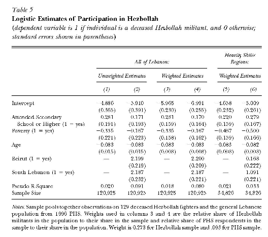

```{r message=FALSE, warning=FALSE, include=FALSE}
library(ggplot2)

theme_set(theme_minimal(base_size = 14))
```

# Introducción

## Ideas básicas

- A menudo nos interesa explicar un resultado cualitativo. Ejemplos: 

    - Queremos estudiar participación laboral o no de mujeres casadas.

    - Queremos saber si un joven es arrestado por un delito o no durante un cierto período de tiempo.

    - Queremos saber si un empleado participa o no en un plan voluntario de ahorro para mejorar sus pensiones.

- En todos estos casos la variable $y$ que queremos explicar es binaria (cero-uno). Esto es, a veces tenemos una variable dummy al lado derecho del modelo.

## Ideas básicas

- Podemos plantear la relación entre $y$ y las variables variables $x_{1}$, $x_{2}$, ..., $x_{k}$ como:
\begin{equation*}
P(y=1|x_{1},x_{2},...,x_{k})=p(x_{1},x_{2},...,x_{k})=p(\mathbf{x})\mathbf{,}
\end{equation*} 
donde $\mathbf{x}$ representa todas las variables explicativas.

- Este modelo es llamado modelo probabilístico ya que modelamos la probabilidad de *exito*, esto es $y=1$.

- La probabilidad de fracaso es $P(y=0|\mathbf{x})=1-P(y=1|\mathbf{x})=1-p(\mathbf{x})$.

- En un modelo de regresión estamos interesados en el efecto parcial de $x_{j}$ sobre $p(\mathbf{x})$:
\begin{eqnarray*}
&& \frac{\partial p(\mathbf{x)}}{\partial x_{j}} \longleftarrow x_j \text{ continua} \\
&& p(x_{1},...,x_{K-1},1)-p(x_{1},...,x_{K-1},0) \longleftarrow x_K \text{ dummy}
\end{eqnarray*}
ahora el reto es nuevamente estimar estos efectos parciales.

## Punto de partida: El modelo lineal de probabilidad

- El modelo lineal de probabilidad no es otra cosa que el modelo de regresión lineal estándar donde la variable dependiente [$y$ es una variable binaria]{.emph}. Si escribimos el modelo como:
\begin{equation*}
y=\beta _{0}+\beta _{1}x_{1}+\beta _{2}x_{2}+...+\beta _{k}x_{k}+u
\end{equation*}%
donde $y$ es binaria, la clave es interpretar los $\beta$s.

- Suponga que $y$ indica pertenencia a un sindicato, y por tanto valores 0 o 1. Suponga que $\beta _{1}=0.035$ y $x_{1}$ es años de escolaridad. ¿Qué significa que un año más de escolaridad $educ$ incremente $y$ en $0.035$?

- Para responder debemos formular la función de media condicional del modelo de regresión:
\begin{equation*}
E(y|\mathbf{x})=\beta _{0}+\beta _{1}x_{1}+\beta _{2}x_{2}+...+\beta
_{k}x_{k}
\end{equation*}

## Punto de partida: El modelo lineal de probabilidad

- Recordemos de estadística que cuando enfrentamos una variable probabilística binaria el valor esperado es: 
\begin{equation*}
E(y|\mathbf{x})= 1 \times p(\mathbf{x}) + 0 \times (1-p(\mathbf{x}))
\end{equation*}
por tanto:
\begin{equation*}
E(y|\mathbf{x})=p(\mathbf{x})=\beta _{0}+\beta _{1}x_{1}+\beta _{2}x_{2}+...+\beta
_{k}x_{k}
\end{equation*}
tenemos la [probabilidad de exito]{.emph}: la probabilidad predicha de que $y = 1$ dado $x$.

- $\beta$ = cambio en la probabilidad de que $y = 1$ para un cambio unitario en $x$:
$$
\beta=\frac{\operatorname{Pr}(y=1 \mid x+\Delta x)-\operatorname{Pr}(y=1 \mid X=x)}{\Delta x}
$$

## Ejemplo 1: Denegar crédito hipotecario vs. relación entre los pagos de la deuda y los ingresos

- Modelo estimado: $deny = \beta_0 + \beta_1 (P/I)$:

```{r}
library(AER)
data(HMDA)
# convert 'deny' to numeric
HMDA$deny <- as.numeric(HMDA$deny) - 1

# estimate a simple linear probabilty model
denymod1 <- lm(deny ~ pirat, data = HMDA)
coeftest(denymod1, vcov. = vcovHC, type = "HC1")
```


- ¿Cuál es el valor predicho para la relación P/I = .3? $\Pr (deny = 1| P/Iratio = .3) = -.080 + .604×.3 = .151$

- Cálculo de "efectos:" aumento de la relación P/I de .3 a .4: 	$\Pr (deny = 1| P / Iratio = .4) = -.080 + .604×.4 = .212$

    El efecto sobre la probabilidad de negación de un aumento en la relación P/I de .3 a .4 es aumentar la probabilidad en .061, es decir, en 6.1 puntos porcentuales. 


## Ejemplo 1: Denegar crédito hipotecario vs. relación entre los pagos de la deuda y los ingresos

```{r}
plot(x = HMDA$pirat, y = HMDA$deny, ylab = "deny", xlab = "P/I", col = "blue",
     main = "Modelo Lineal de Probabilidad para modelar la probabilidad de rechazo de créditos hipotecarios")
abline(denymod1, col = "red")
```

## Ejemplo 1: Denegar crédito hipotecario vs. relación entre los pagos de la deuda y los ingresos

- Ahora incluyamos la variable de descendencia *afro-americana*:

```{r}
# rename the variable 'afam' for consistency
colnames(HMDA)[colnames(HMDA) == "afam"] <- "black"

# estimate the model
denymod2 <- lm(deny ~ pirat + black, data = HMDA)
coeftest(denymod2, vcov. = vcovHC, type = "HC1")
```


- Probabilidad predicha de negación para el solicitante afroamericano con P/I = .3: $\Pr (deny = 1) = -.091 + .559×.3 + .177×1 = .254$

- Mientras que para el solicitante blanco con P/I = .3: $\Pr (deny = 1)= -.091 + .559×.3 + .177×0 = .077$

- Diferencia = .177 = 17.7 puntos porcentuales

*Nota: Todavía hay mucho espacio para el sesgo variable omitida.*

## Ventajas y desventajas del modelo lineal de probabilidad

- El modelo de probabilidad lineal modela $\Pr(y=1| x)$ como una función lineal de $x$.

- Ventajas:

    - Fácil de estimar e interpretar

    - La inferencia es la misma que para la regresión múltiple (necesita errores estándar robustos de heterocedasticidad)

- Desventajas:

    - Un LPM dice que el cambio en la probabilidad predicha para un cambio dado en $x$ es el mismo para todos los valores de $x$, pero eso no tiene sentido. Piense en el ejemplo de HMDA.

    - Las probabilidades predichas de LPM pueden ser $<0$ o $>1$.
     
    - Estas desventajas se pueden resolver utilizando un modelo de probabilidad no lineal: regresión probit y logit

# Modelos Logit y Probit

## Ideas básicas

- El problema con el modelo de probabilidad lineal es que modela la probabilidad de $y=1$ como lineal:
$$Pr(y = 1| x) = \beta_0 + \beta_1 x$$
- En cambio, queremos:

    - Pr(Y = 1| X) ser creciente en X para β1>0, y

    - 0 ≤ Pr(Y = 1| X) ≤ 1 para todo X

- Esto requiere el uso de una forma funcional no lineal para la probabilidad: ¿Qué tal una curva en S?.

## El modelo Probit

- La [regresión probit]{.emph} modela la probabilidad de que $y=1$ usando la [función de distribución normal estándar acumulativa]{.emph}.  

- El modelo de regresión probit es,
$$\Pr(y = 1| x) = \Phi(\beta_0 + \beta_1 x_1 + ... + \beta_k x_k)$$
donde $\Phi(z)$ es la función de distribución normal acumulativa y $z = \beta_0 + \beta_1 x_1 + ... + \beta_k x_k$ es el "valor z" o "índice z" del modelo probit.

- Por ejemplo con un solo $x$ y supongamos $\beta_0 = -2$, $\beta_1= 3$ y $x = 0.4$ tenemos: 
$$Pr(y = 1| x=0.4) = \Phi(-2 + 3×0.4) = \Phi(-0.8)$$	
$Pr(y = 1| x = 0.4) =$ área por debajo de la densidad normal estándar a la izquierda de $z = -0.8$.

## El modelo Probit

```{r}
colorArea <- function(from, to, density, ..., col="blue", dens=NULL){
    y_seq <- seq(from, to, length.out=500)
    d <- c(0, density(y_seq, ...), 0)
    polygon(c(from, y_seq, to), d, col=col, density=dens)
}

curve(dnorm(x), from=-4, to=4, 
  main = "Distribución Normal Estándar", 
  ylab = "Densidad",
  xlab = "z")

colorArea(from=-4, to=-0.8, dnorm)
#colorArea(from=qnorm(0.975), to=4, dnorm, mean=0, sd=1, col=2, dens=20)
```

## El modelo Probit

```{r}
curve(pnorm, from = -4, to = 4, 
  main = "Distribución Normal Acumulada", 
  ylab = "Probabilidad",
  xlab = "z")
```


## El modelo Probit

- ¿Por qué usar la distribución de probabilidad normal acumulativa? La "forma de S" nos da lo que queremos:

    - $\Pr(y = 1| x)$ aumenta en $x$ para $\beta_1>0$.

    - $0 ≤ Pr(y = 1| x) ≤ 1$ para todo $x$.
    
- **Fácil de usar**: 

    - Las probabilidades se tabulan en las tablas normales acumulativas (y también se calculan fácilmente utilizando R)

- **Interpretación relativamente sencilla**: 

    - Como $\beta_0 + \beta_1 x_1 + ... + \beta_k x_k$ es el valor $z$ predicho dado las $x$, 
$\beta_1$ es el cambio en el valor $z$ para un cambio de unidad en $x_1$ manteniendo las otras $x$ constante.

## Efectos marginales en un modelo Probit

- En los modelo Probit los $\beta$ ya no tienen una interpretación directa como en el caso del modelo lineal.

- El [efecto parcial promedio estimado (APE)]{.emph} o [efecto marginal promedio]{.emph}) para una variable continua $x_j$ es
\begin{equation*}
E\left[ \frac{\partial \Pr(y=1|x)}{\partial x_j} |x\right] = \phi(z)\beta_j,
\end{equation*}
donde $\Phi(z)$ es la función densidad normal y $z = \beta_0 + \beta_1 x_1 + ... + \beta_k x_k$. Promediamos el efecto parcial en toda la distribución poblacional de $z$.

- Suponga ahora que $x_{j}$ es una variable binaria. Entonces, su APE es
\begin{equation*}
E[\Pr(y=1|x_{-j},x_j=1)-\Pr(y=1|x_{-j},x_j=0)|x]
\end{equation*}%
donde $x_{-j}$ representa todas las variables excepto la $j$.

## Estimar un modelo Probit en R

- El comando para estimar modelos Probit en R es:
```
resultado <- glm(y ~ x1 + x2 + ... + xk, family = binomial(link = "probit"), data = base_datos)
```

- Notas:

    - Se puede usar después el comando `coeftest(resultado, vcov. = vcovHC, type = "HC1")` para obtener los errores estándar robustos a heteroscedasticidad de White.

- El comando para estimar efectos marginales en R es:
```
efectos <- probitmfx(y ~ x1 + x2 + ... + xk, data = base_datos, atmean = TRUE, robust = TRUE) 
```

- Notas:

    - `atmean = TRUE` calcula los efectos marginales en los promedios de las variables $x$ (`FALSE` calcula el promedio de los efectos marginales).
    
    - `robust = TRUE` calcula los erróres estándar robustos de White.
    

## Ejemplo 2: Denegar crédito hipotecario vs. relación entre los pagos de la deuda y los ingresos (nuevamente)

Modelo estimado: $deny = \Phi (\beta_0 + \beta_1 (P/I))$:
```{r}
# estimate the simple probit model
denyprobit <- glm(deny ~ pirat, 
                  family = binomial(link = "probit"), 
                  data = HMDA)

coeftest(denyprobit, vcov. = vcovHC, type = "HC1")
```

- Coeficiente positivo: ¿Tiene sentido?

- Probabilidades predichas: $\Pr (deny = 1| P/Iratio = 0.3) = \Phi(-2.19+2.97\times 0.3) = \Phi(-1.30) = 0.097$

- Efecto del cambio en la relación P/I de 0.3 a 0.4: $\Pr (deny = 1| P/Iratio = 0.4) = \Phi(-2.19+2.97 \times 0.4) =\Phi (-1.00) = 0.159$
La probabilidad predicha aumenta de 0.097 a 0.159

## Ejemplo 2: Denegar crédito hipotecario vs. relación entre los pagos de la deuda y los ingresos (nuevamente)

```{r}
plot(x = HMDA$pirat, 
     y = HMDA$deny,
     main = "Modelo Probit para modelar la probabilidad de rechazo de créditos hipotecarios",
     xlab = "P/I",
     ylab = "Deny",
     col = "blue")

# add estimated regression line
x <- seq(0, 3, 0.01)
y <- predict(denyprobit, list(pirat = x), type = "response")

lines(x, y, lwd = 1.5, col = "red")
```


## Ejemplo 2: Denegar crédito hipotecario vs. relación entre los pagos de la deuda y los ingresos (nuevamente)

Modelo estimado: $deny = \Phi (\beta_0 + \beta_1 (P/I) + \beta_2 black)$:
```{r}
# estimate the simple probit model
denyprobit2 <- glm(deny ~ pirat + black, 
                  family = binomial(link = "probit"), 
                  data = HMDA)

coeftest(denyprobit2, vcov. = vcovHC, type = "HC1")

predictions1 <- predict(denyprobit2, 
                       newdata = data.frame("black" = c("no", "yes"), 
                                            "pirat" = c(0.3, 0.3)),
                       type = "response")
```

- Efecto estimado de la raza para la relación P/I = 0.3: 

    - $\Pr (deny = 1|0.3,1)= \Phi(-2.26+2.74\times 0.3+0.71 \times 1) = `r predictions1[2]`$
    
    - $Pr (deny = 1|0.3,0)= \Phi(-2.26+2.74\times 0.3+0.71\times 0) = `r predictions1[1]`$
    
- Diferencia en las probabilidades de rechazo = `r diff(predictions1)` (15.8 puntos porcentuales)

## El modelo Logit

- La regresión Logit modela la probabilidad de $y=1$ dadas las x usando la función de distribución logística estándar acumulada.
$$Pr(y = 1| x) = F(\beta_0 + \beta_1 x_1 + ... + \beta_k x_k)$$
donde $F()$ es la función de distribución logística acumulada:
$$
F(\beta_0 + \beta_1 x_1 + ... + \beta_k x_k)=\frac{1}{1+e^{-\left(\beta_0 + \beta_1 x_1 + ... + \beta_k x_k\right)}}
$$

- Dado que los modelos Logit y Probit usan diferentes funciones de probabilidad, los coeficientes ($\beta$) estimados son diferentes.

## El modelo Logit

- Por ejemplo con un solo $x$ y supongamos $\beta_0 = -3$, $\beta_1= 2$ y $x = 0.4$ entonces tenemos:
$$Pr(y = 1| x=0.4) = 1/(1+e^{–(-3 + 2 \times 0.4)}) = 1/(1+e^{–(–2.2)}) = 0.0998$$ 

- ¿Por qué molestarse con logit si tenemos probit?

    - La razón principal es histórica: logit es computacionalmente más rápido y más fácil, pero eso no importa hoy en día.

- En la práctica, logit y probit son muy similares, ya que los resultados empíricos generalmente no dependen de la elección logit / probit, ambos tienden a usarse en la práctica. 

## Ejemplo 3: Denegar crédito hipotecario vs. relación entre los pagos de la deuda y los ingresos (una vez más)

Modelo estimado: $deny = F (\beta_0 + \beta_1 (P/I))$:
```{r}
denylogit <- glm(deny ~ pirat, 
                 family = binomial(link = "logit"), 
                 data = HMDA)

coeftest(denylogit, vcov. = vcovHC, type = "HC1")
```

## Ejemplo 3: Denegar crédito hipotecario vs. relación entre los pagos de la deuda y los ingresos (una vez más)

```{r}
# plot data
plot(x = HMDA$pirat, 
     y = HMDA$deny,
     main = "Modelo Probit y Logit para modelar la probabilidad de rechazo de créditos hipotecarios",
     xlab = "P/I ratio",
     ylab = "Deny",
     col = "blue")

# add estimated regression line of Probit and Logit models
x <- seq(0, 3, 0.01)
y_probit <- predict(denyprobit, list(pirat = x), type = "response")
y_logit <- predict(denylogit, list(pirat = x), type = "response")

lines(x, y_probit, lwd = 1.5, col = "red")
lines(x, y_logit, lwd = 1.5, col = "black", lty = 2)

# add a legend
legend("topleft",
       horiz = TRUE,
       legend = c("Probit", "Logit"),
       col = c("red", "black"), 
       lty = c(1, 2))
```


## Ejemplo 3: Denegar crédito hipotecario vs. relación entre los pagos de la deuda y los ingresos (una vez más)

```{r}
denylogit2 <- glm(deny ~ pirat + black, 
                  family = binomial(link = "logit"), 
                  data = HMDA)

coeftest(denylogit2, vcov. = vcovHC, type = "HC1")
```

```{r}
predictions2 <- predict(denylogit2, 
                       newdata = data.frame("black" = c("no", "yes"), 
                                            "pirat" = c(0.3, 0.3)),
                       type = "response")
```

- Efecto estimado de la raza para la relación P/I = 0.3: 

    - $\Pr (deny = 1|0.3,1)= F(-4.13+5.37\times 0.3+1.27 \times 1) = `r predictions2[2]`$
    
    - $Pr (deny = 1|0.3,0)= F(-4.13+5.37\times 0.3+1.27 \times 0) = `r predictions2[1]`$
    
- Diferencia en las probabilidades de rechazo = `r diff(predictions2)` (14.9 puntos porcentuales)

## Ejemplo 4: ¿Quiénes son los militantes de Hezbolá en Siria?

*Alan Krueger y Jitka Maleckova, "Education, Poverty and Terrorism: Is There a Causal Connection?"  Journal of Economic Perspectives, otoño de 2003, 119-144.*

::::{.columns}

::: {.column width="40%"}

- Ver el paper para obtener más información sobre los datos utilizados.

- Regresión logit: 1 = muerto en evento militar de Hezbolá

:::

::: {.column width="60%"}



:::

::::

## Ejemplo 4: ¿Quiénes son los militantes de Hezbolá en Siria?

- Calculemos el efecto de la escolaridad comparando las probabilidades predichas utilizando la regresión logit de la columna (3):
$$\begin{aligned}
Pr(y=1&|secundaria = 1, pobreza = 0, edad = 20) = \\
&= 1/[1+e–(–5.965+.281×1 – .335×0 – .083×20)]\\
		& = 1/[1 + e7.344] = .000646 \\
Pr(y=1&|secundaria = 0, pobreza = 0, edad = 20) =\\
& = 1/[1+e–(–5.965+.281×0 – .335×0 – .083×20)] \\
		& = 1/[1 + e7.625] = .000488 
\end{aligned}$$

- Entonces:
$$\begin{aligned}
&Pr(y=1|secundaria = 1, pobreza = 0, edad = 20) \\
&– Pr(y=1|secundaria = 0, pobreza = 0, edad = 20) = 0.000158
\end{aligned}$$

## Ejemplo 4: ¿Quiénes son los militantes de Hezbolá en Siria?

- Ambas afirmaciones son ciertas:

    - La probabilidad de ser un militante de Hezbolá aumenta en 0,0158 puntos porcentuales, si se asiste a la escuela secundaria.

    - La probabilidad de ser un militante de Hezbolá aumenta en un 32%, si se asiste a la escuela secundaria (.000158 / .000488 = .32).
    
# Estimación e inferencia

## Estimación

Nos centraremos en el modelo Probit con un solo regresor para simplificar la discusión:
$$Pr(y = 1| x) = \Phi(\beta_0 + \beta_1 x)$$

- ¿Cómo podemos estimar $\beta_0$ y $\beta_1$?

- ¿Cuál es la distribución muestral de los estimadores?

- ¿Por qué podemos usar los métodos habituales de inferencia?

- Primero motivar a través de mínimos cuadrados no lineales  Luego discutimos la estimación de máxima verosimilitud (lo que realmente se hace en la práctica)

## Mínimos cuadrados no lineales

- Recordemos MCO:
$$\min _{\hat{\beta}_0, \hat{\beta}_1} \sum_{i=1}^n\left[y_i-\left(\hat{\beta}_0+\hat{\beta}_1 x_i\right)\right]^2$$
El resultado son los estimadores MCO $\hat{\beta}_0$ y $\hat{\beta}_0$.

- Los [mínimos cuadrados no lineales]{.emph} extienden la idea de MCO a modelos en los que los parámetros entran de forma no lineal:
$$\min _{\hat{\beta}_0, \hat{\beta}_1} \sum_{i=1}^n\left[y_i-\Phi\left(\hat{\beta}_0+\hat{\beta}_1 x_i\right)\right]^2$$	

- ¿Cómo resolver este problema de minimización? El cálculo no da una solución explícita.

    - Resuelto numéricamente usando la computadora (algoritmos de minimización especializados)

## Estimación por Máximo Verosimilitud (MV) 

- En la práctica, no se utilizan mínimos cuadrados no lineales.  Un estimador más eficiente (menor varianza) es MV.

- La [función de verosimilitud]{.emph} es la densidad condicional de $y_1,...,y_n$ dada $x_1,...,x_n$, tratada como una función de los parámetros desconocidos $\hat{\beta}_0$ y $\hat{\beta}1$.

- El estimador de máxima verosimilitud (MV) es el valor de $(\hat{\beta}_0,\hat{\beta}_1)$ que maximiza la función de verosimilitud.

    - MV  es el valor de $(\hat{\beta}_0,\hat{\beta}_1)$ que mejor describe la distribución completa de los datos.

- En muestras grandes, el MV es:

    - Consistente.

    - Distribuido normalmente.

    - Eficiente (tiene la varianza más pequeña de todos los estimadores).

## Caso especial: Estimación MV sin variables dependientes 

- Distribución de Bernoulli:
$$
y=\left\{\begin{array}{l}
1 \text { con probabilidad } p \\
0 \text { con probabilidad } 1-p
\end{array}\right.
$$

- Datos: $y_1,..., y_n$ (i.i.d.)

- La derivación de la probabilidad comienza con la densidad de $y_1$:

- Sabemos que $\Pr(y_1 = 1) = p$ y $\Pr(y_1 = 0) = 1–p$ entonces:
$$Pr(y = y_1) = p^{y_1} (1-p)^{(1-y_1)}$$

## Caso especial: Estimación MV sin variables dependientes 


- La densidad conjunta $(y_1,y_2)$, dado que son independientes, es:
$$
\begin{aligned}
\Pr\left(y\right. & \left.=y_1, y=y_2\right)=\Pr\left(y=y_1\right) \times \Pr\left(y=y_2\right) \\
& =\left[p^{y_1}(1-p)^{1-y_1}\right] \times\left[p^{y_2}(1-p)^{1-y_2}\right] \\
& =p^{\left(y_1+y_2\right)}(1-p)^{\left[2-\left(y_1+y_2\right)\right]}
\end{aligned}
$$

- La densidad conjunta $(y_1,y_2,...,y_n)$, dado que son independientes, es:
$$
\begin{aligned}
& \Pr\left(y=y_1, y=y_2, \ldots, y=y_n\right) \\
& =\left[p^{y_1}(1-p)^{1-y_1}\right] \times\left[p^{y_2}(1-p)^{1-y_2}\right] \times \ldots \times\left[p^{y_n}(1-p)^{1-y_n}\right] \\
& =p^{\sum_{i=1}^n y_i}(1-p)^{\left(n-\sum_{i=1}^n y_i\right)}
\end{aligned}
$$

## Caso especial: Estimación MV sin variables dependientes 

- La probabilidad de observar $(y_1,y_2,...,y_n)$ es la densidad conjunta  en función de los parámetros desconocidos, en este caso $p$:
$$
f(p; y_1, \ldots, y_n)=p^{\sum_{i=1}^n y_i}(1-p)^{\left(n-\sum_{i=1}^n y_i\right)}
$$

- El estimador MV $\hat{p}^{MV}$ maximiza la probabilidad. Es más fácil trabajar con el logaritmo de la probabilidad, $ln[f(p; y_1,...,y_n)]$:
$$
\ln [f(p; y_1, \ldots, y_n)]=\left(\sum_{i=1}^n y_i\right) \ln (p)+\left(n-\sum_{i=1}^n y_i\right) \ln (1-p)
$$

- Maximiza la probabilidad estableciendo la derivada = 0:
$$
\frac{d \ln f\left(p ; y_1, \ldots, y_n\right)}{d p}=\left(\sum_{i=1}^n y_i\right) \frac{1}{p}+\left(n-\sum_{i=1}^n y_i\right)\left(\frac{-1}{1-p}\right)=0
$$

## Caso especial: Estimación MV sin variables dependientes 

- Resolvemos por $p$:
$$
\begin{gathered}
\left(\sum_{i=1}^n y_i\right) \frac{1}{\hat{p}^{M L E}}+\left(n-\sum_{i=1}^n y_i\right)\left(\frac{-1}{1-\hat{p}^{M L E}}\right)=0 \\
\left(\sum_{i=1}^n y_i\right) \frac{1}{\hat{p}^{M L E}}=\left(n-\sum_{i=1}^n y_i\right) \frac{1}{1-\hat{p}^{M L E}} \\
\frac{\bar{y}}{1-\bar{y}}=\frac{\hat{p}^{M L E}}{1-\hat{p}^{M L E}} \\
\hat{p}^{MV}=\bar{y}=\text { fracción de 1s en la muestra}  
\end{gathered}
$$


- Este mismo enfoque se generaliza a modelos más complicados.

## Caso especial: Estimación MV sin variables dependientes 

- Para $y_i$ i.i.d. Bernoulli, el estimador MV es el *estimador natural* de $p$, la fracción de 1s o $\bar{y}$.

- Ya conocemos lo esencial de la inferencia:

    - En $n$ grande, la distribución muestral de $\hat{p}^{MV}=\bar{y}$ se distribuye normalmente.
    
    - La inferencia es *como de costumbre*: prueba de hipótesis suando el estadístico t, intervalo de confianza como $\pm$ 1.96SE.
    
- La teoría de la estimación de MV dice que es el estimador más eficiente de $p$, ¡de todos los estimadores posibles! – al menos para $n$ grande (Mucho más fuerte que el teorema de Gauss-Markov).  

    - Por esta razón, MV es el estimador primario utilizado para modelos en los que los parámetros (coeficientes) entran de forma no lineal.

## Estimación MV con una variable dependiente

- Nada en esencia es diferente, reemplazamos $p=\Pr(y=1|x)=\Phi(\beta_0 + \beta_1 x)$.

- La derivación comienza con la densidad de $y_1$ dado $x_1$:
$$
\begin{aligned}
& \operatorname{Pr}\left(y_1=1 \mid x_1\right)=\Phi\left(\beta_0+\beta_1 x_1\right) \\
& \operatorname{Pr}\left(y_1=0 \mid x_1\right)=1-\Phi\left(\beta_0+\beta_1 x_1\right)
\end{aligned}
$$
$$
\operatorname{Pr}\left(y_1=y_1 \mid x_1\right)=\Phi\left(\beta_0+\beta_1 x_1\right)^{y_1}\left[1-\Phi\left(\beta_0+\beta_1 x_1\right)\right]^{1-y_1}
$$

- La función de probabilidad es la densidad conjunta de $(y_1,...,y_n)$ dada $(x_1,...,x_n)$, tratada como una función de $\beta_0, \beta_1$:
$$
\begin{aligned}
f\left(\beta_0, \beta_1 ;\right. & \left.y_1, \ldots, y_n \mid x_1, \ldots, x_n\right) \\
= & \left\{\Phi\left(\beta_0+\beta_1 x_1\right)^{y_1}\left[1-\Phi\left(\beta_0+\beta_1 x_1\right)\right]^{1-y_1}\right\} \times \\
& \ldots \times\left\{\Phi\left(\beta_0+\beta_1 x_n\right)^{y_n}\left[1-\Phi\left(\beta_0+\beta_1 x_n\right)\right]^{1-y_n}\right\}
\end{aligned}
$$

## Estimación MV con una variable dependiente

- El estimador MV $(\hat{\beta}^{MV}_0, \hat{\beta}^{MV}_1)$ maximiza $\ln[f\left(\beta_0, \beta_1 ;\right.  \left.y_1, \ldots, y_n \mid x_1, \ldots, x_n\right)]$.

- **Problema**: No podemos resolver explícitamente, por lo tanto para obtener el estimador MV se maximiza  utilizando métodos numéricos

- Como en el caso de no $x$, en muestras grandes:

    - $(\hat{\beta}^{MV}_0, \hat{\beta}^{MV}_1)$ son consistentes.
    
    - $(\hat{\beta}^{MV}_0, \hat{\beta}^{MV}_1)$ se distribuyen normalmente y por tanto todos los procedimientos de infrencia vistos aplican.
    
    - $(\hat{\beta}^{MV}_0, \hat{\beta}^{MV}_1)$ son asintóticamente eficientes – entre todos los estimadores (suponiendo que el modelo probit es el modelo correcto)

- Todo esto se extiende a múltiples variables $x$ y para el caso del modelo Logti solo cambia la función $F(\cdot)$.

# Bondad de ajuste

## Medidas de bondad de ajuste para modelos Logit y Probit 

El $R^2$ y el $\bar{R}^2$ no tienen sentido aquí (¿por qué?).  

\ 

Utilizamos otras dos medidas especializadas:

- La [fracción predicha correctamente]{.emph} = fracción de $y$ para la cual la probabilidad predicha es $>50%$ cuando $y_i=1$, o es $<50%$ cuando $y_i=0$.

- El [pseudo-$R^2$]{.emph} mide la mejora en el valor de la probabilidad logarítmica, en relación con no tener $x$.  El pseudo-$R^2$ simplifica al $R^2$ en el modelo lineal con errores normalmente distribuidos.

## Ejemplo 5: Denegar crédito hipotecario (modelo completo)

Ahora el ejemplo en detalle:

- Las hipotecas (préstamos hipotecarios) son una parte esencial de la compra de una casa.

- Pregunta de investigación: *¿Hay acceso diferenciado a créditos hipotecarios por raza?*

    - ¿Si dos personas idénticas, solo diferentes en raza, solicitan un préstamo hipotecario, hay alguna diferencia en la probabilidad de denegación?
    
- Datos: Boston, Massachusetts, procesos de solicitud de créditos hipotecarios 1990-1991

    - Características individuales, características de la propiedad y denegación/aceptación de préstamos

## Ejemplo 5: Denegar crédito hipotecario (modelo completo)

- Proceso de solicitud de un crédito hipotecario:

    - Ir a un banco o compañía hipotecaria

    - Completar una solicitud (información personal + financiera)

    - Reunirse con el oficial de créditos.

- Entonces el oficial de préstamos decide, por ley, de una manera ciega a la raza. EL oficial quiere maximizar la probabilidad de repago. Usa las siguiente variables financieras:

    - Relación P/I

    - Relación entre gastos de vivienda e ingresos

    - Relación préstamo-valor de la vivienda

    - Historial de crédito personal

## Ejemplo 5: Denegar crédito hipotecario (modelo completo)

- La regla de decisión del oficial de crédito esra no lineal: 

    - Ratio préstamo - valor propiedad $>=$ 95%: alto riesgo.
    - Ratio préstamo - valor propiedad $>=$ 80%: riego medio.
    - Ratio préstamo - valor propiedad $<$ 80%: riego bajo.

- Principal problema con las regresiones vistas antes es posible sesgo por variable omitida. 

    - Las siguientes variables (i) ingresan la decisión del oficial de préstamos y (ii) están o podrían estar correlacionadas con la raza: riqueza, tipo de empleo, historial crediticio, estado familiar.

## Ejemplo 5: Denegar crédito hipotecario (modelo completo)

:::{.small}
```{r}
#| output: asis
library(stargazer)

# define low, medium and high loan-to-value ratio
HMDA$lvrat_f <- factor(
  ifelse(HMDA$lvrat < 0.8, "low",
  ifelse(HMDA$lvrat >= 0.8 & HMDA$lvrat <= 0.95, "medium", "high")),
  levels = c("low", "medium", "high"))

# convert credit scores to numeric
HMDA$mhist <- as.numeric(HMDA$mhist)
HMDA$chist <- as.numeric(HMDA$chist)

# estimate all 6 models for the denial probability
lpm_HMDA <- lm(deny ~ black * (pirat + hirat) + lvrat_f + chist + mhist + phist 
               + insurance + selfemp, data = HMDA)

logit_HMDA <- glm(deny ~ black * (pirat + hirat) + lvrat_f + chist + mhist + phist 
                  + insurance + selfemp, 
                  family = binomial(link = "logit"), 
                  data = HMDA)

probit_HMDA_1 <- glm(deny ~ black * (pirat + hirat) + lvrat_f + chist + mhist + phist 
                     + insurance + selfemp, 
                     family = binomial(link = "probit"), 
                     data = HMDA)

rob_se <- list(sqrt(diag(vcovHC(lpm_HMDA, type = "HC1"))),
               sqrt(diag(vcovHC(logit_HMDA, type = "HC1"))),
               sqrt(diag(vcovHC(probit_HMDA_1, type = "HC1"))))

stargazer(lpm_HMDA, logit_HMDA, probit_HMDA_1,  
          digits = 3,
          type = "html",
          header = FALSE,
          se = rob_se,
          model.numbers = FALSE,
          font.size = "footnotesize",
          omit.stat = c("rsq","adj.rsq", "n","aic","ser","f","ll"),
          single.row = TRUE)
               
```
:::


## Ejemplo 5: Denegar crédito hipotecario (modelo completo)

- Podemos usar el paquete `mfx` para estimar los efectos marginales (calculados en los promedios de las variables). Para el modelo Probit:
```{r}
library(mfx)
mod1 = probitmfx(deny ~ black * (pirat + hirat) + lvrat_f + chist + mhist + phist 
                     + insurance + selfemp, data = HMDA)
mod1
```


## Ejemplo 5: Denegar crédito hipotecario (modelo completo)

```{r}
linearHypothesis(probit_HMDA_1,
                 test = "F",
                 c("blackyes:pirat=0", "blackyes:hirat=0"),
                 vcov = vcovHC, type = "HC1")
```


## Ejemplo 5: Denegar crédito hipotecario (modelo completo)

- Los coeficientes sobre las variables financieras tienen sentido.

- La variable afro-americano es estadísticamente significativa en todas las especificaciones.

- Las interacciones entre la raza y las variables financieras no son significativas.

- Incluir controles reduce drásticamente el efecto de la raza sobre la probabilidad de negación.

- LPM, probit, logit: estimaciones similares del efecto de la raza sobre la probabilidad de negación.

- Los efectos estimados son grandes en un sentido del "mundo real".

